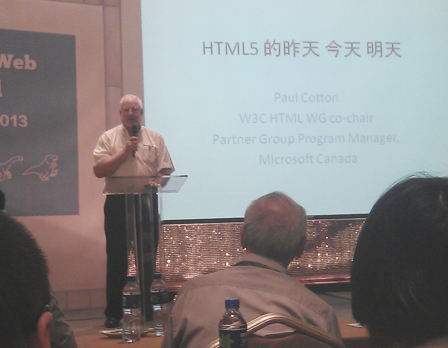
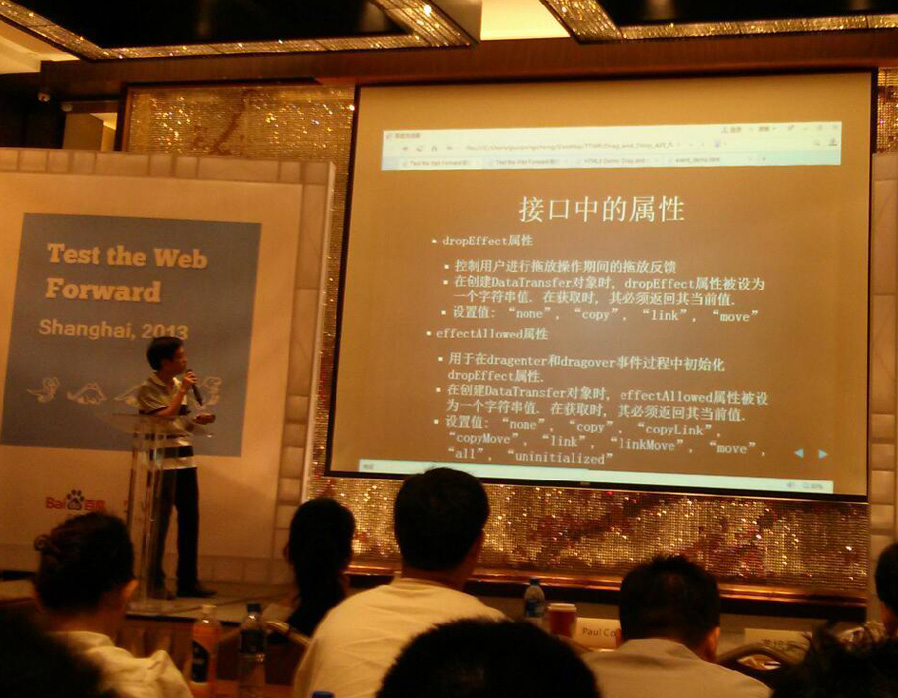
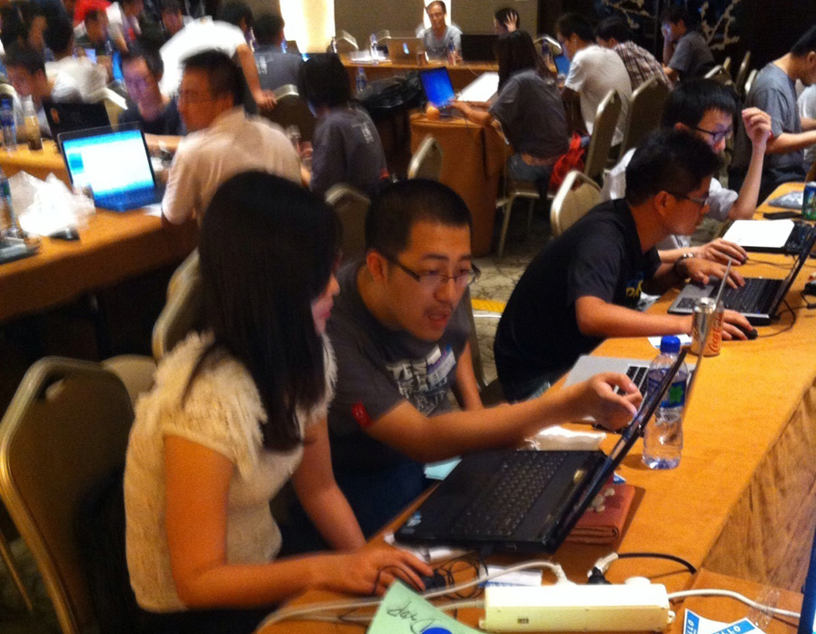
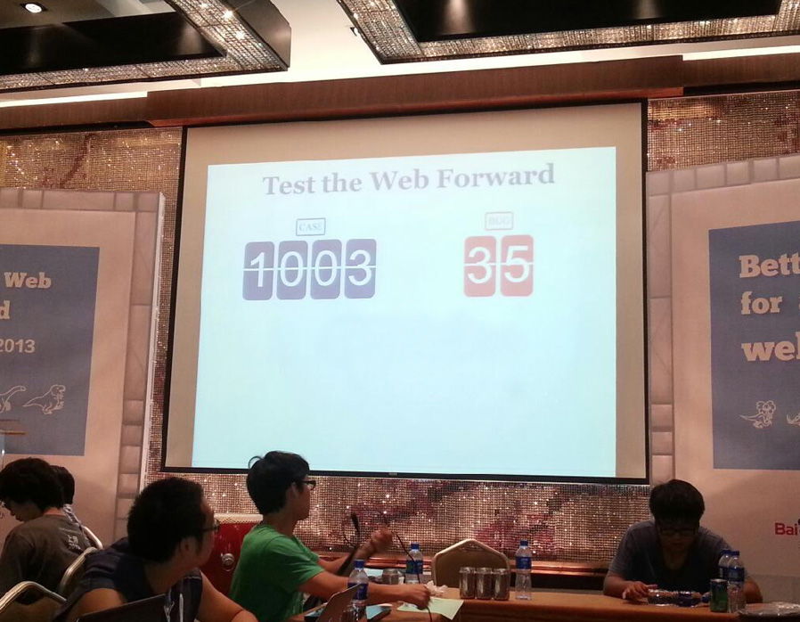
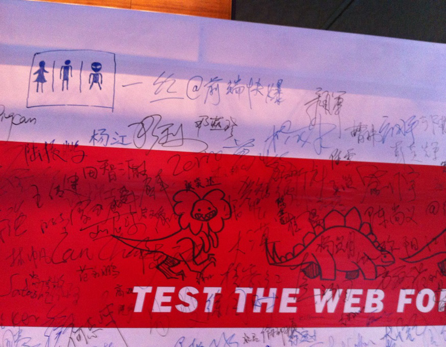
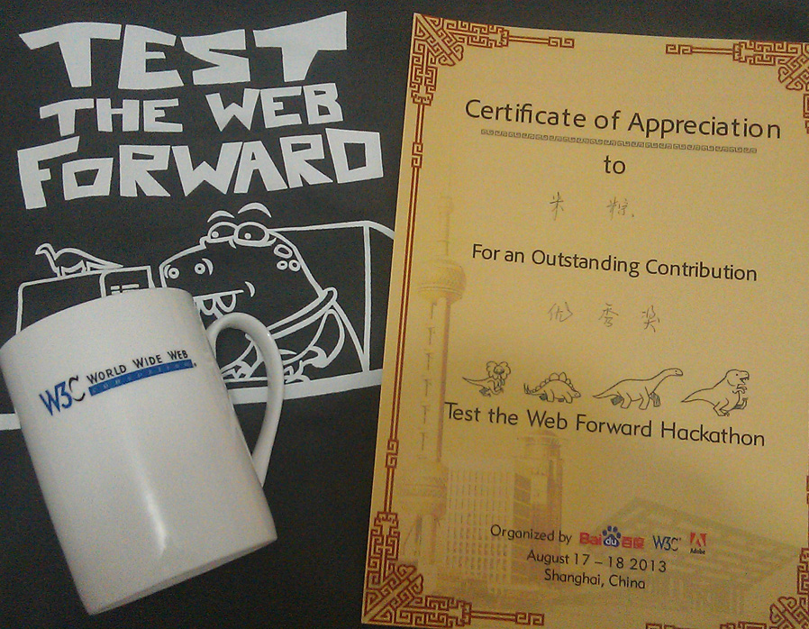

[Test the Web Forward](http://testthewebforward.org/)（简称 TTWF）是 W3C 会员单位 Adobe 和 W3C 联合主办的一个极限编程活动，意在让关注 web 标准的开发者直接参与到 Web 标准的贡献中去。在这个活动中，开发者可以了解到最新的 Web 标准，并学习如何编写 W3C 测试用例，这些测试用例会帮助浏览器更一致地实现这些功能。自从 2012 年 6 月在旧金山第一次举办，一年来已经陆续在北京、巴黎、悉尼、西雅图、东京等全球多个城市开展。今年 TTWF 第二次来到中国，于 8 月 17、18 日两天在上海浦东博雅酒店举行，这次活动由另一家 W3C 会员单位百度独家承办。

活动是从 8 月 17 日下午两点过开始的，开场是 HTML 工作组联合主席 Paul Cotton 以“HTML5 的昨天 今天 明天”为题的演讲。演讲大致介绍了 HTML5 的历史背景，目前的演进状况，以及未来几年的一些计划。

接下来是一位学术圈的老者的演讲，讲得很空洞，毫无意义，学术圈谈产业的典型作派。

短暂休息以后，活动特邀的技术嘉宾们就开始了对测试内容的介绍。这次活动的测试范围包括 [HTML5 File API](https://www.w3.org/TR/FileAPI/)、[HTML5 Drag and Drop](https://www.w3.org/TR/html5/editing.html#dnd)、[Indexed Database API](https://www.w3.org/TR/IndexedDB/)、[CSS3 Transforms](https://www.w3.org/TR/css3-transforms/)、[CSS3 Grid Layout](https://www.w3.org/TR/css3-grid-layout/)、[CSS3 Backgrounds and Borders](https://dev.w3.org/csswg/css3-background/) 等六个模块。由于时间有限，嘉宾们又纷纷超时，结果只对 File API、Drag and Drop、IndexedDB 做了讲解。

讲解结束后，进行了快速的分组，我选择加入了 hax 担任组长的 CSS3 Grid Layout 组，这也是这次测试范围中唯一一个我之前完全不了解的模块，正好借此机会好好学习一下。

分组结束后，第一天就到此为止。

第二天一早到了会场，已经来了很多人，看来大家对动手写代码都很期待。接下来的一整天都在如火如荼的写码中度过。

忙碌的一天，以惊人的提交 1003 个测试用例，发现 35 个 bug 划上句号，要知道去年北京站才提交了 200 多个用例，两个月前的东京站也只有不到 700 个。激动人心的一刻，大家纷纷拍照留念。

而这一切，都是我们共同努力的结果。

我的成绩是 10 个对照测试用例，1 个 [Chrome Canary 的 bug](https://code.google.com/p/chromium/issues/detail?id=275111)。跟朋友们聊天占用了不少时间，所以其实还可以做得更好一些，有点小遗憾，但仍然非常幸运地拿到一个优秀奖。

说到活动，当然少不了纪念品。这次的纪念品是一件 TTWF 的 T 恤和一个 W3C 的马克杯。因为跟大大们聊天，错过了领 T 恤的时间，以至于我这个小身板最后只能在 XL 和 XXL 里面挑。马克杯的做工不错，瓷质平整白净，很漂亮，这得感谢安琪姐。除此之外最重要的是，从今以后哥也是有证的程序员了。

去年北京站没能参加，很遗憾，这回算是弥补了。跟一些老朋友碰了面，相谈甚欢，也结识了一些新朋友。安琪姐终于不再把我跟一丝这个贱货搞混了。Fiona 姐还说要寄 Adobe 的马克杯给我，好感人（后来好像彻底忘了……），收集马克杯的嗜好真是个无底洞……

朋友、奖品、纪念品，这些都很重要，但最重要的是努力和付出换来的认同。希望将来有机会能继续参加这个活动。

---

## 附一：关于如何编写 W3C 标准的测试用例，有很多详细的教学，就没必要再复制粘贴，直接上链接。

- [How to Write a Reftest](http://opensource.adobe.com/web-platform/presentations/testtwf-how-to-write-a-reftest/)
- [Using testharness.js](https://darobin.github.io/test-harness-tutorial/docs/using-testharness.html)
- [Testing with testharness.js](http://hoppipolla.co.uk/talks/ttwf/testharness.html)
- [How to File a Good Bug Report](http://fantasai.inkedblade.net/style/talks/filing-good-bugs/)

---

## 附二：其他资料

- [W3C All Standards and Drafts](https://www.w3.org/TR/)
- [Mirror of CSS WG test repository](https://github.com/w3c/csswg-test)
- [Test Suites for Web Platform specifications](https://github.com/w3c/web-platform-tests)
- [testharness.js](https://github.com/w3c/testharness.js)
