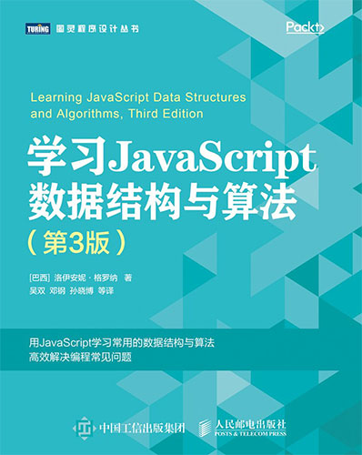
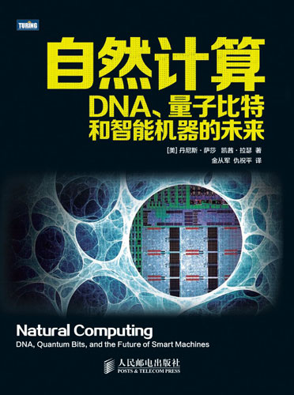

## [学习 JavaScript 数据结构与算法](http://www.ituring.com.cn/book/2653)

这本书介绍了常见的数据结构和算法，并给出 JavaScript 的实现，适用于 Web 前端开发者，以及所有对数据结构和算法感兴趣的读者。第三版的中译本已经上市。

---

## [程序员必读之软件架构](http://www.ituring.com.cn/book/1444)

这是一本面向开发者的架构书籍，介绍了架构的基本概念和方法，以及与敏捷方法相结合的实践经验。不论是对架构有兴趣的程序员，还是想要从瀑布式转向敏捷开发的团队，这本书都是有益的学习材料。

译者序见博文[《程序员必读之软件架构》译者序](/posts/2014/software-architecture-for-developers-translators-preface/)。

---

## [自然计算：DNA、量子比特和智能机器的未来](http://www.ituring.com.cn/book/1103)

这是一本很有趣的计算机交叉学科的科普书，介绍了十六位致力于解决计算领域前沿问题的科学家。他们分别在科学、工程金融等领域从事极富挑战性的工作。书中记录了作者与这些科学家的对话，描绘了新的计算机架构和丰富多彩的新型软件技术。每一章自成一体，揭示了这些科学家独特的探索之路；同时，还介绍了作者写作过程中产生的一系列奇思妙想，这些思想注定会让这个世界变得更好。

这本书是夫人和另一位译者合作完成的。虽然名义上这本书跟我并没有关系，但全部的译稿在提交一审前我都看过，并且提供了一些翻译的意见和建议。因此，看到这本书出版，自己还是觉得挺有成就感的。
