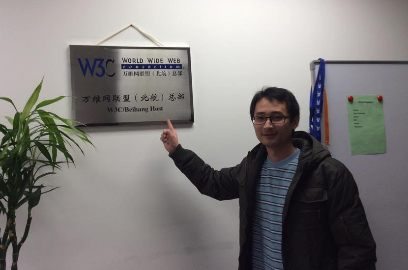

> Whether you agree or not, CSS plays an important role in a web developer’s skill set.

---

CSSConf is a conference where designers, developers and engineers come together and talk about building engaging user interfaces. The activity has been held in US, Australia, Germany and other countries around the world. And finally it came to China.

The first [CSSConf China](https://css.w3ctech.com/) was hosted by [w3ctech](https://www.w3ctech.com/) and [W3C](https://www.w3.org/), and launched at Reporting Hall #1 of BUAA Conference Center on January 10th, 2015.

A glance at the sign-in area. It was 8:20AM or so.

Everybody was waiting for the moment.

At 9:30AM, my ex-colleague Yubo Zhou, the founder of w3ctech, officially announced the opening of the first CSSConf China.

[Bert Bos](https://www.w3.org/People/Bos/) (W3C CSS and Mathematics activities lead, co-inventor of CSS) delivered the first session: _The state of CSS standardization in 2015_.

Besides Bert, there were nine awesome speakers as well, including [Shijun He](https://johnhax.net/) (hax), [Shaofei Cheng](https://weibo.com/wintercn) (winter), etc.

Shaofei Cheng’s topic is really hardcore! He was recently working on a CSS grammar interpreter. So he spent lots of time on fundamentals of compilers. Boring huh? Well, sort of, maybe. Quite interesting for me.

Mai Hou is a front-end engineer from Douban. He shared hands-on experiences on using web fonts, especially dealing with mixture of English and Chinese.

Can you believe this guy is a designer? Yuxi You, the author of [Vue.js](https://vuejs.org/), ex-Googler, and now a [Meteor](https://www.meteor.com/) core developer.

Shijun He’s criticism on CSS frameworks is thought-provoking. We should rather strengthen the ability of the language than limit it. Yes, I mean CSS preprocessors, for instance [Stylus](http://stylus-lang.com/).

The topics were very attractive, see how excited they were.

I had a short chat with Bert during the break, on GUI layout, [flexible box](https://www.w3.org/TR/css3-flexbox/), [grid](https://www.w3.org/TR/css-grid-1/), etc.

W3C does not have a single physical headquarters. There are four institutions, however, that "host" W3C. [BUAA](https://www.buaa.edu.cn/) is one of them.

Should have been sitting closer to the beauty, stupid of me!

Dinner is always a good option for in-depth communication :D

It’s an unforgettable experience. I felt very sad that I couldn’t stay longer in Beijing, had to rush back to my work. On the other hand, I heard rumors that [Lea Verou](https://lea.verou.me/) is a proposed guest speaker next time. So, let’s look forward to the second CSSConf China.

Ah damnit! I forgot to take a photo with Anqi Li (W3C China site manager), again. I don’t remember how many times this had happened... stupid of me!
