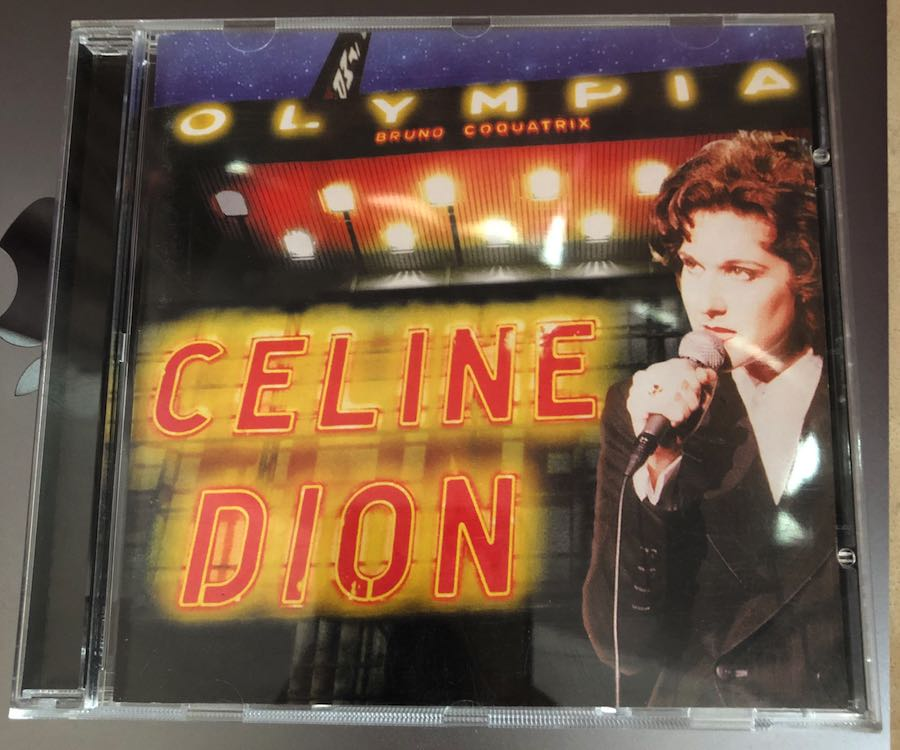

这首歌很多人都翻唱过，以至于有谣言说是“被翻唱最多的法语歌”（应该不是，至少肯定没有 [La Vie En Rose](https://music.163.com/#/song?id=2532494) 多）。听过很多个版本，还是最早听到这个版本最喜欢，相比之下原作的词曲作者 Jacques Brel 其实唱功很一般，唱得并不好。Céline Dion 自己应该也很喜欢这首歌，经常在演唱会返场的时候唱。

