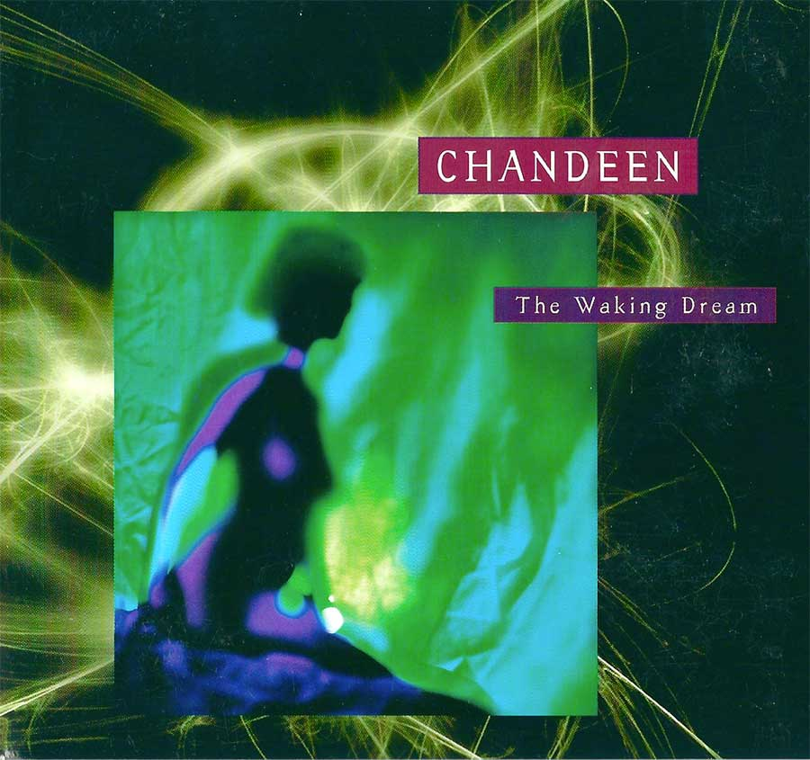

翻唱超越原唱。原作是 dark wave 界老前辈 Dead Can Dance 的早期（上世纪 80 年代初）作品。要说这 Dead Can Dance，音乐圈内的粉丝也是遍地开花，大量作品被不同流派的粉丝各种翻唱，堪比瑞典的 ABBA。

说回原作，DCD 早期属于很典型的 post-punk 风格，把这首歌唱得很乏味，我并不是很喜欢（好在 DCD 后来转型了，否则搞不好一辈子不温不火地活在 The Cure 的阴影中）。其他的翻唱也听过一些，比如另一个圈内粉丝遍地的荷兰的 The Gathering，然而大多数都是“原唱怎么唱我就怎么唱”的复制。

Chandeen 这个版本是我听过的当中最有诚意的，完全重新编曲，配乐比原作丰富了很多。相较原作阴冷的 post-punk 风格，曲风也变得明亮了。再看看这歌名，心想，“哇！这才是这首歌应该有的样子”。
