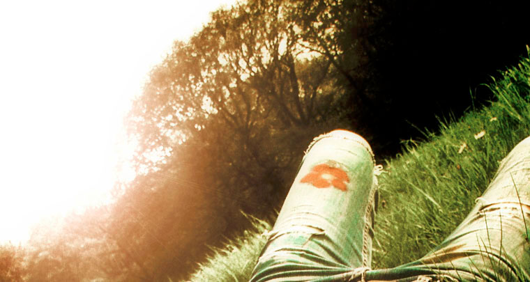
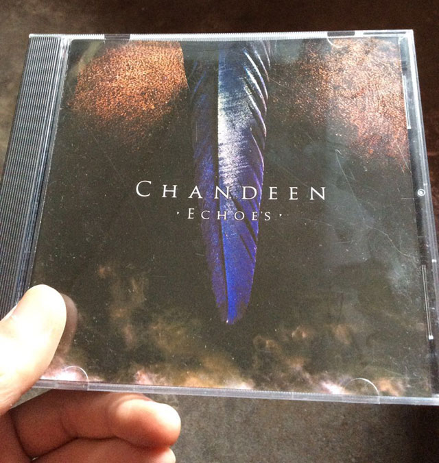

It has been over a decade since I visited [Chandeen’s official site](https://web.archive.org/web/20040226193420/https://www.chandeen.com/) for the first time, after I, by chance, listened to the “Echoes” album. I still remember the words on the homepage clearly: “Chandeen have decided to dissolve the band!”

You couldn’t imagine how sad I was feeling at the moment. I just got to know them, and they told me that they were done with it? I kept coming back to see whether there was a turn for the better. And no! Never! But I was still hoping.

Till one day, a new album called “Teenage Poetry”. Immediately, I recognized that wasn’t Antje Schulz’s voice. And I knew there wouldn’t be a turn any more. So I kept myself away from those albums came later. It was not fair to Julia Beyer, but I just can’t.

<video src="videos/chandeen-shadows-fade.mp4" poster="images/chandeen-shadows-fade.jpg" preload="metadata" controls></video>

Recently, I started listening to “Blood Red Skies”, as I gradually accepted the fact that Antje wouldn’t come back. Honestly, it is a beautiful album, especially the song “Shadows Fade”. And I knew, sooner or later I had to get over it. However, one thing might not change: my favorite albums are still “Echoes” and “Jutland”, my cell phone ringtone is still “Jutland / One Last View”.

After all, she’s not the “echoes”. She’s not Antje.
