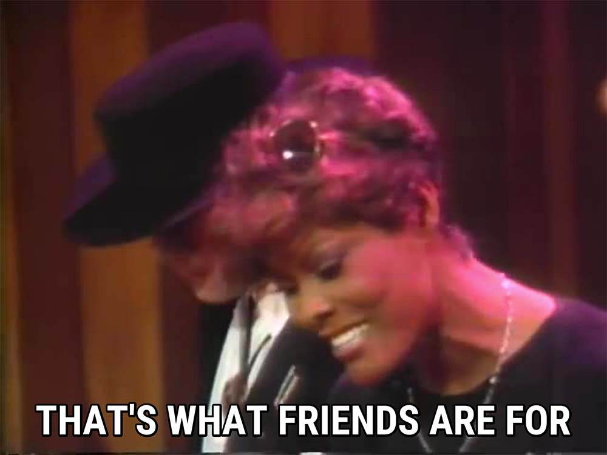

中学时偶尔在电视上的欧美音乐节目中看到过 Dionne Warwick 这个名字。感觉名字很特别，看一眼就记住了。尽管如此，那时候我还沉迷在流行乐当中，欣赏不来福音和灵魂乐，对这位老牌巨星也不甚了了。再说那时候想了解也没门，不像现在有网络什么都能搜。

后来在大学重温 Michael Jackson 的 We Are The World，仔细看了全部的出场人物，当时也有网络了，才知道这位曾经的伴唱歌手来头这么大（第一位得到格莱美的黑人女歌手）。几年前看过一个纪录片，《离巨星二十英尺》，说伴唱歌手其实是很苦的，因为种种原因得不到机会。实力再强也被当做大白菜挑，能走出来成为独唱歌手的少之又少，达到 Dionne 这个程度的（五座格莱美）更罕见。

最近几年听重金属硬摇滚明显少了，听福音、爵士、布鲁斯变得多起来，难道人老了都这样？
