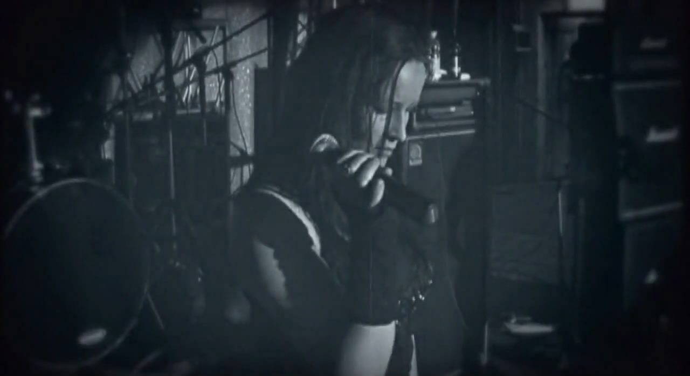

欧洲小众金属圈有个很奇特的现象，喜欢尬舞的女主唱特别多。听听专辑还挺好，看现场表演就很容易出戏。传统挪威三强 Liv Kristine（Theatre of Tragedy）、Vibeke Stene（Tristania）、Anita Auglend（The Sins of Thy Beloved）就都好这口。尤其是 Vibeke，网上流传很广的 My Lost Lenore，唱得是真的好，跳舞也是真的尬。而 Liv 即使长得跟仙女似的，一旦开始「摇摆」也相当地辣眼睛。一路向南，奥地利的 Libuscha Hruska（Sunterra），荷兰的 Sharon den Adel（Within Temptation）都非常明显地极其缺乏舞蹈天赋。不过她们自己似乎不这么认为？直到最南端的地中海，意大利不老女神 Cristina Scabbia（Lacuna Coil）最近也开始放飞自我，有点要晚节不保的征兆。地板姐 Floor Jansen（After Forever / Nightwish）算是比较克制，就还马马虎虎，但也足以暴露舞技的短板。地板姐的前前任，T 姐 Tarja Turunen 也是半斤八两。当然也有对自己认识比较清醒的，像 Simone Simons（Epica）和 Lisa Johansson（Draconian）就不怎么乱动，一心唱歌，拒绝违和。和 Cristina 同岁的 Elisa Martin（Dark Moor / Hamka）台风依然稳健，但吹胀的速度就有点……

