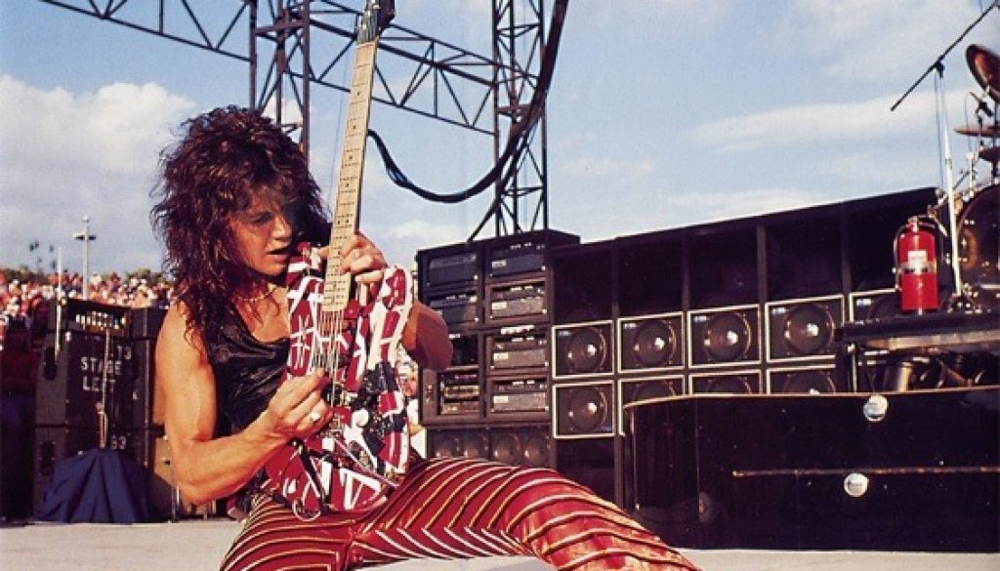

在我看来这是 Eddie Van Halen 最好的纯器乐作品，意境和对演奏的控制都远远超过被很多人顶礼膜拜的 Eruption。这个曲子并没有收录在任何一张 Van Halen 的专辑中，它是电影 Twister 的片尾曲，电影结尾播出字幕时在 end title 之后的第二段音乐。通常，电影配乐为了服务剧情，会被裁剪得支离破碎，因此这个看似尴尬的出现时机，反而最大程度地保留了作品的完整性。阴郁的编曲和收放自如的演奏，跟电影主题非常贴切。

