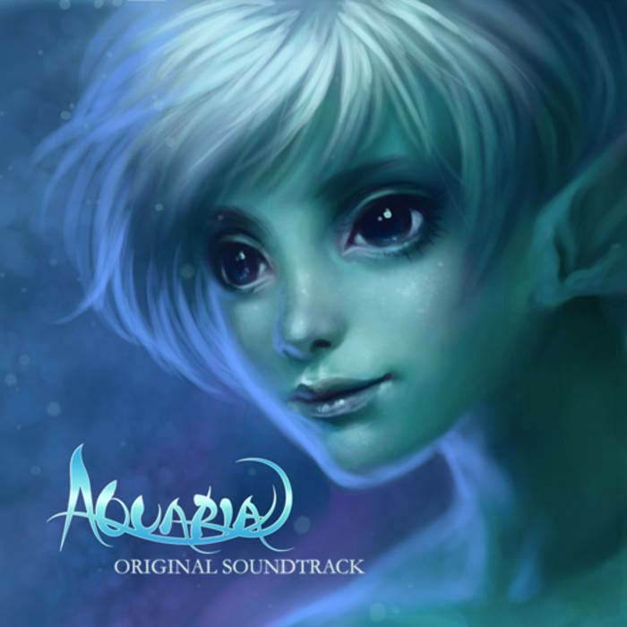

I finally finished the game “Aquaria”, eight years after it was released. This is an underwater fantasy. The art and music is extremely beautiful, but it’s a very sad story. It’s about losing memories. In the end Naija not only loses her love of a lifetime, she doesn’t even know she had loved. For me this is too cruel, I feel sorry for Naija.

The game is quite frustrating at some point, especially exploring the incredibly large labyrinth-like world map. The last stage is much harder than previous part all in a sudden, and the fifth phase of the final boss is insanely difficult. However, when the very last theme rang out, suddenly I realized that it has all been worthwhile.
