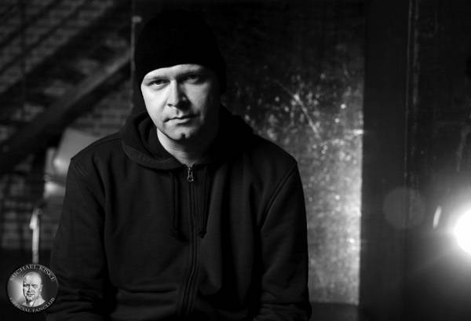

看了 Avantasia 前几年在 Wacken 金属音乐节现场的一些片段，Tobias Sammet 差不多要出车祸了。不过对他兴趣并不大，倒是 Michael Kiske，曾经超高的音域现在已经基本报废，音高上不去，勉强顶上也稳不住。而且脸长胖脖子长粗了以后，彻底变成一个中年秃头大叔。但是同场的老梆子 Bob Catley 声音还是很高啊不知道怎么做到的，可能是唱法和音乐风格的差异？毕竟 Bob 以前玩英式重金属，相比之下，主音能力退化的问题在德式速度金属中就特别容易被放大。然而 Michael 之前一任的 Helloween 主唱 Kai Hansen 也是个老梆子啊，只能说人和人真不能比……算了，至少音色保持得还不错，从 Helloween 单飞以后去玩票流行音乐，中音区的听感也还不错。

