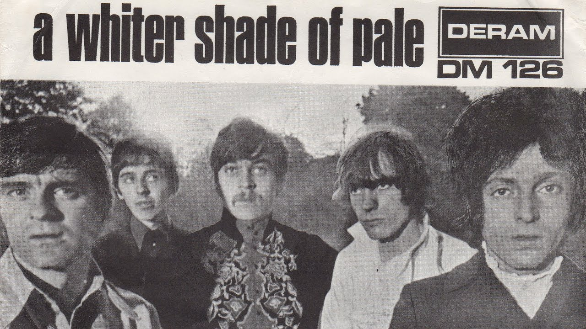

年轻时脾气暴躁，一度沉迷于激流金属黑金属死亡金属这类凶猛的音乐。经历得多一点，性格缓和一点，慢慢喜欢上蓝调、爵士、前卫摇滚。那些比我还要大上几十岁的音乐，有时候就像镇静剂一样，有时候又像是兴奋剂。

P.S. 网易云音乐说我 2017 年听过的最老的歌是 1965 年的 The Sound Of Silence。实际上并不是，那是 Paul Simon 和 Art Garfunkel 两个老头 1990 年的现场演出。真正最老的就是这首 1967 年 Procol Harum 创作的 A Whiter Shade Of Pale。
