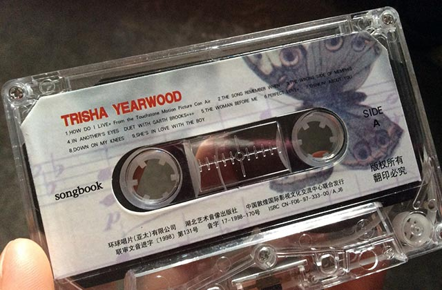

这是乡村歌手 Trisha Yearwood 的歌里面最不像乡村音乐的，因为它是一首翻唱，原唱是 LeAnn Rimes。买这盒磁带的时候，我还在读高中，Trisha Yearwood 刚发行这张精选集 Songbook 不久。

这首歌当初作为电影“Con Air”的主题曲，据说是写歌狂人 Diane Warren（不知道她是谁的以后就别假装听过很多欧美流行歌了，她写过进了 Billboard Top 10 的歌多到吓死你）为 LeAnn Rimes 量身定制。结果电影导演觉得 LeAnn 太年轻，才又找来 Trisha 录了一版。那时候还不像现在，不太兴 Taylor Swift 这种明明唱 teen-pop 却自称乡村歌手的。所以为啥找 Trisha 唱？真是一个谜（导演是粉丝吧，只能这样解释了）。

LeAnn 出道很早，年纪轻轻就很厉害，这首歌唱得其实也不错的，然而仅仅十来岁的小丫头片子，要 PK 成名已久，当时已经三十多岁的一流乡村歌手 Trisha Yearwood，还是这种 adult-pop，这……你说，能有悬念吗？所以说导演不止拍电影，音乐方面的眼光也是很毒的。
