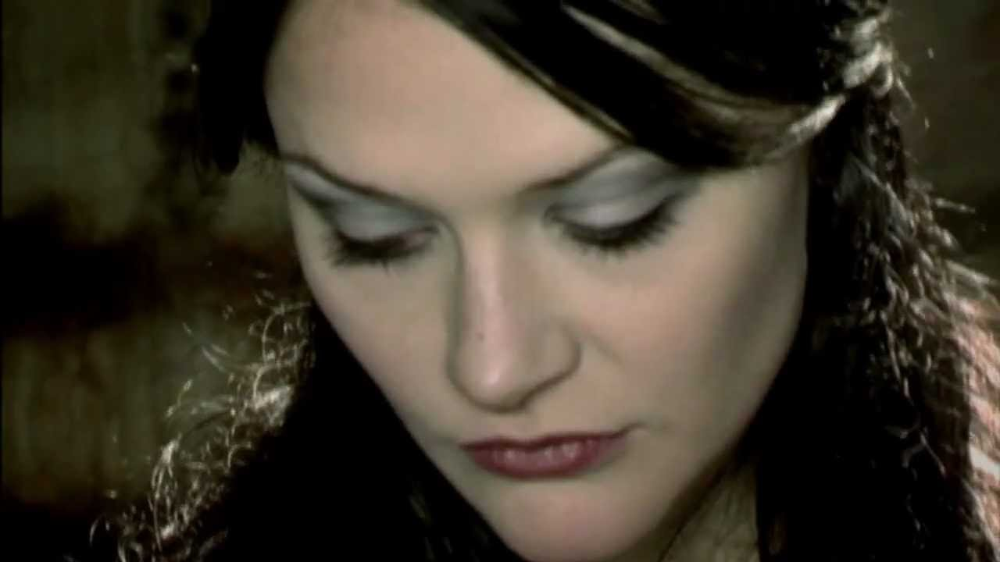

我对挪威 3T 的排名是 Tristania，Theater of Tragedy，The Sins of Thy Beloved。可能很多剧院粉想跳出来打我。我就反问一句，除了剧院还听过谁的，剧院又听过多少，大概能把很多“一首粉”怼到无言以对。后期玩电子乐玩得不伦不类也够了，而且还把 Liv 赶走，会作，可以的。至于 Tristania 排第一，除了女主 Vibeke 高贵冷艳，Pete 的小提琴加持也是很重要的。不过男主 Morten 出走组建 Sirenia 之后，Tristania 就有点江河日下的味道也是可惜。然而除了编曲和唱，Tristania 的歌词实在是炸天（Allan Poe 说主要是我的功劳）。

说到歌词，隔壁的 Arch Enemy 恐怕算是尬聊之王了，Amott 两兄弟编曲和演奏能力没得挑，作文水平却不如小学生。要不是死金界第一女主 Angela 兜底否则不堪设想。无情提示：小盆友不要轻易尝试死亡金属，吓得吃不好睡不着概不负责。

有趣的是，Sirenia 后来在演唱会上也翻唱过 [My Lost Lenore](https://www.youtube.com/watch?v=I84gy0WebmM)，不过效果嘛，就差远了……
