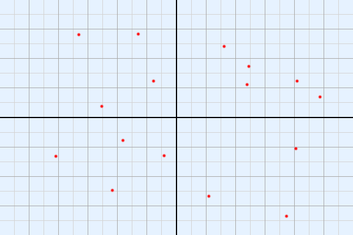

> 本文主要内容是某次无聊争论以后留下的看起来唯一有点用（也可能没有）的一段代码。

---

## 问题

给定数个平面直角坐标系中的点（不包括原点），从中随机选取一个起始点，从原点出发作经过起始点的射线。以原点为中心顺时针旋转射线，依次输出射线扫过的其余点。



---

## 思路

旋转坐标系，使选取的起始点落在 X 轴正方向上。计算所有点的反正切值（取值范围 -2π ~ 0），并通过修正使其余点的反正切值都大于或都小于起始点的反正切值。按反正切值依次对点进行排序，输出结果。

---

## 分析

JavaScript 内置 `Math` 对象中的 `atan2()` 方法接收两个参数，分别是坐标系上点的 Y 坐标值和 X 坐标值，返回结果为 -π ~ π。坐标系旋转后，起始点落在 X 轴正方向，因此起始点的反正切值为 0。如果要以反正切值为基础进行排序，就要使其余点的反正切值都大于或都小于 0。坐标系旋转一周的弧度为 2π，因此只需对为正的反正切值减去 2π，就可以达到除起始点外的所有点反正切值小于 0 的目的。

---

## 代码实现

```js
/**
 * @description 顺时针坐标系点排序
 * @param {Array} input 待排序点构成的数组，数组元素为一个点的 X 坐标值和 Y 坐标值构成的长度为 2 的数组
 * @param {Number} basic 被选中的起始点在输入数组中的索引
 * @return {Array} 排序后点构成的数组
 */
function clockwiseSorting(input, basic) {
    var base = Math.atan2(input[basic][1], input[basic][0]);
    var hash = {};
    var temp = [];
    var output = [];
    input.forEach(function(e, i) {
        var tmp = Math.atan2(e[1], e[0]) - base;
        if(tmp > 0) {
            tmp -= 2 * Math.PI;
        }
        hash[tmp] = i;
        temp[i] = tmp;
    });
    temp.sort(function(a, b) {
        return b - a;
    });
    temp.forEach(function(e, i) {
        output[i] = input[hash[e]];
    });
    return output;
}
```

以上代码为了让大家比较容易地看懂思路，对输入数组做了哈希，其实这不是必要的，对性能造成额外的开销不说，还造成了存在斜率相同的点的时候无法输出正确排序结果的 bug。实际使用可以把代码写成下面这样：

```js
function clockwiseSorting(input, basic) {
    var base = Math.atan2(input[basic][1], input[basic][0]);
    return input.sort(function(a, b) {
        return Math.atan2(b[1], b[0]) - Math.atan2(a[1], a[0]) + (Math.atan2(b[1], b[0]) > base ? - 2 * Math.PI : 0) + (Math.atan2(a[1], a[0]) > base ? 2 * Math.PI : 0);
    });
}
```
