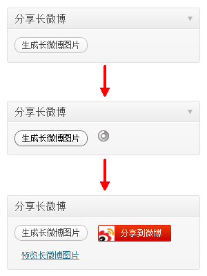

上礼拜不小心接了一个同事的话茬，说“试试写一个 WordPress 发布长微博的插件”。自作孽不可活。自己挖的坑，自己跳了，最后还得自己填……

鉴于我拙劣的二手 PHP 水平，什么颜色、样式、图文混排，我都不会，所以就不做了。不过我发现有好些长微博工具都没能把排版处理好，英文单词腰斩的现象比较普遍，因此我想我要做这么一个东西，就扬长避短，把排版处理好一点吧。从产品设计的角度来说，我个人认为处理好这个问题的优先级，要高于颜色、样式、图文混排等功能，是关系到最基本阅读体验的“核心需求”。

插件没有配置界面，上传到 WordPress 插件目录后，登录后台激活即可。进入文章编辑界面，如果当前文章的发布状态是“公开发布”，您就会在右侧看到分享长微博的选项。只需简单的点击，就可以把文章/页面内容转换成图片，分享到新浪微博。

txt2img 插件已提交至 WordPress 官方插件目录，下载请访问 [https://wordpress.org/plugins/txt2img/](https://wordpress.org/plugins/txt2img/)。

当然，您在使用过程中可能也会觉得有些地方不爽，比如：

- 因为没有申请微博的 appkey，不能够“一键转发”（需要按两次鼠标）。
- 选用的字体是 Droid Sans Fallback，这属于我个人喜好，您可以自行修改。
- 我没有文字排版等相关的开发经验，因此没有实现图文混排，字体字号颜色等编辑功能，暂时还不会。
- 排版没有像 Microsoft Office Word 那样做两端对齐，因为寒老师似乎已经忘了答应给我写排版算法这回事。
- 请补充………

上面提到这些问题，如果您有好的解决方案，欢迎给 [https://github.com/myst729/txt2img](https://github.com/myst729/txt2img) 贡献代码。
