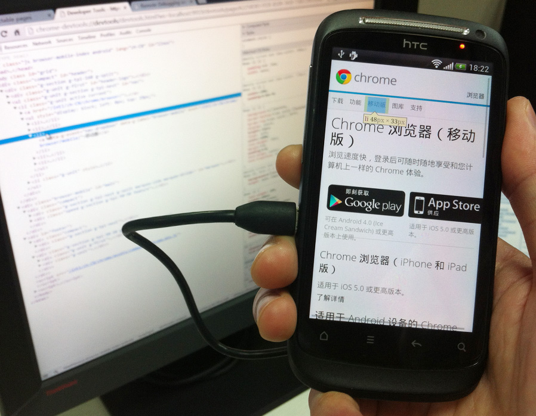

随着智能手机的普及，移动设备的浏览器功能越来越强大，我们用手机上网时，看到的再也不是难看的 wap 页面了。移动页面越来越复杂，随之而来的就是前端开发者需要面对更多开发和调试的问题。回想十年前，web 前端开发的工具十分匮乏，这种窘境一直持续到 [Firefox](https://www.mozilla.org/firefox/) 和 [Firebug](https://getfirebug.com/) 出现，才算是有了起色。

移动 web 前端开发毫不意外的重演了这段历史。两年前我刚接触智能移动设备 web 开发时，Android 还在 2.x 版本。当时的情况非常艰苦，文档稀缺，几乎没有辅助的 web 开发和调试工具，加上 Android 系统自身也有很多坑，web 前端调试苦不堪言。那时候我们最常用的调试方法是大家都非常熟悉的“alert 大法”，也就是把需要的信息通过 `alert()` 函数显示在页面弹出的对话框里。

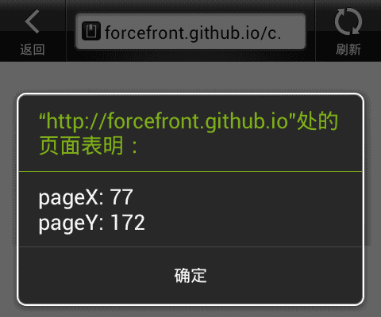

是不是有点时光倒流的感觉？不过“alert 大法”也有很多问题，比如它会打断 UI 交互，阻塞代码执行，因此我们很快抛弃了它，转而使用自己手写的，嵌入页面的控制台。

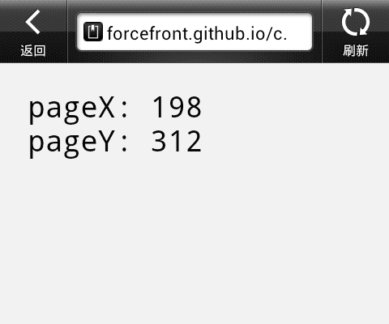

这个控制台（其实只是信息输出）虽然功能非常弱，相比桌面浏览器现有的调试工具落后了十万八千里，但比起“alert 大法”也算是有比较大地改善了。

相对于以前的 web 开发者而言，今天的移动 web 开发者要幸福得多。除了移动浏览器对 web 标准较高的支持程度，开发者们等待工具的时间更是大大缩短了。近两年陆续出现了一些移动浏览器的远程调试工具，使得我们可以通过 PC 上开启的控制台，调试手机浏览器中正在运行的代码，比如较早出现的 [weinre](https://people.apache.org/~pmuellr/weinre/)、iOS 平台上非常受欢迎的 [MIHTool](http://www.mihtool.com/)（国人作品），目前功能还比较搓的 [Adobe Edge Inspect CC](http://html.adobe.com/edge/inspect/) 等。除此之外，浏览器厂商也纷纷推出自己的调试工具，比如 [Opera Mobile 可以借助桌面的 Opera Dragonfly 实现远程调试](https://dev.opera.com/articles/remote-debugging-with-opera-dragonfly/)，[iOS Safari 可以在 Mac OS X 系统中进行调试](http://developer.apple.com/library/ios/#documentation/AppleApplications/Reference/SafariWebContent/DebuggingSafarioniPhoneContent/DebuggingSafarioniPhoneContent.html)。运行于 Android 4+ 系统的 Chrome for Android 同样也可以[配合 ADB（Android Debug Bridge）实现桌面远程调试](https://developers.google.com/chrome-developer-tools/docs/remote-debugging)。

今天我们就来了解一下如何进行 Chrome for Android 的远程调试。

开始之前，先做一些准备工作：

1. 在手机上访问 Google Play 商店，安装 [Chrome for Android](https://play.google.com/store/apps/details?id=com.android.chrome)。

  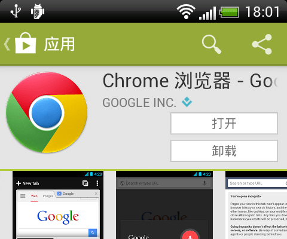

2. 到 Android 开发者中心下载 [ADT Bundle](http://developer.android.com/sdk/index.html)。

  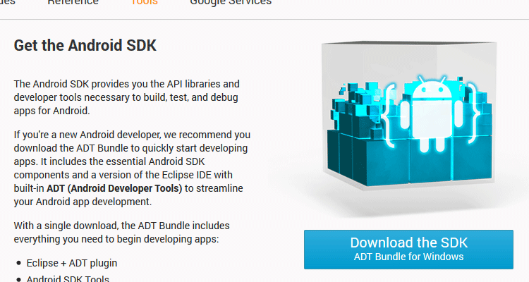

3. 解压后打开 SDK Manager，确保 Platform-tools 已安装。

  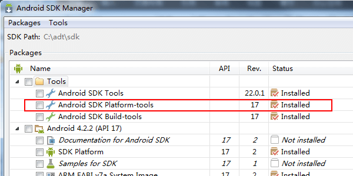

4. 通过 USB 线缆把手机连接到 PC，并开启系统设置中的 USB 调试。

  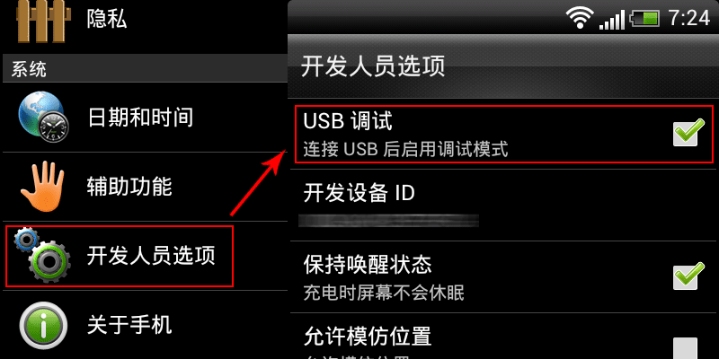

5. 开启 Chrome 设置中的 USB 调试选项。

  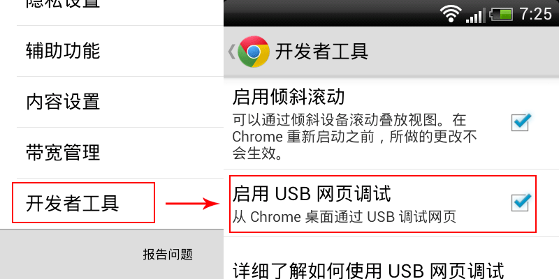

准备就绪，终于可以开始了。

打开命令行工具，运行 platform tools 中的 ADB (Android Debug Bridge)，在选定的端口号启动 Chrome 远程调试工具。

```bash
adb forward tcp:9919 localabstract:chrome_devtools_remote
```

输入的指令比较长，注意不要敲错了。成功后可以看到守护进程已经运行起来了：

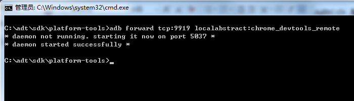

如果守护进程没有运行成功，可以输入 `adb kill-server`，重新试一次。ADB 必须带参数运行。如果直接输入 adb 就会打开它的帮助，可以看到各种参数的用法。比如输入 `adb devices` 就会列出当前通过 USB 连接到 PC 的所有设备：

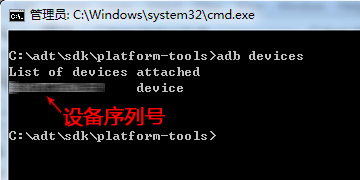

在手机上用 Chrome 随便打开几个网页：

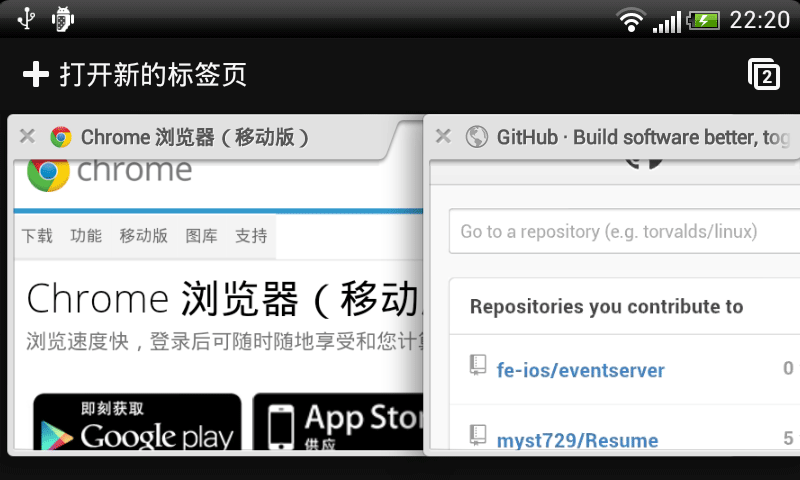

打开 PC 端的 Chrome 访问 **http://localhost:9919/**（端口号就是刚才启动远程调试时使用的端口号），应该可以看到手机 Chrome 已经打开页面的缩略图：

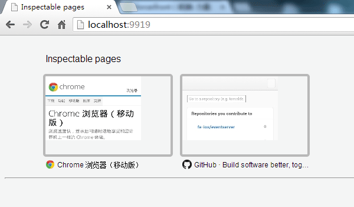

任意点击一个缩略图…… 页面打不开！


原因是 *appspot.com* 很早以前就被墙掉了，所以我们还得自备梯子。翻过墙以后，终于看到了远程调试页面，和 Chrome 内置的调试工具一模一样：

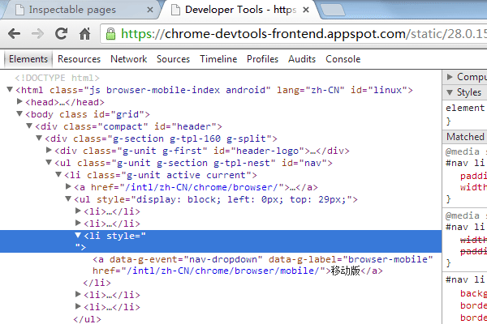

同时可以观察到手机上 Chrome 对调试工具的响应：

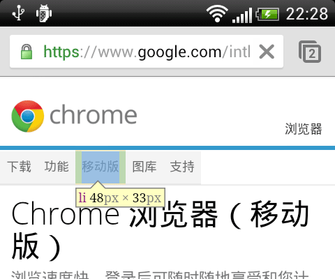

改改样式试试：

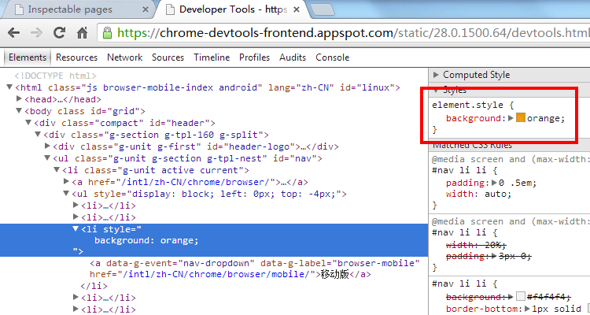

手机 Chrome 中的页面立刻反映出了变化：

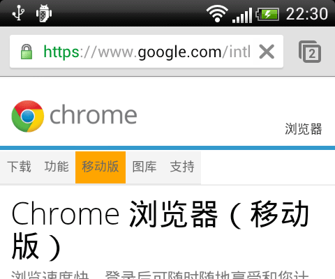

打开控制台执行 JavaScript：

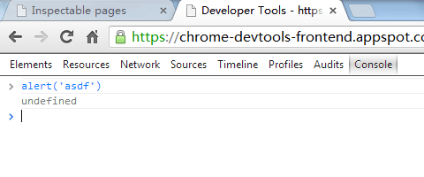

也没有问题：

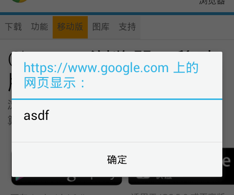

好了，写到这里，你应该清楚接下去要怎么玩弄它了吧……

补充：

1. 其实 ADT Bundle 这个大家伙是 Android 应用开发的一整套工具，而我们需要用的只是一个 ADB。因此如果你不打算做原生应用开发，并且有可靠的来源得到 ADB，完全可以不下载 ADT Bundle。

2. ~~翻墙后看到的调试界面和 Chrome 内置的调试工具非常像，那我们能不能直接调用内置的调试工具，从而免去翻墙的周折呢？答案是可以的，只需要替换远程调试页面的协议和路径。比如原先需要翻墙的地址是：**http://chrome-devtools-frontend.appspot.com/static/28.0.1500.64/devtools.html**?ws=localhost:9919/devtools/page/6C75490A-5E7A-DA49-A82B-5CD233CAF1B1，只要把加粗的部分替换成 **chrome-devtools://devtools/devtools.html**，就可以不用翻墙直接打开。~~改协议的路子已经被堵死了，同学们还是老老实实翻墙吧……

  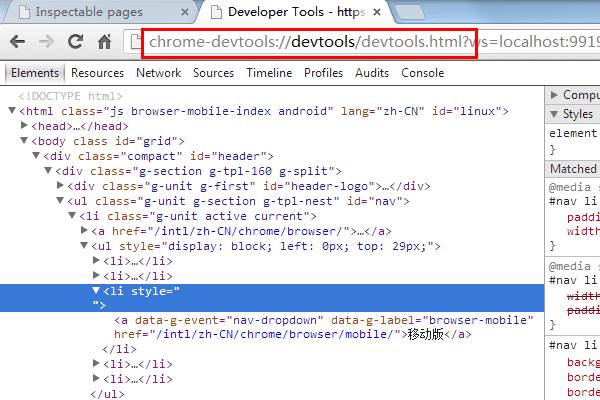

3. 最近 Chrome Web Store 推出了一个新的 Chrome 扩展，就叫 [ADB](https://chrome.google.com/webstore/detail/adb/dpngiggdglpdnjdoaefidgiigpemgage)。安装这个扩展后，我们既不需要下载庞大的 ADT Bundle，也不用在命令行输入那些难记的指令，只要点几下鼠标就可以开始远程调试！具体的用法请看[这里](https://developers.google.com/chrome-developer-tools/docs/remote-debugging#remote-debugging-beta)。

  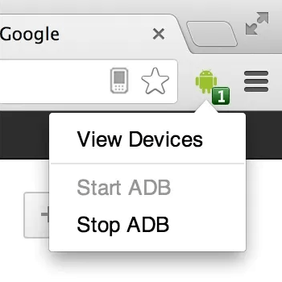

  ~~这个扩展目前只支持桌面的 Chrome beta、dev 和 canary 分支，不过我认为这只是时间问题，相信过不了多久稳定版 Chrome 也可以用上它了。~~好消息，最新的稳定版 Chrome 已经可以正常使用 ADB 插件了。从 Android 4.4 (KitKat) 开始，原生应用中的 WebView 也可以通过 ADB 来调试了。
