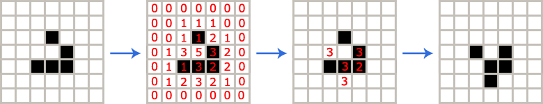
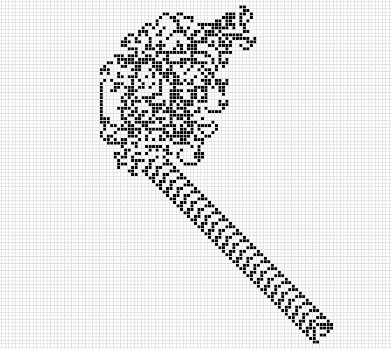
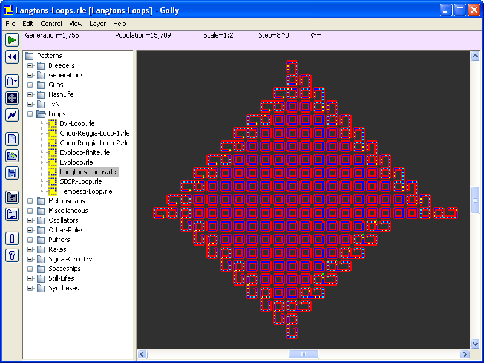

最近写了两个“零玩家游戏”项目：[生命游戏](https://myst729.github.io/toys/game-of-life/)和[兰顿蚂蚁](https://myst729.github.io/toys/langton-s-ant/)。虽然有“游戏”两个字，然而跟我们通常意义上的游戏不同，“[零玩家游戏](https://en.wikipedia.org/wiki/Zero-player_game)”在游戏过程中是不需要人类玩家参与的，我们只能观察它，而不能干预游戏世界的演化。在计算机科学领域，这个词组通常指由使用人工智能的程序代替人类进行的游戏（如：计算机对弈）。因此，零玩家游戏在人工智能领域也占有相当的地位，很多人工智能专家都发明过以自己的名字命名的零玩家游戏。生命游戏和兰顿蚂蚁就是两个很典型的零玩家游戏。生命游戏需要玩家在游戏开始前给定一个输入（游戏的初始状态），而兰顿蚂蚁甚至连玩家输入都不需要。

10 岁的时候我得到了这套张远南先生编撰的[《数学故事丛书》](https://baike.baidu.com/item/%E6%95%B0%E5%AD%A6%E6%95%85%E4%BA%8B%E4%B8%9B%E4%B9%A6)（80 后的同学应该有不少人都对这套书有印象吧），从中我第一次了解到[生命游戏](https://en.wikipedia.org/wiki/Conway's_Game_of_Life)。1970 年，英国数学家约翰·何顿·康威（[John Horton Conway](https://en.wikipedia.org/wiki/John_Horton_Conway)）发明了生命游戏并发表在当年 10 月《科学美国人》（[Scientific American](https://en.wikipedia.org/wiki/Scientific_American)，美国的一本科普杂志，始于 1845 年 8 月 28 日，为美国历史最长的、一直连续出版的杂志）的马丁·加德纳（[Martin Gardner](https://en.wikipedia.org/wiki/Martin_Gardner)，著名科普作家，《啊哈？灵机一动》等书的作者）“数学游戏”专栏。

生命游戏（Conway’s Game of Life）是由无限个正方形格子构成的二维世界。每个格子（细胞）有两种状态：存活或死亡。每个细胞都可以和以自身为中心的周围八个细胞（邻居）产生互动，进行演化。生命游戏的演化规则如下：

+ 当前细胞为死亡状态，且恰好有 3 个存活的邻居，该细胞变成存活状态。 （适宜繁殖）
+ 当前细胞为存活状态，且存活的邻居少于 2 个，该细胞变成死亡状态。（人口稀少无法繁殖）
+ 当前细胞为存活状态，且有 2 个或 3 个存活的邻居，该细胞继续存活。（适宜的生存环境）
+ 当前细胞为存活状态，且存活的邻居超过 3 个，该细胞变成死亡状态。（过度拥挤）

看明白了吗？没明白的话我们通过下面这个简单的例子来感受一下。

1. 给定一个初始状态。
2. 标出每个细胞的存活邻居个数。
3. 根据演化规则，只留下可以存活的细胞。
4. 完成一次演化。

生命游戏的规则就是这么简单，但你可千万别小看这个游戏。上 Youtube 随便搜一搜，你会看到很多令人震惊的视频，甚至有无比奇幻的[分形](https://en.wikipedia.org/wiki/Fractal)演化！

相比之下，兰顿蚂蚁（[Langton’s Ant](https://en.wikipedia.org/wiki/Langton's_ant)）更加简单。兰顿蚂蚁的世界也是由方格构成的二维平面，格子有两种颜色：黑色或白色。其中一个格子里有一只“蚂蚁”，它的头部朝向上下左右其中一方。兰顿蚂蚁的游戏规则如下：

+ 如果蚂蚁在黑格，右转 90 度，翻转所在格子的颜色，并向它所朝方向移动一格。
+ 如果蚂蚁在白格，左转 90 度，翻转所在格子的颜色，并向它所朝方向移动一格。

刚开始，蚂蚁走过的路线看起来是杂乱无章的，并且只在某个范围内活动。但不论起始状态如何，蚂蚁最终会留下一条让你意想不到路线。

如果你觉得上面两个游戏还不够过瘾，可以下载 [Golly](http://golly.sourceforge.net/) 这个开源软件，里面有非常多的[细胞自动机](https://en.wikipedia.org/wiki/Cellular_automaton)（人工智能的一类）游戏，包你玩个够！

