前言：本文源于前几天看到的一条[微博](https://weibo.com/1057676857/Adpfwwfsv)：


对于这种言论我并不赞同。我大学学的是化学，没有学习过计算机专业的课程，但我认为至少这个问题并不需要多么高端的计算机专业知识，只要中学数学没有全还给老师，就应该能给出至少一种解法。比如说，我就随便涂了一个多边形和一个点，现在我要找出一种通用的方法来判断这个点是不是在多边形内部（别告诉我用肉眼观察……）。

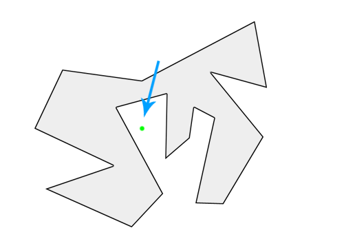

首先想到的一个解法是从这个点做一条射线，计算它跟多边形边界的交点个数，如果交点个数为奇数，那么点在多边形内部，否则点在多边形外。


这个结论很简单，那它是怎么来的？其实，对于平面内任意闭合曲线，我们都可以直观地认为，曲线把平面分割成了内、外两部分，其中“内”就是我们所谓的多边形区域。

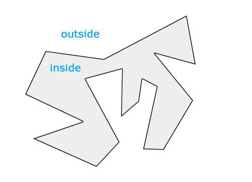

基于这一认识，对于平面内任意一条直线，我们可以得出下面这些结论：

1. 直线穿越多边形边界时，有且只有两种情况：**进入**多边形或**穿出**多边形。
2. 在不考虑非欧空间的情况下，直线不可能从内部再次进入多边形，或从外部再次穿出多边形，即连续两次穿越边界的情况必然成对。
3. 直线可以无限延伸，而闭合曲线包围的区域是有限的，因此最后一次穿越多边形边界，一定是穿出多边形，到达外部。

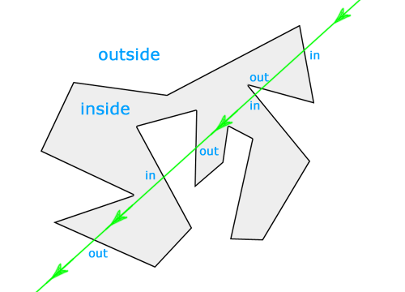

现在回到我们最初的题目。假如我们从一个给定的点做射线，还可以得出下面两条结论：

1. 如果点在多边形内部，射线第一次穿越边界一定是穿出多边形。
2. 如果点在多边形外部，射线第一次穿越边界一定是进入多边形。

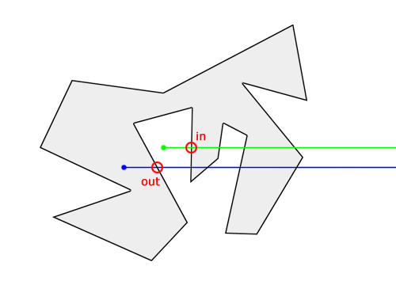

把上面这些结论综合起来，我们可以归纳出：

1. 当射线穿越多边形边界的次数为偶数时，所有**第偶数次**（包括最后一次）穿越都是穿出，因此所有**第奇数次**（包括第一次）穿越为穿入，由此可推断点在多边形外部。

  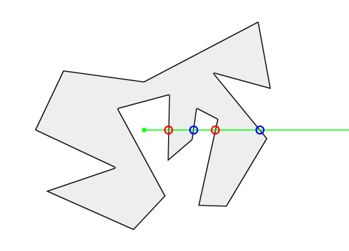

2. 当射线穿越多边形边界的次数为奇数时，所有**第奇数次**（包括第一次和最后一次）穿越都是穿出，由此可推断点在多边形内部。

  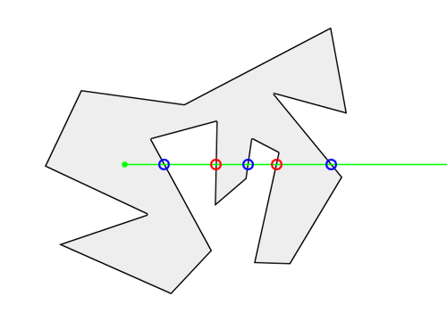

到这里，我们已经了解这个解法的思路了，下面接着看算法实现的一些具体问题和边界条件的处理。

1. **点在多边形的边上**

  上面我们讲到，这个解法的主要思路就是计算射线穿越多边形边界的次数，那么对于点在多边形的边上这种特殊情况，射线出发的这一次，是否应该算作穿越呢？

  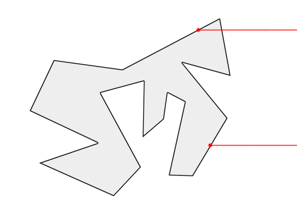

  看了上面的图就会发现，不管算不算穿越，都会陷入两难的境地——同样落在多边形边上的点，可能会得到相反的结果。这显然是不正确的，因此对这种特殊情况需要特殊处理。

2. **点和多边形的顶点重合**

  这其实是第一种情况的一个特例。

  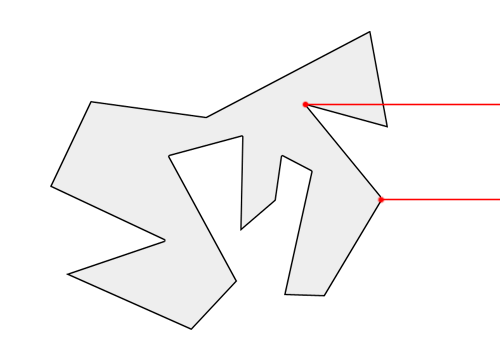

3. **射线经过多边形顶点**

  射线刚好经过多边形顶点的时候，应该算一次还是两次穿越？这种情况比前两种复杂，也是实现中的难点。

  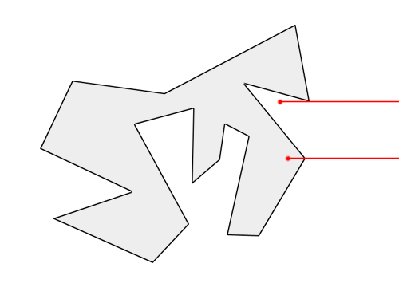

4. **射线刚好经过多边形的一条边**

  这是上一种情况的特例，也就是说，射线连续经过了多边形的两个相邻顶点。

  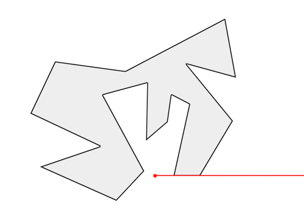

**解决方案：**

1. 判断点是否在线上的方法有很多，比较简单直接的就是计算点与两个多边形顶点的连线斜率是否相等，中学数学都学过。

2. 点和多边形顶点重合的情况更简单，直接比较点的坐标就行了。

3. 顶点穿越看似棘手，其实我们换一个角度，思路会大不相同。先来回答一个问题，射线穿越一条线段需要什么前提条件？没错，就是线段两个端点分别在射线两侧。只要想通这一点，顶点穿越就迎刃而解了。这样一来，我们只需要规定被射线穿越的点都算作其中一侧。

  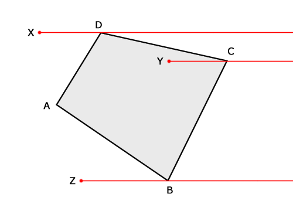

  如上图，假如我们规定**射线经过的点都属于射线以上的一侧**，显然点 D 和发生顶点穿越的点 C 都位于射线 Y 的同一侧，所以射线 Y 其实并没有穿越 CD 这条边。而点 C 和点 B 则分别位于射线 Y 的两侧，所以射线 Y 和 BC 发生了穿越，由此我们可以断定点 Y 在多边形内。同理，射线 X 分别与 AD 和 CD 都发生了穿越，因此点 X 在多边形外，而射线 Z 没有和多边形发生穿越，点 Z 位于多边形外。

4. 解决了第三点，这一点就毫无难度了。根据上面的假设，射线连续经过的两个顶点显然都位于射线以上的一侧，因此这种情况看作没有发生穿越就可以了。由于第三点的解决方案实际上已经覆盖到这种特例，因此不需要再做特别的处理。

这种简单直观的算法通常叫做[射线法](https://en.wikipedia.org/wiki/Point_in_polygon#Ray_casting_algorithm)或**奇偶法**，下面给出 JavaScript 的算法实现。

```js
/**
 * @description 射线法判断点是否在多边形内部
 * @param {Object} p 待判断的点，格式：{ x: X 坐标, y: Y 坐标 }
 * @param {Array} poly 多边形顶点，数组成员的格式同 p
 * @return {String} 点 p 和多边形 poly 的几何关系
 */
function rayCasting(p, poly) {
  var px = p.x,
      py = p.y,
      flag = false

  for(var i = 0, l = poly.length, j = l - 1; i < l; j = i, i++) {
    var sx = poly[i].x,
        sy = poly[i].y,
        tx = poly[j].x,
        ty = poly[j].y

    // 点与多边形顶点重合
    if((sx === px && sy === py) || (tx === px && ty === py)) {
      return 'on'
    }

    // 判断线段两端点是否在射线两侧
    if((sy < py && ty >= py) || (sy >= py && ty < py)) {
      // 线段上与射线 Y 坐标相同的点的 X 坐标
      var x = sx + (py - sy) * (tx - sx) / (ty - sy)

      // 点在多边形的边上
      if(x === px) {
        return 'on'
      }

      // 射线穿过多边形的边界
      if(x > px) {
        flag = !flag
      }
    }
  }

  // 射线穿过多边形边界的次数为奇数时点在多边形内
  return flag ? 'in' : 'out'
}
```

除了射线法还有很多其他的方法，下面再介绍一种[回转数法](https://en.wikipedia.org/wiki/Point_in_polygon#Winding_number_algorithm)。

平面中的闭合曲线关于一个点的[回转数](https://en.wikipedia.org/wiki/Winding_number)（又叫卷绕数），代表了曲线绕过该点的总次数。下面这张图动态演示了回转数的概念：图中红色曲线关于点（人所在位置）的回转数为 2。

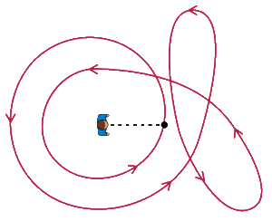

回转数是拓扑学中的一个基本概念，具有很重要的性质和用途。本文并不打算在这一点上展开论述，这需要具备相当的数学知识，否则会非常乏味和难以理解。我们暂时只需要记住回转数的一个特性就行了：**当回转数为 0 时，点在闭合曲线外部**（回转数大于 0 时所代表的含义，大家可以自己想一想，还是很有趣的）。

对于给定的点和多边形，回转数应该怎么计算呢？

1. 用线段分别连接点和多边形的全部顶点。

  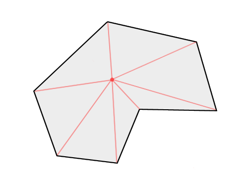

2. 计算所有点与相邻顶点连线的夹角。

  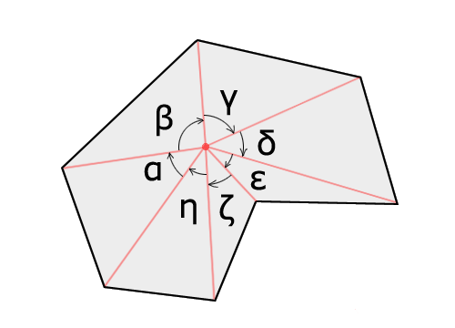

3. 计算所有夹角和。注意每个夹角都是有方向的，所以有可能是负值。

  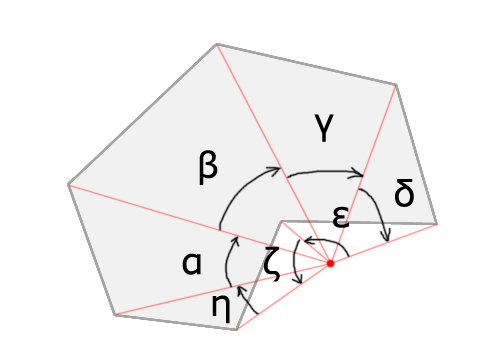

4. 最后根据角度累加值计算回转数。看过前面的介绍，很容易理解 360°（2π）相当于一次回转。

思路介绍完了，下面两点是实现中需要留意的问题。

1. JavaScript 的数只有 64 位双精度浮点这一种。对于三角函数产生的无理数，浮点数计算不可避免会造成一些误差，因此在最后计算回转数时需要做取整操作。
2. 通常情况下，平面直角坐标系内一个角的取值范围是 -π 到 π 这个区间，这也是 JavaScript 三角函数 `Math.atan2()` 返回值的范围。但 JavaScript 并不能直接计算任意两条线的夹角，我们只能先计算两条线与 X 正轴夹角，再取两者差值。这个差值的结果就有可能超出 -π 到 π 这个区间，因此我们还需要处理差值超出取值区间的情况。

这里也给出回转数法的 JavaScript 实现。

```js
/**
 * @description 回转数法判断点是否在多边形内部
 * @param {Object} p 待判断的点，格式：{ x: X 坐标, y: Y 坐标 }
 * @param {Array} poly 多边形顶点，数组成员的格式同 p
 * @return {String} 点 p 和多边形 poly 的几何关系
 */
function windingNumber(p, poly) {
  var px = p.x,
      py = p.y,
      sum = 0

  for(var i = 0, l = poly.length, j = l - 1; i < l; j = i, i++) {
    var sx = poly[i].x,
        sy = poly[i].y,
        tx = poly[j].x,
        ty = poly[j].y

    // 点与多边形顶点重合或在多边形的边上
    if((sx - px) * (px - tx) >= 0 && (sy - py) * (py - ty) >= 0 && (px - sx) * (ty - sy) === (py - sy) * (tx - sx)) {
      return 'on'
    }

    // 点与相邻顶点连线的夹角
    var angle = Math.atan2(sy - py, sx - px) - Math.atan2(ty - py, tx - px)

    // 确保夹角不超出取值范围（-π 到 π）
    if(angle >= Math.PI) {
      angle = angle - Math.PI * 2
    } else if(angle <= -Math.PI) {
      angle = angle + Math.PI * 2
    }

    sum += angle
  }

  // 计算回转数并判断点和多边形的几何关系
  return Math.round(sum / Math.PI) === 0 ? 'out' : 'in'
}
```

也有人问到像下面这种复杂多边形有没有办法？答案是肯定的。至于为什么，就留给大家思考吧。

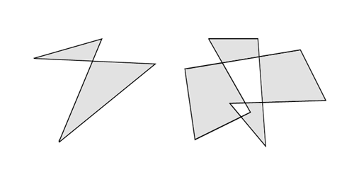
