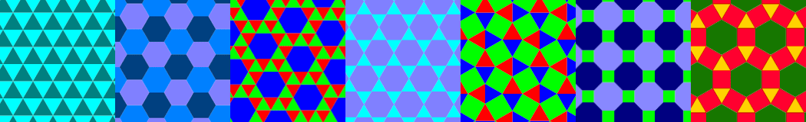

[A* 算法](https://en.wikipedia.org/wiki/A*_search_algorithm)是一种解决图遍历问题的计算机算法，在电子游戏中最主要的应用是寻找地图上两点间的最佳路线。

为了便于理解，本文将以正方形网格地图为例进行讲解。

如图，蓝色格子是障碍物，灰色格子是可通过区域，绿色格子是起点（S），红色格子是终点（D）。我们要做的是找到一条从起点到终点的最佳路线。

为了顺利地解决问题，我们先要设定一些约束条件：

1. 从一个格子可以朝周围 8 个方向移动。其中朝上、下、左、右移动的成本为 1，朝左上、右上、左下、右下移动的成本为 1.4（&radic;2 近似值）；

   

2. 不能朝障碍物所在格子移动（显然啦！）；

   

3. 如果右边和上边两个格子都是障碍物，则不能朝右上方的格子移动（如图：不能朝右上和右下两个格子移动，太窄挤不过去呀～）。

   

好，下面开始找路！

首先，我们把起点 S 加入一个待检查节点的列表（Open List）。

接下来，找出 S 周围所有可移动的格子（邻居），算出从 S 移动到该格子的总成本（记为 G），并将 S 设为其父节点。

好，这样我们已经完成了对 S 的检查。把上一步找到的邻居都加入 Open List。从 Open List 中移除 S，并将其加入另一个已检查节点的列表（Closed List）。如图，橙色边框代表待检查节点，黑色边框代表已检查节点。

这下问题来了，Open List 一下有了 8 个待检查节点，先检查哪一个呢？每一个待检查节点都有一个 G 值，代表从起点 S 移动到这个节点的成本。我们再计算出每一个待检查节点与终点 D 之间的[曼哈顿距离](https://en.wikipedia.org/wiki/Taxicab_geometry)（只通过朝上、下、左、右四个方向的移动，抵达终点 D 的最短距离），作为从该节点移动到终点 D 的估算成本（记为 H）。注意！这里计算曼哈顿距离时要忽略所有障碍物。最后把 G 和 H 相加（记为 F）。

现在，从 Open List 中选出 F 值最小的节点（上图中应该是 S 右边 F 值为 4 的格子），对它执行前面的检查。不过这一次搜索邻居时需要注意以下几点：

+ 如果邻居已经在 Closed List 中，直接忽略；

+ 如果邻居不在 Open List 中，计算 G、H、F，设置父节点，并将其加入 Open List；

+ 这一点非常重要！如果邻居已经在 Open List 中（即该邻居已有父节点），计算从当前节点移动到该邻居是否能使其得到更小的 G 值。如果能，则把该邻居的父节点重设为当前节点，并更新其 G 和 F 值。

完成检查后，把当前节点从 Open List 中移除，放入 Closed List。

继续处理其他待检查节点。

注意！在下面这一次检查中，S 下方两格的节点（星标）更新了 G 值和父节点。

在下面这一步中，我们注意到终点 D 已经进入了 Open List，并且是其中 F 值最小的。

我们从 Open List 取出的 F 值最小的节点后，发现它的 H 值为 0，这意味着我们已经找到了终点 D，搜索到此就可以告一段落。

从终点 D 开始，依次向父节点移动，直到回到起点 S，途经即最佳路线，总长 5.6。

算法讲解完毕，请各位自己动手尝试实现吧。

查看[在线演示](https://myst729.github.io/toys/a-star-pathfinding/)

---

## 补充几点

1. 最佳路线可能有多条，比如本文的示例，下图也是一条总长为 5.6 的路线。这取决于当 Open List 存在多个 F 值最小的节点时，先选取哪一个进行搜索；

   

2. 曼哈顿距离只是估算 H 值最简单的一种方法，常用的方法还有[欧几里德距离](https://en.wikipedia.org/wiki/Euclidean_distance)、[切比雪夫距离](https://en.wikipedia.org/wiki/Chebyshev_distance)等。估算方法的优劣是影响算法效率的重要因素；

3. Open List 的数据结构也是算法实现的改良点。通常为了从中取出 F 值最小的节点，我们需要遍历整个 Open List，对其排序。因此，维护一个好的 Open List 结构，减少遍历，也能够提高算法的效率；

4. 实际应用中，为提高效率，还可以进行双向搜索。从起点和终点分别发起搜索，一方搜索到另一方的已检查节点时，即找到最佳路线。地图较复杂时，双向搜索可以显著减少寻路过程中检查的节点数量。

5. 除了正方形网格地图，A* 算法也能处理其他正多边形镶嵌和复杂甚至不规则多边形镶嵌的地图。其区别在于对邻居的处理和计算；

   

6. A* 算法并不保证得到的路线是平滑的。为了解决这个问题，我们可以对转向进行惩罚。即当移动方向发生变化时，增加额外的 G 值，以此提高转向的成本，从而得到更平滑（转向少、转角小）的最佳路线；

7. A* 算法的在游戏中的实际应用可能会复杂得多。比如不同种族或技能的单位在同一地形上的移动成本各有差异，同一单位在草地、泥地、砂石、沼泽等各种地形上移动的成本也不尽相同（对应不同的 G 值增量），甚至允许以较高的成本翻越障碍（翻墙、过河等）；

8. 在游戏中你可能还需要处理与障碍物和其他移动单位的碰撞；

9. 请补充……
