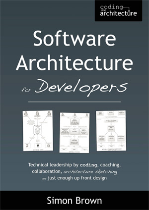

三月开始联系试译，四月签下翻译合同，七月完成翻译初稿，到这个月终于要出版了。

---

## 译者序 2.0

在本书行将出版之时读到周爱民老师写的推荐序，感触良多。因而书还未面世，译者序就写了第二稿，倒也跟 IT 行业的风格挺契合——很多软件首次发布时的版本号都是 2.0，甚至更高。

---

### 初识软件架构

我是从一个小互联网公司走出来的野生程序员。小公司里没有很细的分工，程序员必须像万金油，什么都会一点。数据怎么分表、后端接口怎么分、URL 结构怎么定、前后端怎么接，这些都得搞定。事情多了，必须想清楚。

我在盛大创新院做的最后一个项目是一个 iOS 垂直社交应用。两个同事合作开发 iOS 客户端，而我在这个项目里的工作是开发一个 REST 架构的数据服务。需求很简单，就是根据客户端的应用场景编写一整套 API。当第一个里程碑的所有工作完成之后，我发现需求开发只占用了一小部分时间，而设计关系型数据库的结构，设计认证、授权和报告，设计应用签名和令牌，设计 REST 风格的 URL 结构，开发 API 调试工具，编写 API 文档，这些事情却耗费了大量的时间。我就想，花了这么多时间做这些事情，并没有增加任何功能，又感觉不能不做，这到底是为什么？对这个问题的思考和学习，应该算是我对软件架构的入门。

---

### 怎么会翻译这本书

两年前我进入 IBM，参与的项目是一个适用于大型数据中心的存储资源管理工具。这个工具的规模和复杂程度远远超出大多数面向普通用户的互联网应用，自然对架构的要求更为严苛。而 IBM 作为一家传统软件企业，深厚的技术积累也令我大开眼界，给了我很多学习和思考软件架构的机会和资源。

我们项目的架构师会贡献代码，会参加代码评审/回顾；我们有预先架构设计，也有架构演化；我们执行 SCRUM 方法；任何人对设计有意见，都可以给架构师写邮件，只要有理有据，就能说服他更改设计；等等。在此之前我从未见过这样奇特的组合。很快地适应了以后，我又想，这么好的方式，居然只有我们在用？直到今年三月，在微博上看到图灵的李松峰老师为 *Software Architecture for Developers* 一书征召译者。读过样章后才发现，我们就是作者理想中的团队啊！既然如此，何不尝试翻译这本书？

---

### 架构离我们并不遥远

写给程序员的软件架构，这是一个很有趣的出发点。长久以来，架构师在程序员群体中声名狼藉，软件架构被很多人认为是一项脱离现实、高高在上的工作。其实对程序员来说，架构近在眼前！下至接口设计，上至技术选型，不论你是否意识到，每个程序员或多或少都接触和参与过一些架构工作。架构师也自然而然成为相当一部分程序员的职业发展方向——你看，我们努力想要成为自己咒骂的人。

本书的作者是一位经验丰富的架构师。他从最简单的基本概念入手，对软件架构进行了层层深入的细致讲解，结合自己的实践经验，总结出很多实用的准则和方法，并且附上一个完整的开源项目来对这些内容加以佐证，帮助读者学习和理解。翻译这本书，在我看来更是对软件架构的一次系统的学习，不仅丰富了我对软件架构的理解，更改变了我对架构师这个角色的一些固有印象。这本书令我获益匪浅，希望更多有志成为架构师的程序员朋友也能从中有所收获。

---

### 周爱民老师的序

十一假期结束后打开邮箱，收到图灵的李静老师的邮件，得知周爱民老师会为这本书撰写推荐序。喜，因为爱民老师是包括我在内的很多人所敬仰的资深前辈。惶恐，因为我在软件架构方面还是个菜鸟，写作能力更与爱民老师相去甚远。

要来爱民老师的文章一读，“然后忘掉”，写得真好！我从未受过任何计算机科学或软件工程的专业训练，大学所学的化学专业也跟计算机毫无关联。因此，去看去听去做，并且**牢牢记住**，使我得以在这个行业一步步走到今天。自从对软件架构产生兴趣，也是如此逐渐学到很多概念、方法。虽然清楚架构必有权衡，不能十全十美，然而了解的知识越多，就更想面面俱到，反而放不开。殊不知，牢牢记住，也给自己画地为牢，陷入爱民老师所说的困局。

如果说这本书帮我画了一个更大的圈，那么爱民老师的文字则告诫我要跳出这个圈。我面前的架构之路还很长，不知何时能走出圈外，走到爱民老师今日所处之地。

---

### 谢谢你们

这本书的翻译能够完成，我最想感谢的人是成都七中的高中语文老师王正可。王老师是我近二十年学生生涯中最重要的一位老师：她是第一个让我对语文产生兴趣的人。王老师教给我文字的艺术，帮助我找到阅读和写作的乐趣，对我而言这是一笔巨大的财富。如果不曾有幸成为她的学生，我想我不会养成写作的习惯，更不可能有翻译图书的想法。

为了让我能够安心地翻译，家里的领导承担了洗衣、做饭、扫地（以及数钱）等繁琐的家务。对一些难以理解的字句，她也和我一起讨论。作为一个非球迷，她还陪我熬夜观看了好多场世界杯比赛，大大减轻了我因为拖延翻译而产生的负罪感。图灵公司的李松峰和李静两位老师，对我翻译这本书给予了极大的肯定和支持，并且纵容了我逾期未完工的行为。这本书也有他们的一份付出。

邓钢 2014 年 10 月 上海

