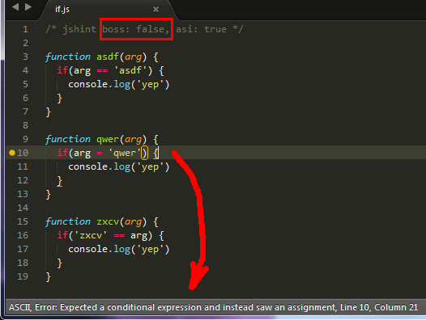

> 马克思政治经济学认为，在生产资料中，起最重要作用的是生产工具，它是社会生产力发展水平和发展状况的最主要标志。

---

昨天 Sofish 发了一条微博：

> 使用了一段时间常量前置的写法，感觉还是不习惯，有谁一直在用么？比如 `if('str' === str) blah();`

这是一种古老的用法，也曾被一些人当作最佳实践。这条微博下面的回复几乎都是赞同这种写法的，只有个别人表示反对。过去我或许也会赞同，然而现在我会明确地表示反对这种写法。为什么？我们还是先来说说这种写法出现的缘由。

通常，我们会这样写 JavaScript 的 `if` 语句：

```js
if (one === 'another') {
  // do something
}
```

是人都会出错。有时候我们会不小心把比较操作符 `===`（或 `==`）错写成赋值操作符 `=`：

```js
if (one = 'another') {
  // do something
}
```

这样一来条件表达式就变成了赋值表达式，这相当于：

```js
one = 'another'

if (one) {
  // do something
}
```

这段代码完全偏离了我们原本的设想。然而要命的是，它又完全合法！在测试覆盖不够的情况下，你甚至可能发现不了这个问题……直到出现线上 bug。小小的错误，也会带来很大麻烦。因此，有聪明人想了一个办法，把比较操作符的两边调换一下。

```js
if ('another' === one) {
  // do something
}
```

这样一来，一旦再出现写错操作符的情况，`'another' = one` 就是一个非法的赋值表达式，浏览器会报错，程序功能会挂掉——我们能够立刻发现问题。应该说，这是一种工程上的进步，我确实如此认为——代码变得更易于调试了。然而，经过最近几年炒得火热的前端工程化（工具化）浪潮，各种各样的前端工具越来越丰富。我们在工程上有了更多更好的选择，我认为这样的古法已经不再有必要。

以我最常用的 [JSHint](https://jshint.com/) 为例，它有一个 [boss](https://jshint.com/docs/options/#boss) 选项是这么说的：

> This option suppresses warnings about the use of assignments in cases where comparisons are expected. More often than not, code like `if (a = 10) {}` is a typo.

所以，只要禁用这个选项—— `boss: false` ——就可以避免我们上面提到的笔误问题。



就这样？就这样！

如同“写不写分号”、“一个 `var` 还是多个 `var`”，这也是一个很小的问题。然而很多小的问题累积起来，往往折射出一个人的工程能力。好的工具摆在面前，我们应该好好利用它。坚持用人力替代工具，这不太妙。

// 请再读一遍本文的第一段。
