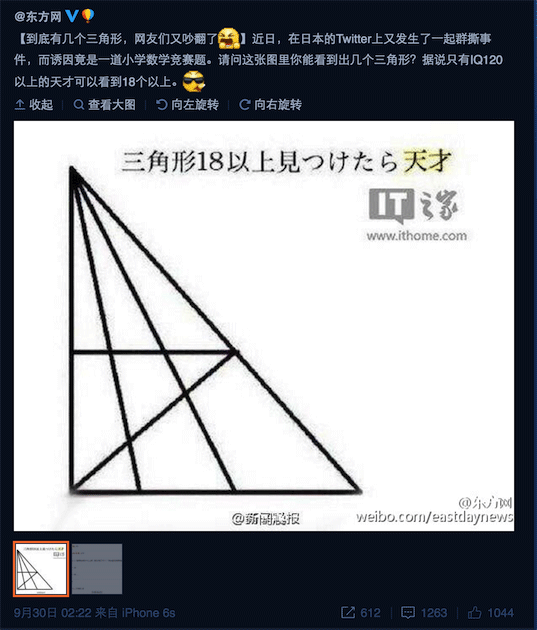
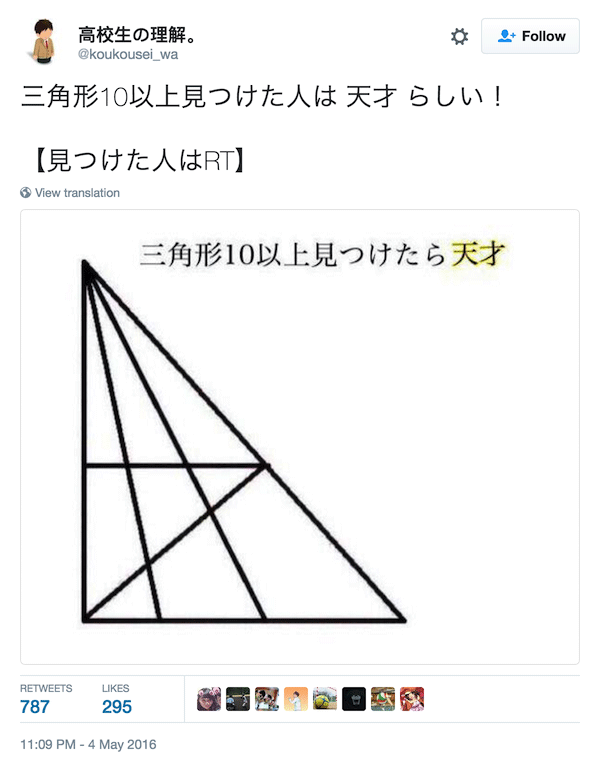
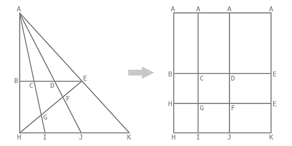

前两天看到条微博，说有条日推，声称可以数出 18 个三角形就算是智商达到 120 的天才。



找来找去，只在 Facebook 看到一条类似的，然而并没有提到智商什么的。


日推上找到的这条要求更低，天才的标准直降 8 个，好划算啊！



对于这种小学奥数入门水平都算不上的题目，怎么数就不多说了，直接给答案吧，**24**。下面要尝试的是写个算法来解类似题目，毕竟如果答案是成百上千，数起来也挺费劲的。



- 原图里面的图形既有三角形又有四边形，怎么数比较方便呢？
- 好办呀，把它们都变成四边形，全部数一遍好了。
- 等等……三角形跟四边形是一回事吗？没错，在拓扑学（[Topology](https://en.wikipedia.org/wiki/Topology)）中就是一样的。
- 经过拓扑变换，左边的原图变成了右边的矩形网格，一个三角形都没有了。
- 一个三角形都没有，那还怎么数三角形？
- 如果一个矩形有两个相同的顶点，那它在变换前就是一个三角形呀。
- 还有问题吗？

最后给代码。

```js
function polygon(points) {
  var polygons = []
  for (var i = 0; i < points.length - 1; i++) { // first row
    for (var j = i + 1; j < points.length; j++) { // second row
      for (var k = 0; k < points[i].length - 1; k++) { // first column
        for (var l = k + 1; l < points[i].length; l++) { // second column
          polygons.push(new Set([points[i][k], points[i][l], points[j][k], points[j][l]]))
        }
      }
    }
  }
  return polygons
}

var vertices = [
  ['A', 'A', 'A', 'A'],
  ['B', 'C', 'D', 'E'],
  ['H', 'G', 'F', 'E'],
  ['H', 'I', 'J', 'K']
]

var triangles = polygon(vertices).filter(p => p.size === 3)

console.log(triangles)
```
