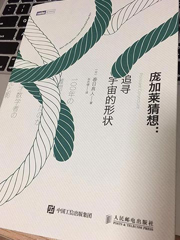
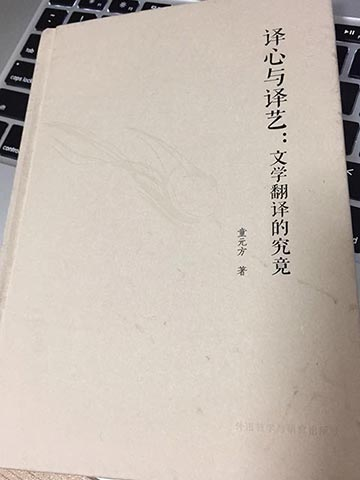

我觉得自己还勉强算是一个喜欢阅读的人。然而回想即将过去的这个 2016 年，因为各种干扰（误），读的书屈指可数。那就只说说我觉得最好的一本吧，『庞加莱猜想：追寻宇宙的形状』。

别被标题吓到，这本书讲的是数学故事，而非数学知识。全书由佩雷尔曼博士拒领菲尔茨奖这一令人瞠目的事件展开，围绕世纪难题<q>庞加莱猜想</q>，讲述了近几十年数学界发生的一些有趣的事情。具体内容不剧透了，推荐一读。

关于佩雷尔曼博士拒绝领奖这个事情，网上还有很多报导，据说里面也涉及数学界一些肮脏的派系斗争。这种龌龊事似乎在任何领域都是躲不掉的，叹息。

在 2016 年即将结束之际，经人推荐得知了这一本『译心与译艺：文学翻译的究竟』。作为一个外国文学爱好者兼图书翻译业余选手，自然是毫不犹豫地抱回来。

读来非常有趣。暂时还没有读完，不过很可能成为 2017 年读的最好的一本书。
