> 本文并非 Git 入门指南，而是面向已经掌握 Git 常规操作的开发者。如果你还是新手，或者不知道 Git 是什么，请在浏览器地址栏输入 [try.github.io](https://try.github.io/)，回车。除此之外，你最好已经掌握一些常用的 shell 命令。

---

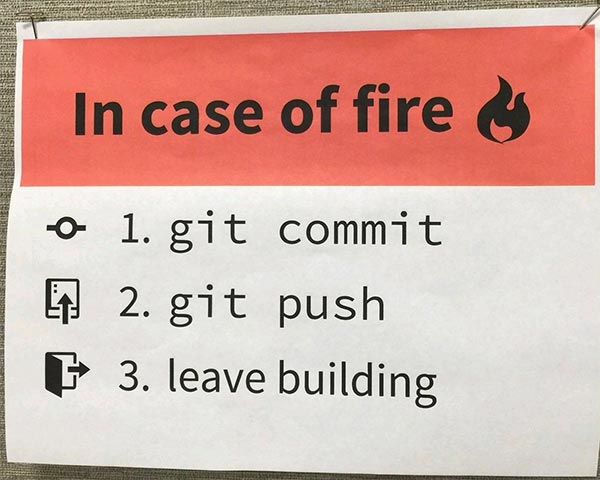

如果要票选日常使用最频繁的 Git 命令，我想 `git commit` 排第一恐怕不会有太大争议。那么问题来了，一次 `git commit` 操作背后到底发生了些什么？神秘的字符串又有什么含义？

---

## Hash 是什么？

在 Git 里面我们最常碰到的一种 hash 就是 commit hash。搜一搜百度，很容易找到答案：commit hash 是标识一次提交的唯一编码。就这么简单？是的，就这么简单。但我们想要更进一步，聊一聊它是如何产生的。

为了回答这个问题，我们要用到一个平常几乎不会接触的 Git 管道命令 [`hash-object`](https://git-scm.com/docs/git-hash-object)。Git 官方文档对这个命令的介绍是：

> Compute object ID and optionally creates a blob from a file

是不是有种一头雾水的感觉？没关系，我们来实际操作一下。打开命令行工具，输入以下内容：

```bash
echo 'leo' | git hash-object --stdin
```

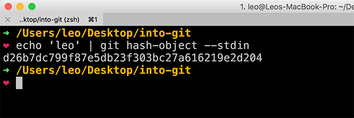

可以看到字符串 `'leo'` 的哈希结果是 d26b7dc799f87e5db23f303bc27a616219e2d204。

如果把这段内容保存到一个文件里再哈希呢？

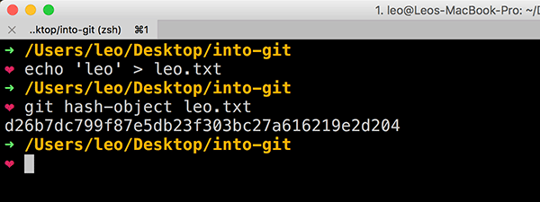

结果完全一样。试试不同的内容？

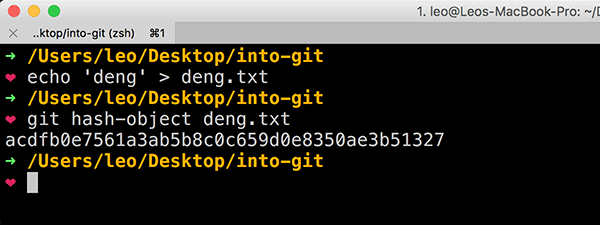

给的内容不一样，哈希结果就变了。

Git 所使用的哈希算法可以对包括 commit 在内的任意对象生成这样一个长度为 40 字符的编码，而且不同的内容，编码结果也不一样，这就是为什么 commit hash 可以唯一的标识一次提交。那么有人就问了，40 个字符虽然可以组合出非常多的字符串，但也是有限的呀，会不会出现不同的内容编码后产生了相同的结果（哈希碰撞）？理论上当然是可能的。然而目前用 Git 管理源代码的规模最大的开源项目——Linux 内核——在经历了近 70 万次提交后，也只需要用到这个编码的前 12 位，就可以对号入座了。因此，哈希碰撞的问题在 Git 里面实在太遥远了，我们暂时（根本）不用想太多。

---

## Commit 是什么？

我们的目录里已经有两个文件了，现在来创建一个 Git 仓库吧。

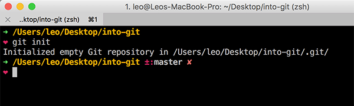

这会在当前目录下创建一个名为 .git 的隐藏目录，这就是记录 Git 仓库信息的地方。打开这个目录，里面还有一个 objects 目录，看名字应该是存一些对象的地方。不过现在除了 info 和 pack 两个空目录，这里什么都没有。

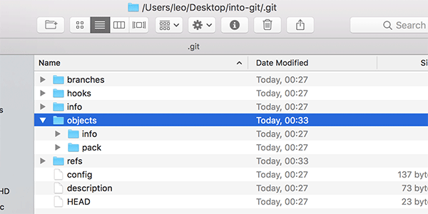

别急，刚才不是创建了两个文件吗？先提交一个到仓库里。

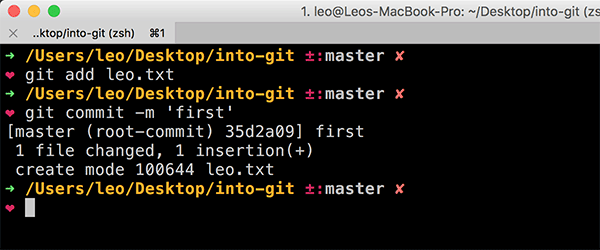

看到 35d2a09 这个字符串了吗？其实这只是 commit hash 的前七位，这是 Git 默认的短码长度。我们可以通过 `git log` 命令看到完整的 commit hash——35d2a099cee18e853990cc84a79b8cbacc85f824。

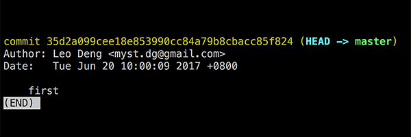

回到我们刚才打开的 .git/objects 目录，一下多出来三个文件夹！

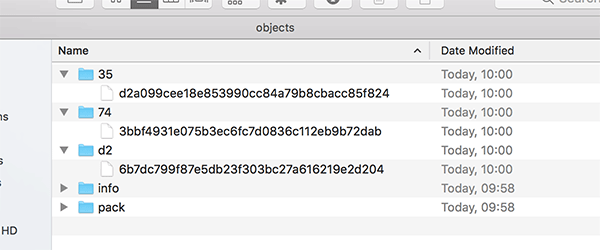

其中 35 目录下面有一个文件是 d2a099cee18e853990cc84a79b8cbacc85f824，文件夹和文件的名字拼起来正好是我们第一次提交的 commit hash。这里面会不会就记录了我们刚才这次提交的信息？

怎么看呢？我们试试另一个 Git 管道命令 [`cat-file`](https://git-scm.com/docs/git-cat-file)，官方文档对它的介绍是：

> Provide content or type and size information for repository objects

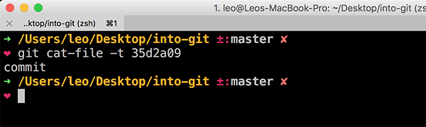

可以看到这个哈希对象的类型是 commit，我们猜得没错。

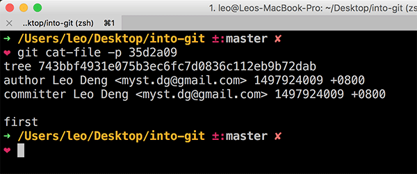

对象的内容除了作者、提交者、提交说明等基本信息，还有一条重要的信息——又一个 40 字符的哈希编码——743bbf4931e075b3ec6fc7d0836c112eb9b72dab。刚才我们还纳闷，明明一次提交，怎么多出来三个哈希文件，没想到这里就碰到了其中一个。还有，看到 tree 这个类型，我们很容易联想到 shell 命令 tree，那这个对象里面是不是保存了文件的列表？看看。

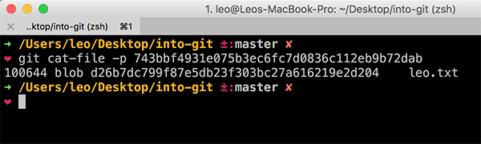

果然，第三个哈希对象也出现了，类型是 blob，对应的文件正是我们刚才提交的 leo.txt。如果你记忆力够好的话，肯定已经注意到了，这个 blob 的哈希编码跟我们最开始执行 `echo 'leo' | git hash-object --stdin` 的结果是相同的。

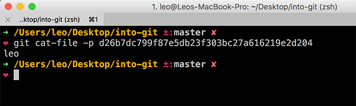

这是三个哈希对象之间的关系：

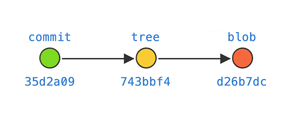

如上图，commit 对象 35d2a09 包含一个指向仓库根目录的 tree 对象 743bbf4，这个 tree 对象又包含一个文件名为 leo.txt 的 blob 对象 d26b7dc。用我们最熟悉的语言再说一遍就是，仓库根目录下有一个内容是字符串 `'leo'` 的文件 leo.txt。是不是非常准确地反映了发生提交时仓库的状态？

---

## History 是什么？

接下来，我们把 deng.txt 文件放到一个 sub 目录下面，准备进行第二次提交。

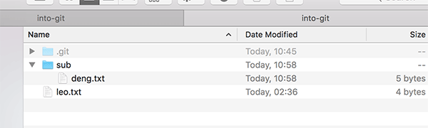

执行 `git add` 命令，再执行 `git status` 可以看到这样的信息：

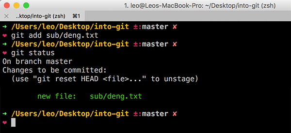

去 .git/objects 目录下看看：

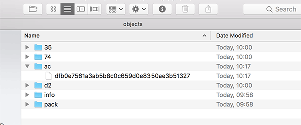

只是 `git add` 就多出来一个新的哈希对象，赶紧看看是什么。

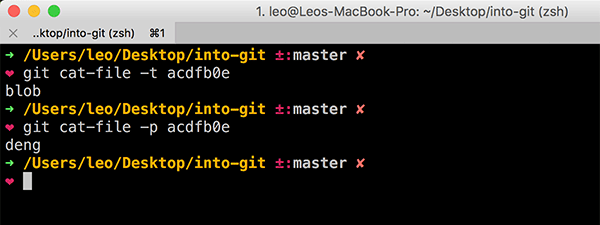

并不意外，类型是 blob，内容是 deng，正是 sub/deng.txt 文件保存的内容。由此可见，一个提交所包含的这些哈希对象并不全是在发生提交的时候才生成。继续执行 `git commit` 完成第二次提交，得到一个新的 commit hash。

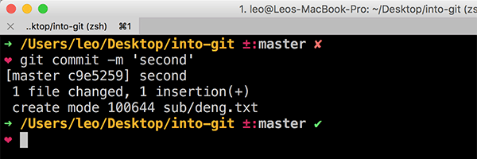

可以看到，除了 acdfb0e，又增加了三个新的哈希对象，也就是说这一次提交一共增加了四个哈希对象。

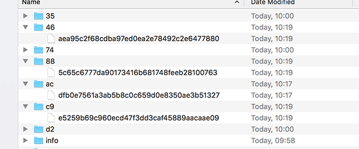

我们顺着 commit hash，挨个看看多了些什么东西。

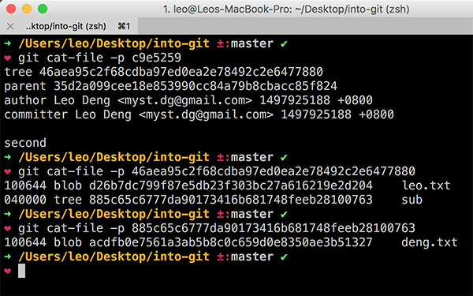

- 第二次提交的哈希对象多了一个 parent，正是第一次提交的 commit hash。结合我们已有的 Git 知识，两个 commit 对象之间的关系已经不言自明。
- 一个新的 tree 对象 46aea95，其中包含了第一次提交产生的 blob 对象 d26b7dc，以及另一个子目录 sub 的 tree 对象 885c65c。
- 885c65c 的内容是刚才 `git add` 时生成的 blob 对象 acdfb0e。

原来如此。接下来我们把 leo.txt 复制一份到 sub 目录，进行第三次提交。这一次 `git add` 之后，.git/objects 目录下并没有产生新的哈希对象。这不难理解，因为相同的内容在第一次提交已经被哈希过，两个内容相同的 leo.txt 在 Git 看来是完全相同的。继续完成提交，这一次又产生三个新的哈希对象。

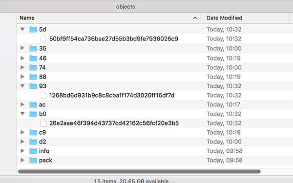

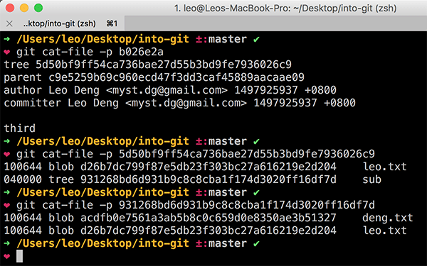

一个 commit，两个 tree。新增了一个文件，却没有产生新的 blob 对象，而是尽可能复用已有的对象，Git 的实现还是很聪明的。

到目前为止，三次提交，十个哈希对象，我们可以整理出一张完整的关系图。

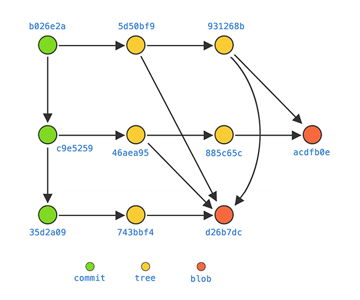

现在，我们基本上可以得出一个结论：Git 的 history 就是所有这些哈希对象构成的有向图。其中每一个 commit 对象都精确地记录了它被创建时的仓库目录结构和文件内容。这就是 Git 实现版本管理的基础。

---

## 小结

到这里，我们了解了 Git 的 hash、commit、history 的实质。[下一篇](/posts/2017/git-inside-simplified-part-2/)我们继续聊聊 branch、tag 和其他一些习以为常却大有文章的东西。
