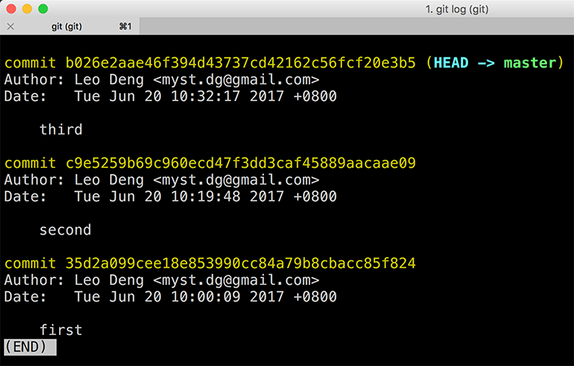
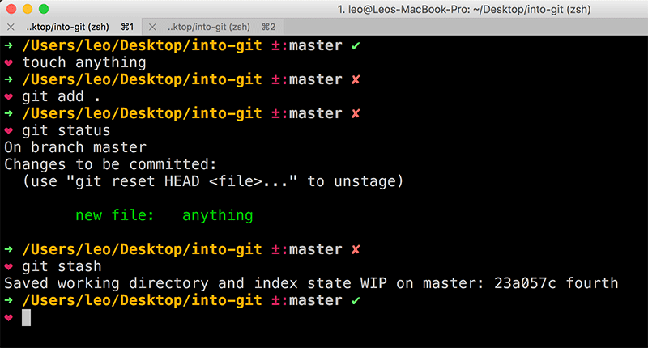

> [上一篇](/posts/2017/git-inside-simplified-part-1/)我们聊了 Git 内部的一些基本知识。这次接着聊一聊我们经常会用到的一些东西，比如 branch、tag，等等。

---

## Branch 是什么？Tag 呢？

来不及解释了，直接上 `git cat-file` 吧。怎么回事，master 分支怎么是一个 commit 对象？

我们已经知道，.git 目录下面存放了仓库的信息，其中哈希对象全都保存在 objects 目录下。那我们再去翻翻其他的目录，会发现 .git/refs/heads 目录下有一个 master 文件，这刚好是 Git 仓库的分支名，这是不是巧合？

不妨看看这个文件里面是什么东西。

是不是很眼熟？这不是第三次提交的 commit hash 吗？

原来如此，分支其实就是 commit 对象的引用。等等，这里还出现了一个 HEAD，看起来应该跟 master 一样，也是个引用。

我们注意到，.git/refs 目录下还有一个 tags 目录，这里应该就是保存标签信息的地方吧。而且看起来标签跟分支一样，也是 commit 对象的引用。创建一个标签试试。

同时在 .git/refs/tags 果然出现了一个 third 文件。

它的内容也不出所料，就是第三次提交的 commit hash。

现在，master 分支和 third 标签都是第三次提交 commit 对象的引用。当然，还有那个神秘的 HEAD。

标签和分支都是 commit 对象的引用，那它们有什么不同？别急，我们进行一次提交后再看看。

看！提交过后，master 分支以及 HEAD 都指向了最新的这个 commit，而 third 标签并没有变化，仍然是第三次提交的引用。这么看来，标签和分支都是对 commit 对象的引用，但标签的引用不会变，而分支的引用会在提交时发生变化。

---

## Git 命令 reset 做了什么？

既然标签和分支都是内容为 commit hash 的文本，我们能不能手工去修改它们呢？答案是：可以。比如，我们用文本编辑器打开 .git/refs/heads/master 和 .git/refs/tags/third，把它们的内容分别改成第三次和第二次提交的 commit hash。

并不意外，third 标签指向了第二次提交，master 指向第三次提交，而第四次提交好像没有存在过。但是，第四次提交新增的文件并没有消失，它处于 staged 状态。

我们把 .git/refs/heads/master 的内容改回第四次提交的 commit hash，然后执行 `git reset --soft b026e2a`，效果是一样的。

很明显，`git reset` 所做的事情就是修改 master 分支对 commit 对象的引用。`git reset` 还有很多参数，对仓库文件状态的处理各有不同，但它们的共同点，都是修改 .git/refs/heads 目录下，当前分支对应的引用文件。

至于标签，Git 并没有提供修改的命令。如果你发现自己创建了错误的标签，除了删除重建，也可以像我们刚才那样，手动篡改——不仅是内容，标签的名字也可以改。

---

## Git 命令 reflog 有什么用？

如果我们去看 .git/refs/objects 目录，会发现第四次提交的哈希对象还在，并没有因为 `git reset` 操作而消失（即使加了 `--hard` 参数也是如此）。然而通过 `git log` 提供的信息无法追溯到它，也就是说，第四次提交所产生的哈希对象，成为了仓库历史中的孤岛。

对于这座孤岛，我们要找到它，首先要知道它叫什么。有熟悉的同学应该反应过来了，`git reflog`。

了解了前面的知识，再看 `git reflog` 这个命令的名字，它的含义就很清楚了——打印分支的引用日志。既然如此，当然也能找到孤岛的信息，毕竟它曾在分支中留下过脚印。不用多说大家也知道了，引用变更日志一定也保存在 .git 的某个地方。没错，对于 master 分支，这个文件就是 .git/logs/refs/heads/master。

打开看看。每一行都记录了引用变更前后的 commit hash，以及造成变更的操作。也就是说，`git reflog` 命令是对这个文件的内容进行格式化的输出。当然了，只有通过 Git 命令进行的操作会记录在案，我们手动篡改的行为并没有在这里留下任何痕迹。

大家一定还有印象，23a057c 这个哈希对象是有 parent 的，为什么会掉队呢？在 Git 的设计中，每一个 commit 对象只知道自己的 parent 是谁，而不清楚谁会把自己当做 parent。因此，仓库历史只能从 HEAD 或 branch 出发，顺着 parent 链回溯到最初的 commit，对于 HEAD 或 branch 之后的 commit 对象，就选择性地无视了。

顺便提一句，很多 Git 入门教程都会告诉我们，`git pull` 等于依次执行了 `git fetch` 和 `git merge` 两个命令。如果只执行 `git fetch`，也相当于把远端的 commit 对象拿到本地，以孤岛的形式存在。当然了，也是会留下脚印的，否则 `git merge` 就没办法操作了。

---

## Git 命令 checkout 到底检出了什么？

有了孤岛的 commit hash，就可以上岸了吧。没错，这就是 `git checkout`。说到这里，有的同学可能很困扰，`git checkout` 这个命令既可以检出分支，又可以检出标签，还可以检出 commit hash，加上 `-b` 参数甚至还能创建分支，感觉好乱。看完上一篇以及本篇前面的内容，应该就比较清楚了。`git checkout` 做的事情只有一件，就是检出某个 commit 对象（你可以试试检出其他类型的哈希对象，并不会成功）。好了，上岸吧。

Git 明确的告知我们，这是一座孤岛。你所做的任何操作都有可能是徒劳，除非，你把这座孤岛变成另一个分支。通过 `git log` 可以看到，HEAD 和 master 这回终于不一样了。master 的引用还在第三次提交，而 HEAD 则始终指向当前所在的 commit。

查看分支的命令 `git branch` 也反馈了相同的信息。

这次操作当然也会记录在引用日志中。

不过，我们还是可以通过 `git checkout` 命令回到 master 分支，再执行 `git reset` 命令，让 23a057c 重新回到可追溯的历史中。

---

## Stash 是什么？

关于 `git stash` 命令怎么用，什么时候用，这里不赘述，我们只看它做了些什么。创建一个文件，加入 stash。

操作完之后，.git/objects 目录下多出来三个哈希对象。

其中两个都是 commit 对象，什么情况？

先看这个 tree 对象 cd49f69，记录文件树状态的，应该没有什么疑问，就不多解释了。

而两个 commit 对象就有点意思了。它们都包含 tree 对象 cd49f69，也拥有相同的 parent，第四次提交 23a057c。令人不解的是，26cd970 还有第二个 parent——1d1ecb1。

不过我们发现，.git/refs 目录多了一个 stash 文件，它一定指向这两个 commit 对象中的一个。

没错，stash 也是一个引用，它指向的正是拥有两个 parent 的 commit 对象 26cd970。

这两个 commit 对象和 master 分支引用的对象形成了一种奇特的关系。

继续 `git stash pop`，26cd970 虽然还存在，但 stash 已经不再指向 26cd970。仓库状态也回到了执行 `git stash` 之前。

为什么会这样？别着急，看完下一篇，你就会知道 stash 到底在玩什么花样。

---

## 小结

这次我们介绍了 branch、tag，还有 reset、reflog、checkout 等命令，又卖了一把 stash。原本只是想写一篇 rebase 操作指南，没想到一不小心铺垫了这么多。下一篇终于可以写 merge 和 rebase 了。
