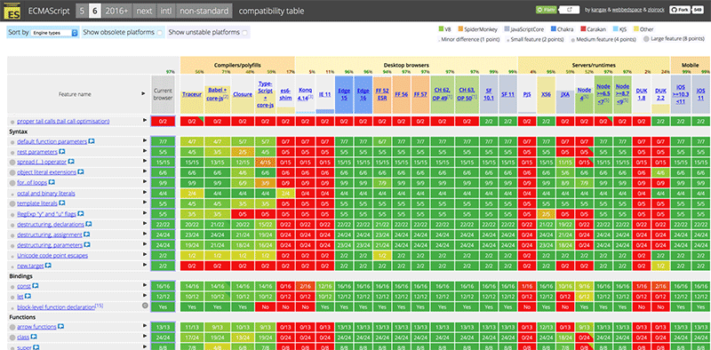

> 本文由 2017 年 12 月受邀在上海 GIAC 分享的主题[《前端生产环境部署 ES6 代码》](files/deploying-es6-in-production.pdf)整理而成。2018 年 5 月再次到百姓网分享。

## 背景

我们常说的 ES6，也就是 2015 年 6 月正式发布的 ECMAScript 2015。它是 ES 规范的第六个版本，发布至今已有两年多。在这个快节奏的时代，两年时间感觉是很长，可以发生很多事情了。比如，ES6 发布时你最多买到 iPhone 6，而现在不少人都用上 iPhone X 了。

我们不妨把时间再往前拨一些。ECMAScript 3（ES3）发布于 1999 年 12 月，ECMAScript 5（ES5）发布于 2009 年 12 月。这样一看，就发现两年其实还是比较短的。有人可能会问，这么快把 ES6 推向生产环境，靠谱吗？别急，我再说一个，你恐怕就会觉得我疯了。2016 年 4 月，淘宝和天猫正式停止对 IE6 浏览器的支持。IE6 可是 2002 年面世的，它甚至完全不支持 ES5！这么看来，生产环境部署 ES6 应该是一次非常冒险的尝试。那到底要多大的诱惑才能让人甘愿跳坑？

这个问题先按下不表。

前端圈这些年涌现出很多工具。我 2011 年接触的 NodeJS，2012 年知道的 Grunt，到现在日常使用的 Webpack、Rollup、Babel、ESLint，其间还经历过 Gulp、Browserify，最近又新出了 Parcel。框架类库这边，从 ExtJS、jQuery 到 Backbone、AngularJS，再到现在的 Vue、React、Angular，更新的速度之快也是令人目不暇接。有人对此很悲观，“前端好难，要学这么多。”也有人调侃，“前端好惨，要学这么多。”我倒觉得这很正常，这是前端圈的「工业革命」。正是这些工具的前仆后继，才使得我们在开发中可以轻松地使用 ES6，甚至 ES7、ES8 的语法和特性，部署到生产环境时再转译成 ES5。



看过 [ES6 兼容性表格](https://kangax.github.io/compat-table/es6/)的人应该不少吧。这个页面从 2010 年开始一直在更新，可以说完整地记录了现代浏览器对 ES6 特性支持的历史进程。中间最大这块绿色是桌面浏览器，最右边的是移动浏览器，中间有两列是 NodeJS 环境。是不是绿得很整齐？如果我们的用户恰好都在绿色这一块，代码是不是只需要转译到 ES6 就够了？

当然可以。但可以做不等于必须做，我们还需要更充分的理由。为了寻找这样的理由，谷歌工程师 Philip Walton 就[用自己的博客做了实验](https://philipwalton.com/articles/deploying-es2015-code-in-production-today/)。他在构建自己的博客程序时，把 JS 代码分别转译为 ES5 和 ES6，结果很有意思。ES6 版本的文件尺寸和执行时间都只有 ES5 版本的一半不到！

<table style="font-size:18px">
  <tr>
    <th rowspan="2">版本</th>
    <th colspan="2">文件尺寸</th>
    <th colspan="2">执行时间</th>
  </tr>
  <tr>
    <th>编译压缩</th>
    <th>Gzip 压缩</th>
    <th>测量值</th>
    <th>平均值</th>
  </tr>
  <tr>
    <td>ES2015+</td>
    <td>80K</td>
    <td><strong>21K</strong></td>
    <td>184ms、164ms、166ms</td>
    <td><strong>172ms</strong></td>
  </tr>
  <tr>
    <td>ES5</td>
    <td>175K</td>
    <td><strong>43K</strong></td>
    <td>389ms、351ms、360ms</td>
    <td><strong>367ms</strong></td>
  </tr>
</table>

这里面虽然有些背景交代得不清楚，可能存在夸大的成分，但这样的数字确实很吸引人。对于互联网行业来说，带宽和时间最终都是可以换算成钱的！于是，一个「大胆的想法」产生了——ES6 代码上生产环境！

---

## 技术方案

如果你的前端团队没有太落后于时代，项目已经引入了构建这个环节，用上了 Babel，那这个事情就变得特别简单。只要根据 ES6 兼容性表格，把 **.babelrc** 文件里的目标浏览器修改为原生支持 ES6 特性的浏览器，构建得到的 JS 代码就是 ES6 了。

- 修改前：

  ```js
  "presets": [
    ["env", {
      "modules": false,
      "useBuiltIns": true,
      "targets": {
        "browsers": [
          "> 1%",
          "last 2 versions",
          "not ie <= 8"
        ]
      }
    }]
  ]
  ```

- 修改后：

  ```js
  "presets": [
    ["env", {
      "modules": false,
      "useBuiltIns": true,
      "targets": {
        "browsers": [
          "Chrome >= 60",
          "Safari >= 10.1",
          "iOS >= 10.3",
          "Firefox >= 54",
          "Edge >= 15"
        ]
      }
    }]
  ]
  ```

实际上，我自己的博客就是 ES6 的，反正只有前端工程师才会来看吧。而饿了么的一些内部系统也已经跑在 ES6 上了。如果你的产品用户都用着很新的浏览器，或者产品形态可以控制 JS 代码执行环境（比如 Electron 打包的应用），从而很好地支持 ES6，那就不要犹豫了，现在就开搞吧。

话说回来，构建成 ES5 和 ES6，到底差别在哪里？执行变快还容易理解，为什么代码量也可以少这么多？下面的图是通过 Webpack 构建包分析工具得到的，ES5 版本代码比 ES6 主要多了两大块。一个是 **core-js**，包含了很多 ES6 特性的 polyfill，这些代码在 Gzip 压缩以后仍然超过 10K。


另一个是 **regenerator-runtime**，这是 ES6 生成器转译为 ES5 所产生的，单单这一个东西，Gzip 压缩后就有 2.37K 之多，是 ES6 转译为 ES5 当之无愧的第一大 polyfill。有人会问，“我没用生成器啊，怎么也有这个？”如果你开发的时候用过 ES8 特性 `async`/`await`，构建时 Babel 就会把它们先转译为 ES6 的生成器，再转译为 ES5。


除此之外，还有一些语法特性是无法在运行时进行处理的，必须在转译过程中修改源代码。这些修改也会导致代码量增加。

回到正题，我们构建 ES6 代码并推向生产环境的目标已经实现，算是大功告成了吧？当然没有啦。内部系统毕竟只是服务自己的，我们真正的目标应该是广大的普通用户。然而现实很残酷，对外产品的用户构成多样，还没有哪一个达到了直接上 ES6 的条件。换句话说，用户的浏览器在 ES6 兼容性表格里并不都是绿的。所以我们需要一个能够安全降级到 ES5 的方案，让浏览器不支持 ES6 的用户也能正常使用我们的产品。

这就不得不提到 ES 规范的演化方式。如今的 ES 规范一改过去与实现脱节的乱象，转而以模块化的方式由各大厂商分别驱动。这也造成一个问题，我们很难通过某一个特性来判断浏览器是否「全面」支持 ES6。进行全面的特性检测也不现实，尤其在移动端，几乎无法接受。幸好，还有极少数的特性，因为规范细节有争议，或者实现难度大，各个厂商都到最后才支持。这种特性虽然会推高检测的门槛，但恰好满足我们对于「全面支持 ES6」的检测需求。这样的选择也比较少，比如，HTML 对 ES6 模块化支持的规范，就是其中之一。

```html
<!-- 支持模块类型：下载并执行； -->
<!-- 不支持模块类型：下载但不执行。 -->
<script type="module" src="es2015.js"></script>

<!-- 支持模块类型：不下载； -->
<!-- 不支持模块类型：下载并执行。 -->
<script nomodule src="es5.js"></script>
```

对于支持模块类型脚本的浏览器，**es2015.js** 这个文件会被下载并执行，而 `nomodule` 属性会阻止 **es5.js** 文件的下载。对于不支持的浏览器，`module` 不是一个规范定义的脚本类型，因此 **es2015.js** 虽然会被下载，但不会执行。而 `nomodule` 只是一个不认识的属性，没有声明类型的脚本，**es5.js** 文件会被下载并当作 `text/javascript` 类型执行。这样一来，不管用户手里的是最新的 iPhone X 还是老旧的山寨安卓机，都可以使用我们的服务。问题解决了，完美！

---

## 遇到的问题

话虽如此，但我们都知道「完美」实际上是不存在的。在开发阶段我们就发现了下面这些问题：

- 不支持 ES6 模块规范的浏览器会下载两份代码——这会让老旧的设备变得更慢。

  这其实没有太好的办法。这个案例的情况，造成我们对于特性检测没有太多选择。而大多数兼容方案本身就是有代价的，无法面面俱到，只能权衡和取舍。

- ES6 模块只运行于「严格模式」，且顶层变量不能通过 `window` 属性访问。

  这倒算不上什么大问题。开发阶段做好代码检查就可以避免了，ESLint 是你的好伙伴。

- 构建工具 Webpack 内置的代码压缩工具不能识别 ES6 代码。

  Webpack 内置 UglifyJS 插件的版本非常低，实际上 UglifyJS 早就支持对 ES6 的解析了。引入一个更新的 UglifyJS 插件即可。

  ```js
  const UglifyJsPlugin = require('uglifyjs-webpack-plugin')
  
  module.exports = {
    plugins: [
      new UglifyJsPlugin()
    ]
  }
  ```

- 模块类型的脚本元素在浏览器中会表现出 `defer` 属性的效果。

  如果你的页面只有一个脚本元素，这倒没什么问题。然而实际的项目并不是这么简单的。我们为了让页面变得更快，会用上很多优化手段，比如对生产依赖和业务代码进行分离，部分生产依赖还会直接通过 CDN 加载。浏览器厂商也是如此，甚至会突破规范，对页面进行「暴力」优化，比如多个外链文件并行下载。情况变得复杂以后，表现出 `defer` 的行为就令人头疼了，因为它会破坏浏览器的暴力优化策略，让页面部分脚本的下载时机延后，最终让页面实际上变得更慢了。饿了么前端的主流实践是纯客户端单页应用，HTML 文件的主要作用就是各个脚本文件的入口，下载时机延后的影响就很大了。

  不过，我们聪明的小伙伴还是找到了一个不漂亮但有效的办法——声明[预加载](https://www.w3.org/TR/preload/)。

  ```html
  <link rel="preload" as="script" href="es2015.js" crossorigin>
  ```

- Safari 10 虽然支持了模块类型，但没有支持 nomodule 属性。

  不支持 `nomodule` 属性意味着，Safari 10 对于两份代码**都会**下载并执行！这是非常令人崩溃的现实，Safari 果然无愧于「新时代 IE6」的称号。好在国外的开发者早就注意到这个问题，并且发挥聪明才智，找到了很棒的[解决方案](https://gist.github.com/samthor/64b114e4a4f539915a95b91ffd340acc)！

  ```js
  (function () {
    var check = document.createElement('script')
    if (!('noModule' in check) && 'onbeforeload' in check) {
      var support = false
      document.addEventListener('beforeload', function (e) {
        if (e.target === check) {
          support = true
        } else if (!e.target.hasAttribute('nomodule') || !support) {
          return
        }
        e.preventDefault()
      }, true)

      check.type = 'module'
      check.src = '.'
      document.head.appendChild(check)
      check.remove()
    }
  })()
  ```

  这个方案利用 Safari 支持的非标准事件 `beforeload`，巧妙地阻止了带有 `nomodule` 属性的脚本元素的默认行为，从而避免脚本文件被下载。Safari 11 已经修复了这个问题。

- 检测的门槛提高了，一些明明支持 ES6 大部分主要特性的浏览器也被拒之门外。

  这是我们早有预期的，但是到底提高了多少？

  

  看看 [Can I Use](https://www.caniuse.com/#feat=es6-module)，跟 ES6 兼容性表格相比，这差别也太大了，可以说惨不忍睹。那到底有多少用户真正地受到影响，被这个高门槛挡在外面？还是上线后看实际的用户数据吧。

---

## 实验效果

我们选择的实验对象是饿了么一个比较小众的产品，它在饿了么手机应用和移动站点都有入口，每天只有几万次独立访问——相比饿了么一天的订单量，简直是九牛一毛，不过用来做实验也足够得出结论。这个项目投入的人力很少，开发方式比较粗放，只对生产依赖和业务代码做了简单的分离，没有细致地优化。部署 ES6 方案前，页面平均加载时间是 1.4 秒左右。对比站点监控数据，我们注意到几个非常显著的变化。

<table style="font-size:18px">
  <tr>
    <th rowspan="2">版本</th>
    <th colspan="2">命中占比</th>
    <th colspan="3">生产依赖</th>
    <th colspan="3">业务代码</th>
  </tr>
  <tr>
    <th>预期</th>
    <th>实际</th>
    <th>编译压缩</th>
    <th>Gzip 压缩</th>
    <th>执行时间</th>
    <th>编译压缩</th>
    <th>Gzip 压缩</th>
    <th>执行时间</th>
  </tr>
  <tr>
    <td>ES5</td>
    <td>&lt; 40%</td>
    <td>67%</td>
    <td>307K</td>
    <td>94.6K</td>
    <td>75ms</td>
    <td>288K</td>
    <td>96.7K</td>
    <td>636ms</td>
  </tr>
  <tr>
    <td>ES6</td>
    <td>&gt; 60%</td>
    <td><strong>33%</strong></td>
    <td>298K</td>
    <td>92.3K</td>
    <td>67ms</td>
    <td>274K</td>
    <td>105K</td>
    <td><strong>233ms</strong></td>
  </tr>
</table>

- 业务代码执行时间缩短了近三分之二，远远超过 Philip Walton 的实验结论。

  稍微一想，这其实很正常。Philip 的实验数据是单机测试得到的，两份代码在同样的环境中执行。而在实际情况中，命中 ES6 版本的设备，硬件配置往往高于命中 ES5 版本的设备，提升更明显并不意外。业务代码打包尺寸只有些许减少，这也不奇怪。我们对生产依赖进行了分离，polyfill 都在生产依赖的包里面，业务代码只减少了转译中的语法转换。正因如此，ES6 版本业务代码的语法特性也就变多了。从 Gzip 压缩算法的原理来看，代码量的减少不足以抵消特征的增加，Gzip 后尺寸变大也是讲得通的（这只是猜测，没有严格求证）。

- 生产依赖各个指标的变化都不大。

  很多生产依赖提供的发布包仍然是提前构建为 ES5 版本的。因此，尽管构建 ES6 的过程中，业务代码转译不需要引入额外的 ES6 特性 polyfill，最终得到的生产依赖包里还几乎都是 ES5 的代码，几项指标自然不会有太大差异。如果生产依赖能够提供构建为 ES6 的版本，我们的应用肯定会有更大的提升。饿了么是 Vue 的重度用户，因此我在 Vue 项目的 GitHub 仓库创建了一个[工单](https://github.com/vuejs/vue/issues/6937)，希望官方能支持这个需求。这一提议得到了很多正面的反馈，甚至 React 社区的人看到之后，也提出了相似的需求。不久前，Vue 项目修改了构建脚本，增加了一个新的构建包——一个真正的 ES6 模块。这是很好的开始，但还不够，希望整个 Vue 和 JS 生态圈都能积极地跟进。

- ES6 版本的命中率低得可怜。

  我们前面提到了门槛被提高的问题，这对用户到底造成多大的影响呢？根据已有的监控数据和兼容性表格，我们推算出有超过 60% 的用户浏览器都可以直接运行 ES6 代码，而最终命中的用户仅有 33%，单日数据最低的时候甚至不到 25%。究其原因，浏览器对 HTML 模块类型脚本的支持程度远远不及 ES6 特性支持。

---

## 更多的问题

没有「完美」的方案，这是我们早有心理准备的，开发阶段遇到问题也尽量处理了。然而人算不如天算，到了生产环境我们还是碰到了新的问题。

- Safari 10 令人困惑的语法错误。

  ```bash
  SyntaxError: Cannot declare a let variable twice: 'e'.
  ```

  如果这个错误真是我们写出来的，ESLint 首先就不会同意，究竟是怎么回事？原来是 UglifyJS 压缩时替换变量名，造成了函数形参和内部声明变量重名。

  ```js
  let e = e => {
    console.log(e)
    for (let e of [1, 2, 3]) // Cannot declare a let variable twice: 'e'.
      console.log(e)
  }
  ```

  上面这段代码本身应该是符合规范的，但在 Safari 10 中运行就会报错，这显然是 [Safari 10 的问题](https://bugs.webkit.org/show_bug.cgi?id=171041)，「新时代 IE6」果然不会轻易放过我们。但我们也不能因此就放弃使用 Safari 10 的用户吧，对此 UglifyJS 的开发者也很无奈，不得不提供了一个丑陋的[开关选项](https://github.com/mishoo/UglifyJS2/tree/harmony#mangle-options) `safari10`，以避免在变量名替换过程中出现重名（即使规范允许）。

  ```js
  const UglifyJsPlugin = require('uglifyjs-webpack-plugin')

  module.exports = {
    plugins: [
      new UglifyJsPlugin({
        mangle: {
          safari10: true
        }
      })
    ]
  }
  ```

  即便如此，仍然有人反映问题没有得到解决，我们的实验项目也是其中之一。不得已，我们替换了 UglifyJS，用 [babel-minify](https://www.npmjs.com/package/babel-minify) 对 JS 代码进行压缩。虽然 babel-minify 非常慢，但好歹搞定了 Safari 10。

- 各种定制浏览器和 WebView。

  做移动 Web 开发的同学看到这里，应该都会苦笑吧。各个厂商都会定制自己的浏览器，各家应用也会在 WebView 里加入一些私有技术。最要命的是，他们并不会告诉你做了什么。而且这一次特别难办，因为运行 ES6 是全新的尝试，几乎没有可借鉴的经验。Can I Use 和 ES6 兼容性表格的数据也不全，Oppo、Vivo、锤子等一众国产品牌根本没收录。好在我们的实验对象流量主要来自手机应用，其他来源占比太少可以暂时不管。

等等，真的可以不管吗？你想多了，当然不能。只是由于人力不足，没法及时解决这些问题，再加上 ES6 命中率偏低，大量 ES5 命中用户要付出额外的流量和等待时间，综合考虑，我们暂时下线了 ES6 的方案，回滚到只提供 ES5 的旧版本。

---

## 方案改良

实验到这里暂时告一段落，方案看起来过于超前，结果也喜忧参半。那么还有救吗？是不是只能像熬死 IE6 一样，干等？等待确实是一个不错的办法，毕竟智能手机的更新换代很快，情况远远好于桌面环境。至少，不太可能有人买了新手机后，再去刷一个十年前的操作系统。除了等呢？我们的数据显示，能够运行 ES6 的用户其实已经过半了，只是卡在特性检测上。如果能够降低检测的门槛，不就能让更多的用户受益吗？下面是我们打算继续尝试的两个方案。

前面说到在客户端进行全面的特性检测不现实。ECMAScript 的测试集 [test262](https://github.com/tc39/test262) 有接近三万个测试用例，全部用例的代码打包后有 25M 多。用 2017 年新款的 MacBook Pro 跑完一遍 test262 都要花好几分钟，在用户的手机上做这个检测，那才真是疯了。

最新版《新华字典》收录了 13000 多个汉字，而我们生活中的常用字只有 3000 个左右。日常开发也是如此，真正会用到的特性只是规范的一小部分。因此，从实用的角度考虑，我们也可以执行[简化的特性检测](https://gist.github.com/DaBs/89ccc2ffd1d435efdacff05248514f38)，只检查部分常用的特性，应该是行得通的。

下面这段代码只有 20 行，就涵盖了类、对象解构、生成器、箭头函数、Promise、Unicode 等最常用的ES6特性：

```js
class ಠ_ಠ extends Array {
  constructor(j = 'a', ...c) {
    const q = (({u: e}) => {
      return { [`s${c}`]: Symbol(j) }
    })({})
    super(j, q, ...c)
  }
}

new Promise(f => {
  const a = function* () {
    return '\u{20BB7}'.match(/./u)[0].length === 2 || true
  }
  for (let r of a()) {
    const [s, ws, m, wm] = [new Set(), new WeakSet(), new Map(), new WeakMap()]
    break
  }
  f(new Proxy({}, {
    get: (h, k) => k in h ? h[k] : '42'.repeat(0o10)
  }))
}).then(t => new ಠ_ಠ(t.d))
```

把这段代码保存为字符串，用 `eval` 尝试执行，通过 `try`/`catch` 捕获异常，就可以根据特性检测的结果，加载不同版本的代码：

```html
<script>
  try {
    var str = '...' // 特性检测代码的字符串
    eval(str)
    // 正常执行，浏览器特性检测通过
    document.write('\<script src="es2015.js"\><\/script\>')
  } catch(e) {
    // 捕获到异常，浏览器特性检测失败
    document.write('\<script src="es5.js"\><\/script\>')
  }
</script>
```

简化的特性检测有两大优点：

- ES6 支持的门槛大大降低；
- 不支持 ES6 的浏览器不需要下载额外的代码。

由于主要的代码是通过 `document.write` 插入的，浏览器的资源下载优化肯定会受到影响。同时，简化虽然让特性检测变得可行，也带来了风险。正如前面提到的 regenerator-runtime，如果你在开发中使用了 ES7、ES8 的特性，就必须了解它们会被转译为 ES6 的哪些特性，并维护好特性检测代码，同时对产品进行充分的测试。否则，用户的设备有可能通过了特性检测，却无法使用你的服务。

客户端特性检测效果不好，我们还可以在服务端想办法。回想刚刚踏入移动时代那会儿，有一种对桌面和移动浏览器分别提供不同内容的手段，叫做[动态服务](https://developer.mozilla.org/en-US/docs/Web/HTTP/Headers/Vary#Dynamic_serving)。这种方法到今天依然有用武之地，具体的做法是分析用户代理的字符串，通过白名单的机制来判断发起请求的浏览器是否支持 ES6。要采用这种方法，HTTP 返回必须正确地设置 `Vary` 头为 `User-Agent`。这对 SEO 是有好处的，它可以告诉搜索引擎页面内容发生变化的依据，避免被误判为 SEO 欺诈行为。

动态服务的优点也很明显：

- ES6 支持的门槛大大降低；
- 不支持 ES6 的浏览器不再需要下载额外的代码；
- 不影响浏览器对资源下载的暴力优化。

动态服务是基于用户代理白名单的检测，可靠性实际上不如浏览器特性检测。一旦出现误判，将不支持为 ES6 的浏览器识别为支持，用户同样无法正常使用我们的服务。同时，移动客户端分裂现象严重，白名单的维护成本也很高。更糟糕的是，一些厂商为了防止被准确识别，有意将自己伪装成其他的用户代理。

---

## 结束语

生产环境部署ES6虽然是一次不太成功的实验，但我们不会就此放弃，还会继续尝试。别忘了，**编写 ES6 只是程序员的胜利，部署 ES6 才是与用户的双赢。**
