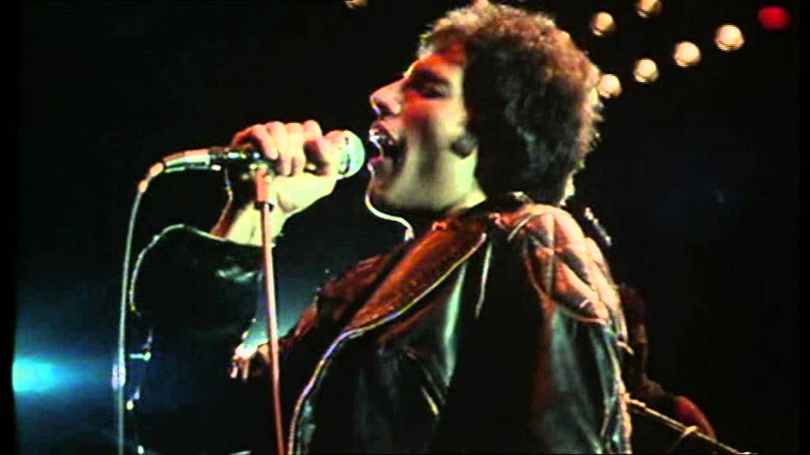

看了「Bohemian Rhapsody」。Rami Malek 很努力，这两个多钟头里他一直在提醒我，他想演好 Freddie Mercury。仅此而已。在我看过的同类型的电影中，这一部跟 2007 年的「Control」完全不在一个水平，尽管论成就和影响力，Joy Division 远不如 Queen。之前在网上看过预告片，Live Aid 这一段复刻得可以说很有诚意。然而，仅靠复制粘贴，未必能演好一个（并不太久远的）历史人物，何况是家喻户晓的流行文化符号。放在整个电影里，这样的结尾方式既奢侈又无聊。就结尾的精彩程度而言，1998 年的「Velvet Goldmine」是最好的。伴着 The Venus In Furs 的「2HB」，并不激昂，却意味深长。

直到「Don’t Stop Me Now」和「The Show Must Go On」响起，才觉得有了 Queen 的“味道”……那确实是 Freddie，无可替代。
