本文不是硬核教学，没有干货，略带安利向。tl;dr 先上完成图。

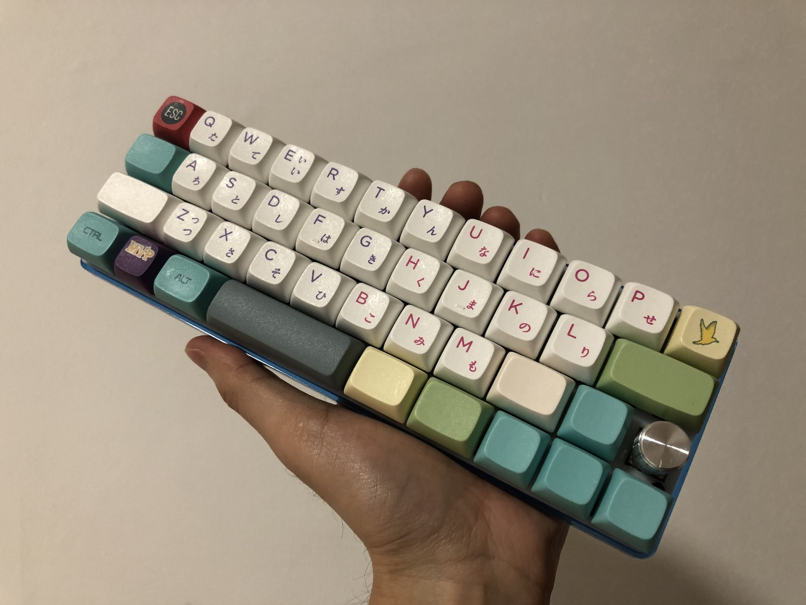

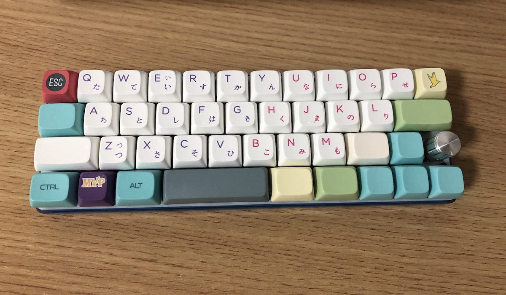

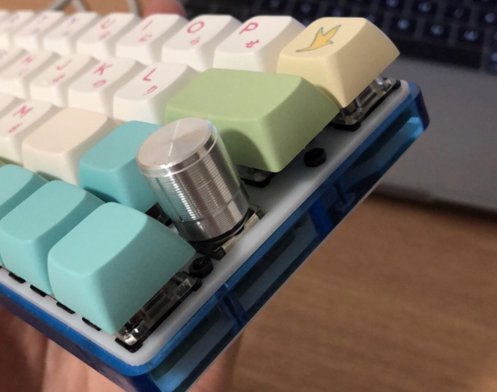

## 为什么自己做？

大部分程序员会花很多心思去折腾自己的操作系统和开发环境。没毛病，跟工作效率息息相关的东西，折腾舒服了绝对事半功倍。键盘同样是程序员（或其他长时间案头工作的工种）重度使用的生产力工具，被重视的程度就差了很多。抛开大众对键盘的种种误解（吵、贵），不少人因为对效率的漠视而选择将就，毕竟就连苹果自己都承认是设计缺陷的 Macbook 蝴蝶键盘也「又不是不能用」。稍有追求的程序员会买一个爆款（Poker、Minila、HHKB），并且在感受到效率收益后逐渐向周围人安利。

量产键盘为了平衡销量和成本，会考虑让尽可能多的人达到 80 分的满意度。如果你想要的是 90 分甚至 99 分，答案就比较遗憾了。键盘的制作由于涉及到单片机开发相关知识，对软件开发者来说还是有一定的门槛。因此，只有极少数人有能力的人会选择自（zhē）制（teng）。而这样的人往往被周围人视为极客、技术大拿。实际上，键盘作为最典型的输入设备，在绝大多数单片机教学材料中，都是第一个出现的范例。可以毫不夸张地说，制作键盘所需要的硬件知识是最入门级的。如果愿意在输入设备上挖掘工作效率，你会发现，不多的投入就可以换来非常感人的回报。

## 怎么做？

矩阵扫描、按键防冲之类的基础知识还是要储备的，不过这里不打算介绍了，网上搜一搜有很多，要看懂也并不难。这里直接进入动手部分。

### 设计外观

首先要确定的是，你的键盘长啥样。多少按键，如何排列。这需要你对自己过去的使用习惯进行一次完整的梳理，最好是找一个你用过最顺手的键盘，在它的基础上列出可以进一步提升的点。

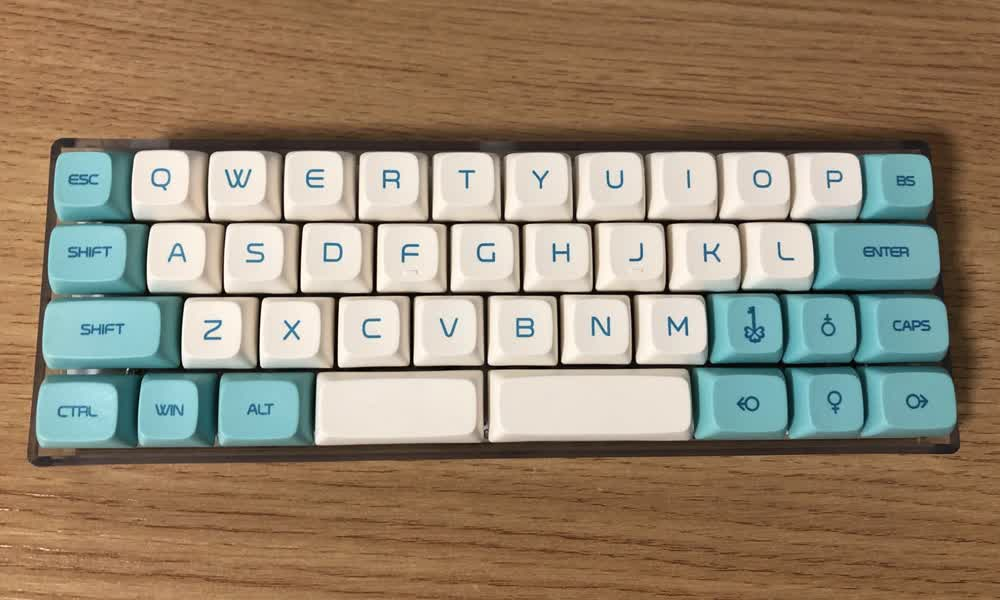

我在决定自制前，用得最多的键盘是 YDKB Chicory。我习惯用左手拇指敲空格，因此 Chicory 双空格的右边我会设置为切换层。而这个键实在太大了，就比较浪费。我希望能在同样的位置摆下两个小一点的键。另外 CapsLock 在 Windows 系统上没有那么不可或缺，但在 macOS 却承担着中英文切换的功能，因此占据了原本右 Shift 的位置。综上，我设计了如下两种略有差异的键盘布局。

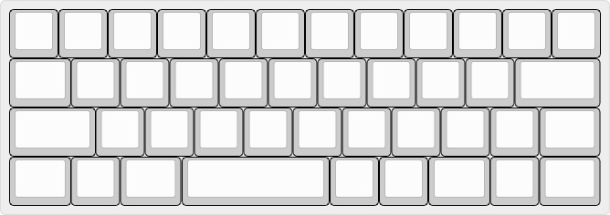

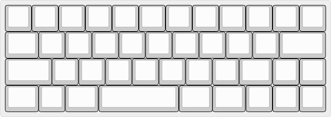

确定好外观后，去 [Keyboard Layout Editor](http://www.keyboard-layout-editor.com/) 生成布局文件，再去 [Plate Builder](https://builder.swillkb.com/) 生成 dxf 图纸。这个图纸很重要，既用于生产定位板，也是绘制 PCB 的重要辅助。两个网站的用法不难，稍微试试就会，不赘述。

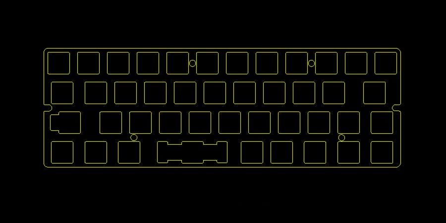

### 制作电路板

绘制电路分两步，原理图和 PCB。原理图决定了使用哪些电子元件，以及如何连接这些元件。开源社区可以找到很多现成的键盘原理图，再加上前面提到的知识储备，按自己的需求进行改造并不难。我就找了一个 ATMEGA32U4 最小系统的原理图，而不是完全从空白图纸开始画。

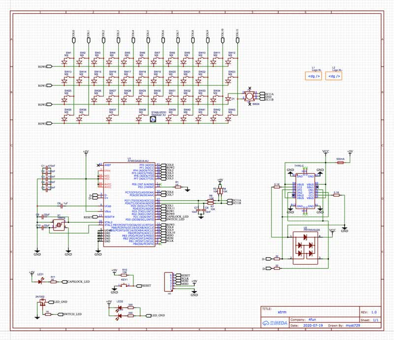

PCB 是第二个阶段，把电路的原理图转化为可以交给工厂生产的设计稿。需要注意的点也没什么新鲜的，根据后期的工艺（机器贴片或手工焊接）合理安排元件的摆放位置，避免电磁干扰，避免飞线，控制过孔数量，防止短路，设计固定方式（留出螺丝孔）等等。

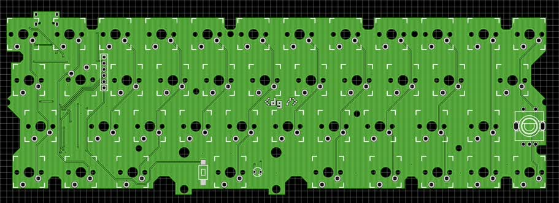

搞定图纸后，就可以找工厂下单制板了。随着物联网和智能家居的兴趣，一些电路板生产厂家也开辟了面向 DIY 开发者小批量生产的服务。最低五块钱就可以制作五张 10 厘米见方的 PCB 空板。下方是在另一家工厂制作的塑料外框。

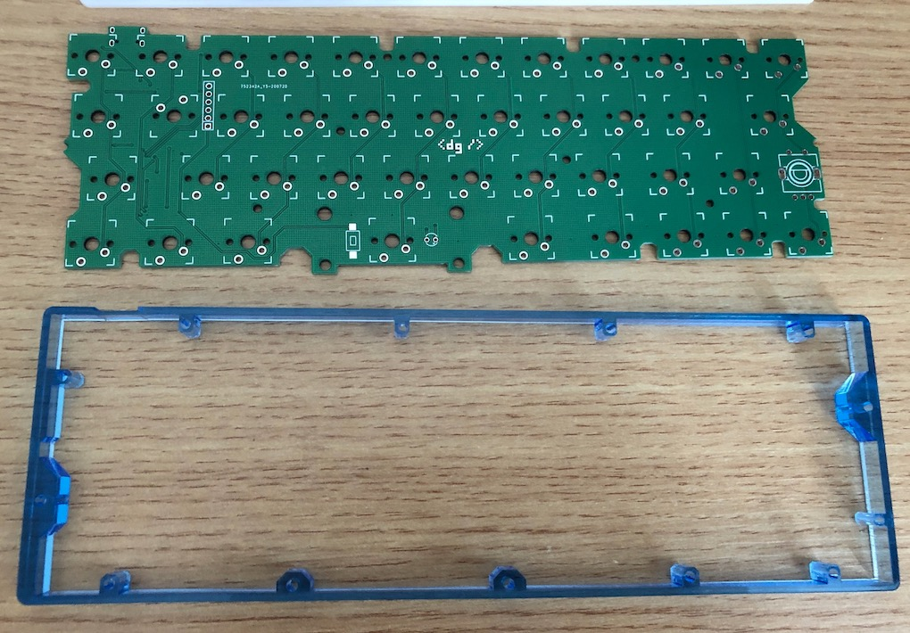

拿到板子以后，焊上芯片、晶振、二极管、电阻、电容等元件，硬件制作就算完成了。手工贴片是一个辛苦活，动手能力弱的话，翻车交学费也是少不了的。如果不想遭这份罪，或者产量足够大，也可以花钱让工厂搞定，机器贴片比人工漂亮多了，质量也比较可靠。对于我这种极度抠门，并且家传手艺的人来说，这个钱是不可能花的，自己焊没问题。助焊剂别省，一顿涂，拖焊并不难。无情提示：个人感觉手工焊接难度最大的是 16 针 Type-C 接口，其次是贴片晶振。芯片倒还好。

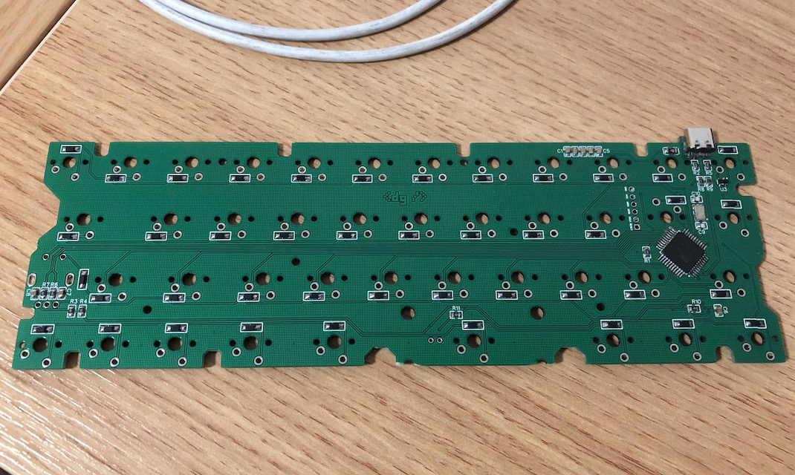

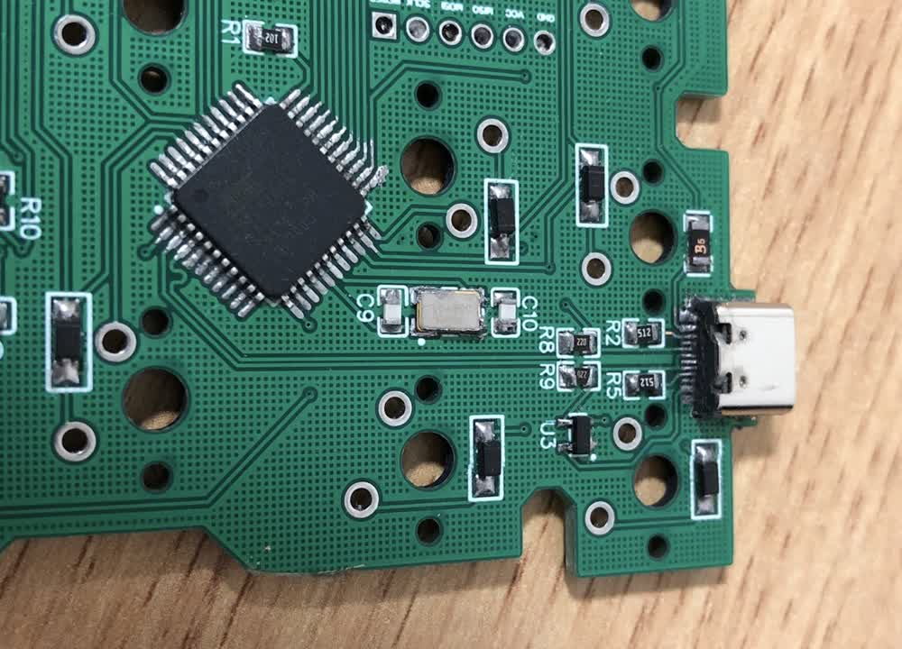

上面两张焊接完成的图片完全暴露了我作为业余选手，在电路设计方面的小白，以及「能用就行」的焊接水平。工具比较差是一方面，主要还是动手实践太少。总之专业人士和从业者请随便嘲讽吧。制作硬件还有一个很麻烦的点，就是调试成本高。在拿到实物之前，你都不能百分之百确定自己的设计没有问题。因此你需要准备一些面包板之类的材料，或者阶段性制作一些最小系统的实物来验证设计，以免最终的设计翻车导致损失过大。下面这个小板子就是我验证旋钮方案的小玩意 [Knoboy](https://github.com/myst729/Knoboy)。

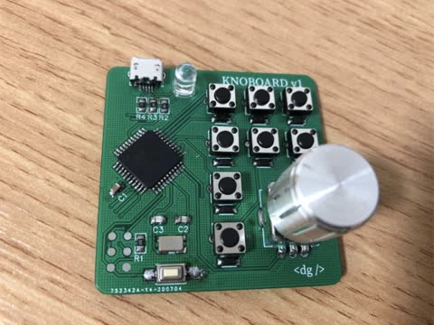

### 制作固件

光有硬件还不行，要让这些电子元件能跑起来，得有合适的固件。TMK 和 QMK 是应用最广泛的两个开源键盘固件，我这里选择的是 QMK。对于软件开发者来说，这一块应该是整个过程中最简单的，有一定的 C 语言基础就可以，多看看文档和范例，问题不大。我制作了一个三层布局的固件。

制作好固件以后，烧入硬件即可。烧写的部分也不多介绍了，网上能搜到不少资料。要点是胆大心细，不要怕，也不要莽。只要不砖不冒烟，多试几次也没有太大问题。烧好固件之后，理论上一个键盘的核心部分就完成了。这个时候就可以连接电脑，用电线短接按键的引脚，测试键盘功能。

### 组装外设

PCB 成品测试完成，键盘制作也快接近尾声了。这个阶段最主要的工作量是焊轴。机械键盘最常用的是 MX 轴体，主流的黑红茶青，还有一些比较小众的颜色。不同颜色代表不同的行程和弹簧压力。我个人喜欢线性轴的手感，根据位置和发力习惯，各个键位的弹簧压力会略有差异。

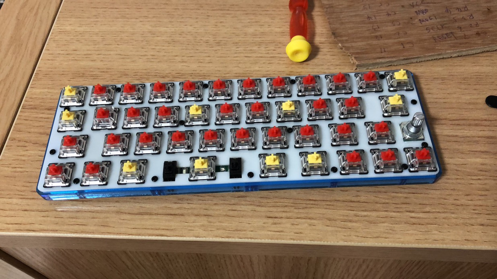

最后装上外壳和键帽，就大功告成了。

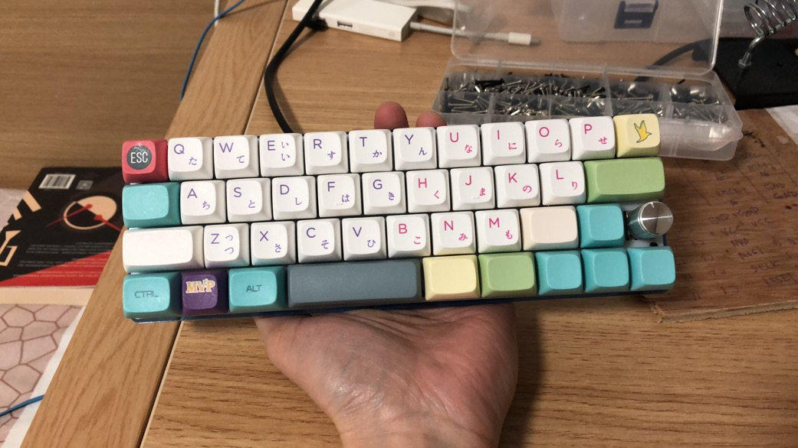

## 入坑或不入?

到目前为止，我已经使用过至少十个不同的 40% 键盘，它是我日常工作的主力输入设备。本次制作的也是一个 40% 键盘。顾名思义，40% 键盘的大小只有全尺寸键盘（104 键）的 40% 左右，按键数量在 38~48 不等。它的核心设计理念是压缩键盘尺寸，尽可能减少双手移动距离，从而提升输入体验。尺寸缩减的代价是需要大量组合键才能对齐全尺寸键盘的输入能力。相应的，自定义固件使得每一个按键都可以编辑。这样一来，组合键可以完全按照个人的生理习惯进行排列，再也不会有全尺寸键盘上按组合键的扭曲感（没错，它还能保护手腕）。因为是按自己习惯来的，组合键也不需要刻意花心思去记忆。快速适应以后，几乎是条件反射的无脑按。两相权衡，我个人认为 40% 键盘的输入体验明显优于全尺寸键盘。

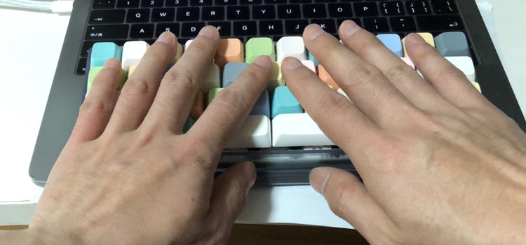

不过高度定制化的东西，必然无法适应所有人的需求，40% 键盘注定还是一个小众产品。我几乎没有任何不适，就从全尺寸键盘无缝切换到了这个尺寸，已经使用挺长时间。而被我安利入坑的人，有的很快就上手，有的颇费了些时间，也成了主力设备，还有用不习惯束之高阁的。所以你吃不吃这个安利，我倒不在意。就像我自己也适应不了 30% 键盘。关键在于，找到适合你的方案。对重度案头工作的人来说，键盘是重要的生产力工具。而你愿意花多少心思琢磨生产力工具，某种程度也反映了你对待工作效率的态度。

来个合影。

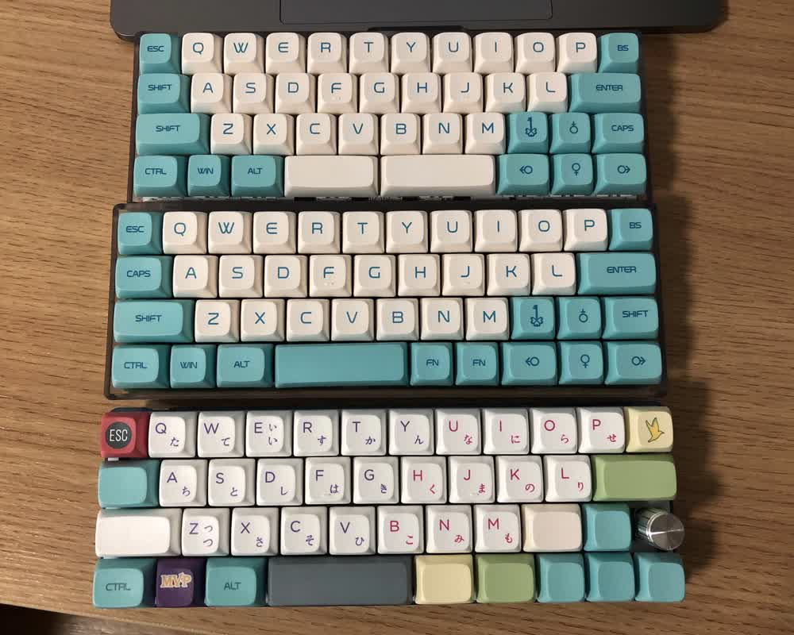

## 备注

文中展示制作的键盘是 [Xtrm](https://github.com/myst729/xtrm)，本文大部分内容使用此键盘录入。其余内容使用另一个键盘 Prototype 录入。

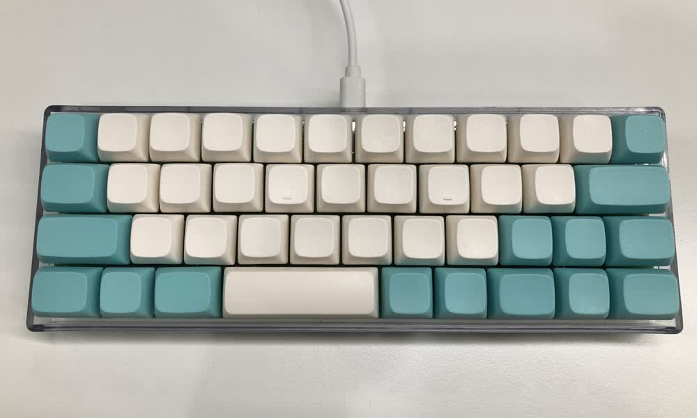
