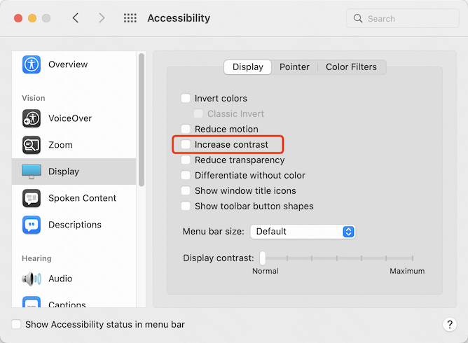

# 什么是深色主题

前一段时间我发现设计同学在部门的一致性设计规范里面增加了一个「暗色模式」的页面。之后不久，部门的一个项目也上线了一版深色的界面。这是不是意味着部门的项目将来都要支持深色主题？虽然尚未收到明确的消息，但我认为不排除这个可能，因此打算未雨绸缪地搞一波技术储备。

深色主题到底是什么？这个讲法其实很宽泛，我们以往见过不少深色调为主的界面配色方案。比如程序员非常熟悉的代码编辑器，各种深色皮肤早就大行其道。而我们今天要讨论的，主要是苹果近年来的产品中推出的深色主题功能，以及由此出现的一系列相关技术规范的应用。


苹果在 2017 年发布的 macOS High Sierra (10.13) 首先实验性地支持了深色顶栏和 dock，继而在 Mojave (10.14) 提供了完整的深色主题支持。接下来的 Catalina (10.15) 则增加了 Auto 选项，可以随一天中的时间变化自动切换系统主题。后续的大版本更新也不断优化这个功能。在移动端，iOS 13 开始加入深色主题功能。macOS 启用深色主题后，内置的应用会切换为深灰色为主的配色，字体则显示为浅灰色。


第三方应用如果适配了深色主题，也会根据设置改变自身的界面配色。


适配了深色主题的网页也有不少，比如 Redux 作者 Dan Abramov 的个人站点 [Overreacted](https://overreacted.io/)。不过他实现得比较简单，只有深浅两个选项，不能根据系统设置自动切换。


我们非常熟悉的 [MDN web docs](https://developer.mozilla.org/en-US/) 更胜一筹，可以跟随系统设置的变化自动切换主题。

<video src="videos/5.mp4" poster="images/5.png" type="video/mp4" controls preload></video>

# 太阳底下没有新鲜事

是不是觉得没啥大不了的？确实如此，换配色这事我们早就见惯不惊了。还记得曾经风靡一时的绿色健康模式吧？就像仙人掌吸辐射之类的绿植无脑神话，这个健康模式其实并没有什么科学依据，真搞不懂它是怎么流行开的。


十多年前电子阅读兴起时，一些阅读设备厂商也研发了护眼模式。不同于的豆沙绿的伪科学，电子阅读器还是有一定科学依据的。据研究表明，偏暖的色调会让人不那么兴奋，有利于长时间专注地阅读。在传统出版行业，也能看到不少采用鹅黄色纸张的书籍。


到了行业软件领域，Adobe 先是在 Photoshop Lightroom 尝试深色界面，并在稍后的 Photoshop CS6 加入此设计。这里简单回顾一下初中学的生物和物理知识，人眼之所以能看到颜色，是因为视神经受到可见光的刺激。白色是所有可见光叠加的效果，因此面对浅色界面的软件，人眼会接收大量与工作内容无关的可见光刺激。对于 Adobe 系列产品的用户而言，深色界面大幅度降低了此类干扰，无疑能帮助使用者更加专注于和颜色打交道的工作。如今 Adobe 系列软件几乎都已默认采用深色界面。


移动互联网时代到来后，夜间模式一度成为众多应用的必备功能。它通过采用偏暗的配色，降低显示亮度等方式，让用户可以在环境亮度很低甚至关灯的情况下继续使用，而不至于让眼睛太难受。然而，可别以为这是软件厂商的善意，它这么做只是想让你多玩一会儿手机，把睡眠时间变成它的用户时长。在我看来这是一种反人类的设计，是消费互联网无休止攫取用户时长的恶性竞争。


# 网页中的主题切换

回到浏览器，切换主题色早在个人站长时代就是潮站标配。比如曾经制霸中文社区的论坛产品 Discuz!，就可以一键切换主题色。


一键切换的实现非常简单，在那个时代我们写前端代码也很狂野，寥寥数行就搞定。

```html
<head>
  <style>
    body.theme-red, .theme-switch-red { background: red }
    body.theme-red .some-selector { /* red based theme settings */ ... }
    body.theme-blue, .theme-switch-blue { background: blue }
    body.theme-blue .some-selector { /* blue based theme settings */ ... }
    body.theme-pink, .theme-switch-pink { background: pink }
    body.theme-pink .some-selector { /* pink based theme settings */ ... }
  </style>
</head>
<body class="theme-blue">
  <div class="theme-switch">
    <span class="theme-switch-red" onclick="document.body.className = 'theme-red'"></span>
    <span class="theme-switch-blue" onclick="document.body.className = 'theme-blue'"></span>
    <span class="theme-switch-pink" onclick="document.body.className = 'theme-pink'"></span>
  </div>
  ...
```

Web 标准这边，Mozilla 主推过一个替换样式的规范。然而由于种种原因，这个规范从未得到其他厂商的广泛支持，自然也没有普及。


简单几行代码，你仍然能在最新版的 Firefox 中尝试这个功能。

```html
<link href="default.css" rel="stylesheet" title="Default Style">
<link href="simple.css" rel="alternate stylesheet" title="Simple">
<link href="fancy.css" rel="alternate stylesheet" title="Fancy">
```


替换样式其实由两部分组成：样式表 `rel="stylesheet"`，以及必须搭配其他属性生效的替换属性 `rel="alternate"`。可别因为这对难兄难弟无人问津，就以为替换属性没什么用哦。替换属性的应用还不少，比如支持多语言的站点，配合 `rel="canonical"` 可以帮助搜索引擎正确地创建索引，为不同地区访客呈现合适的语言版本。

以往的工作经历中，我也承接过不少可用性相关的开发需求，比如针对视障群体的高对比度主题适配。在 Windows 控制面板的个性化设置，可以启用高对比度主题。


应用高对比度主题后，Windows 系统的显示颜色数会减少到只有十来种。默认的颜色表都经过精心搭配，使得任意两种颜色组合都能呈现比较大的反差，以便于视障人群阅读屏幕内容。


除了极为有限的颜色数量，高对比度模式下的网页还有诸多限制，比如不再显示背景图和阴影，不能修改滚动条样式等。为此，适配高对比度主题的页面，也需要遵循一定的原则和实践。以老牌前端框架 dojo 及其组件库 dijit 为例，它的对话框组件在高对比度模式下，标题栏的浅灰色背景被替换为虚线边框，右上角可点击的关闭图标则替换为字母 x。此外，表单输入框和提交按钮的边框都加粗，变得更醒目。除此之外，所有这些元素还可以完全通过键盘导航，获得焦点的元素会应用有区分度的样式。

 

相比于开发一套高对比度主题，更为麻烦的是什么时候应用它？换句话说，怎么探测系统启用了高对比度主题。多年以前缺乏技术标准，我们只能用最简单粗暴的办法，往页面塞一个带样式的元素，看看渲染效果有没有被高对比度模式的渲染规则降级。

```js
var div = document.createElement('div')
div.style.cssText = [
  'background-image: url(blank.gif)',
  'border: 1px solid',
  'border-color: red green',
  'height: 5px',
  'position: absolute',
  'top: -9999px'
].join(';')
document.body.appendChild(div)
var cs = window.getComputedStyle(div)
var bkImg = cs.backgroundImage
var isHCM = (cs.borderTopColor == cs.borderRightColor) ||
    (bkImg && (bkImg === 'none' || bkImg === 'url(invalid-url:)'))
```

从 Windows 8 开始，才逐渐出现了一些浏览器提供的技术能力支持（[IE ⾼对⽐私有属性](https://developer.mozilla.org/en-US/docs/Web/CSS/@media/-ms-high-contrast)、[强制颜⾊](https://developer.mozilla.org/en-US/docs/Web/CSS/@media/forced-colors)、[对⽐度优先](https://developer.mozilla.org/en-US/docs/Web/CSS/@media/prefers-contrast)，等），探测系统主题变得不再这么繁琐。

使用 macOS 设备的同学如果对高对比度模式感兴趣，也可以在辅助功能中启用「提高对比度」。如果感受不强，还可以打开 VoiceOver，关掉显示器，体验一下盲人的不易。



<!--
说到高对比度模式，在这次调研过程中我还有幸拜读了一篇某讯体验设计部门的雄文。此文作者对 Windows 的高对比度主题给出了如下评价。


> ## 让人无法接受的深色模式：Windows高对比度模式
>
> 在Windows推出了相当长的一段时间里，黑色界面就不再出现了。但是准确的说，实际上保留了一个主题功能。这个主题可以让用户设计用户界面的配色，从比较早期的Windows开始（忘了具体是哪个版本）。Windows保留了高对比度的主题。
>
>（虽然这个效果真的...没办法接受）
>
> 可能也是因为没怎么走心吧...也可能它只是一个高对比度模式，微软对于容器和控件层级的解决办法，就是通过白线来分割...虽然看起来非常没有质感，不够优雅，但是的确能解决问题。
>
> 它从来没有真正流行过。但是可以看到，微软的设计师心中，也许还是为黑色主题留了一块位置的。结果过了一段时间，他们果然找到了方向，在一款不入流的MP3上线实验了。

恕我直言，这位作者完全没有搞明白高对比度主题的用户和目标。这段文字中看不到对用户的尊重和换位思考，只有无知和傲慢。对此我的评价就两个字：暴论。
-->

# 撸起袖子干

不就是弄个黑乎乎的界面嘛。历史回顾得差不多，上古技术也复习了，<!--暴论也围观了，-->似乎差不多可以开搞。


搞些啥呢？为了最终能顺利地在项目中落地，我们还是得顺着工程的玩法来捋一下具体要做的事情：

1. 多套独⽴的主题⽅案（浅⾊/深⾊）
2. 主动切换主题，⽀持本地状态存储
3. 检测和监听系统设置，被动切换主题
4. 根据深浅主题的视觉差异，对显示效果进行针对性的优化
5. 特性检测，对不支持的环境进行降级
6. 调试和测试工具支持

其中 1\~3 是最基本的技术方案，完成后可以说深色主题也就搞定了。但是，如果我们以交付产品功能为目标，而不仅仅是代码，那么接下来的 4\~5 也得做好。最后，为了保障交付的效率和质量，还少不了必要的工程手段。接下来我们挨个解决。

<!--
|   | 工作项                                      | 可以借鉴经验的历史项目    |
| - | :----------------------------------------- | :-------------------- |
| 1 | 多套独⽴的主题⽅案（浅⾊/深⾊）                 | ⼀键换主题、⾼对⽐度适配  |
| 2 | 主动切换主题，⽀持本地的状态存储                | ⼀键换主题              |
| 3 | 检测和监听系统设置，被动切换主题                | ⾼对⽐度适配            |
| 4 | 根据深浅主题的视觉差异，对显示效果进行针对性的优化 | ⼀键换主题、⾼对⽐度适配  |
| 5 | 特性检测，对不支持的环境进行降级                | ⾼对⽐度适配            |
| 6 | 调试和测试工具支持                            | 🤷‍♂️                    |
-->

## 多套独⽴的主题⽅案

通过前面的回顾，可以说这一条我们早就会了，不费吹灰之力就能完成。但要想把代码写得好看，便于将来维护，那也得动动脑子。十多年前的前端远远没有今天这样丰富的工程实践经验，即便我们写代码很狂野，仍然会对复用有所考量。一个常见的做法是尽量把颜色相关的属性抽出来，放到单独的选择器中。要添加新的配色，只需要重新编写一份颜色相关的选择器即可。最近十几年，前端工程领域发生了翻天覆地的变化，有几样新的东西很适合我们要做的这件事：

- 替换可继承属性硬编码颜色值的 CSS 关键字 `currentColor`
- Stylus、Sass 等 CSS 预编译工具提供的编程能力，及其内置的颜色相关的工具函数
- CSS 技术标准中的自定义属性：变量（variables）

这里我用上面提到的预编译工具 Sass 写了一段很短的代码：

```scss
$base: red
$primary: adjust-hue($base, 30degrees)
$lighter: lighten($primary, 30%)
$darker: darken($primary, 10%)

.colors
  background-color: $lighter
  border-color: $darker
  color: $base
```

经过编译得到如下的橙色调的配色方案：

```css
.colors {
  background-color: #ffcc99;
  border-color: #cc6600;
  color: #ff8000;
}
```

如果我们想得到一个偏蓝的配色，只需要把 Sass 代码第二行调色函数的第二个参数改为 `240degrees`。了解 HSL 颜色空间的同学应该秒懂，这里就不解释了。如果调研足够充分的话，可用的技术方案远不止上面提到这几个，比如 CSS 引擎向应用层暴露的 Houdini API、CSS 标准中尚未得到广泛支持的 `color()` 函数，等等。近些年前端技术和工程的爆发带来了非常大的想象空间。

### 一个反面案例

[VueUse](https://vueuse.org/) 页面中的代码高亮，适配深浅主题的做法是输出两遍 HTML，分别应用不同着色。切换页面主题时，改变他们的 CSS `display` 属性。这是一个很无奈的实现，它使用的代码高亮模块，并不是通过 CSS 类名来控制代码着色，而是直接输出的带行内样式的代码片段。这个案例提醒我们要认真对待技术选型。选型留了坑，将来会引入更多的坑。


> 后来跟 antfu 简单聊过，VueUse 目前的方案还涉及到其他的技术考量，因此「反面案例」这个评价可能有些片面，各位自行判断。

## 主动切换主题，⽀持本地状态存储

多套主题有了，主动切换也不是新东西，甚至本地状态存储也是多年以前就能做到。Cookie、IE 独有的 userData、Flash 都是当时曾经用过的方案，不过这些方案都有各自的局限。随着时间的推移，Web 技术标准逐渐演化出 `localStorage`、`indexedDB`、`CacheStorage` 等能够在本地存储状态的规范，其中最简单的要属 `localStorage`。我尝试用它结合前面提到的 `currentColor`、CSS 预编译、CSS 变量写了一个简单的[主动切换主题](https://codepen.io/myst729/pen/YzaMxjZ)。你可以随便改改试试，增加一个绿色的配色方案只需要动两行。经过良好的技术设计，充分发挥工具的能力，CSS 代码可以变得非常简洁和易于维护。

## 检测和监听系统设置，被动切换主题

如果只想实现一个像 [Overreacted](https://overreacted.io/) 一样的「基础版」深色主题，那么目前为止所有的技术问题都已经解决了。但，假如我们的目标是像 [MDN Web Docs](https://developer.mozilla.org/) 那样的「完全版」，就还得搞定一件事：检测系统当前的主题配置，并且能监听它的变更。

前面回顾高对比度适配的时候，我们知道 CSS 规范已经提供了强制颜色和对比度优先等媒体查询属性，那么对于表现上有一定共性的深色主题，有没有类似的规范支持呢？简单搜索了一下，确实有一个[配色方案优先](https://developer.mozilla.org/en-US/docs/Web/CSS/@media/prefers-color-scheme)的媒体查询属性，用法非常简单。

```css
@media (prefers-color-scheme: dark) {
  .el {
    color: black;
  }
}
@media (prefers-color-scheme: light) {
  .el {
    color: white;
  }
}
```

不过为了能和 `localStorage` 等能力结合使用，我们还是希望通过 JavaScript 来做这件事情，这可以用媒体查询通用的 `matchMedia` 办到：

```html
<style>
:root {
  --background-color: white;
  --text-color: black;
}
[data-theme="dark"] {
  --background-color: black;
  --text-color: white;
}
</style>
<script>
const mql = matchMedia('(prefers-color-scheme: dark)')
const initialScheme = mql.matches ? 'dark' : 'light'
document.body.dataset.theme = initialScheme
</script>
```

根据我们多年以来对浏览器运行机制的了解，JavaScript 下载和执行会阻塞 DOM 解析渲染，因此通常的实践是给 `<script></script>` 声明 `defer` 属性，延迟下载和执行，或着干脆扔到 `</body>` 前。如果 JavaScript 在执行过程中修改了页面已有内容的样式，那么在完成最终渲染结果前，页面会产生多次重排和重绘。在某些场景下，这是应用初始化过程正常的流程，但对于应用深色主题而言，这样的重绘显然是不必要的，也就是通常所说的 <abbr title="flash of unstyled content">FOUC</abbr>。为了解决这个小小的体验问题，我们可以在页面可见内容开始渲染前，先执行 JavaScript 得到最终生效的配色方案。上面的代码稍作调整，放到 `</head>` 前即可。这就解决了页面加载时的主题检测。至于和 `localStorage` 实现的本地状态存储相结合，想必对大家来说不是问题，这里不再赘述。

```js
// document.body.dataset.theme = initialScheme
document.documentElement.dataset.theme = initialScheme
```

到目前为止，我们的「完全版」还剩下最后一个需要突破的技术点——监听系统主题变化，切换对应的配色方案。如果你认真看完上面介绍的 `matchMedia` 的文档，那么它返回的 MediaQueryList 对象会在对应的媒体查询属性发生变化的时候触发一个 `change` 事件。监听这个事件就可以根据系统主题改变及时做出反馈。

```js
const mql = matchMedia('(prefers-color-scheme: dark)')
const initialScheme = mql.matches ? 'dark' : 'light'
document.documentElement.dataset.theme = initialScheme

mql.addEventListener('change', e => {
  const currentScheme = e.matches ? 'dark' : 'light'
  document.documentElement.dataset.theme = currentScheme
}, false)
```

大功告成。就在我准备发条推炫耀一下的时候，突然发现这个页面怎么看着不太对劲呢？这滚动条还是浅色的，没有跟深色主题适配，看来硅谷大厂也不是那么精益求精嘛。那么我们就拭目以待，看看马总的雷霆手段能起到什么立竿见影的效果。


改滚动条样式这事我太熟了，不就几个选择器嘛。但是等等，改完这个还有一大堆，音视频的播放界面、复杂表单元素的内部结构，等等。这些浏览器原生 UI 大量使用了 Shadow DOM 技术，一个个改下去还得了？再一想，难道规范连这个问题都没考虑到？应该不至于。简单查阅 MDN，规范果然已经给出办法了。在 HTML 头部声明 `color-scheme` 元信息，浏览器就可以正确处理原生 UI 的主题适配。这里我们设置成 light 和 dark 都支持。如果你开发的页面并没有为深色模式做好准备，可以设置为只支持 light，这样即使系统切换到了深色模式，页面仍然会以浅色主题展现。

```html
<meta name="color-scheme" content="light dark" />
```

CSS 也提供了等价的能力。

```css
:root {
  color-scheme: light dark;
}
```

来看看正确设置了主题配色元信息的效果：


至此，所有的技术问题全部解决。


然而，我相信每一个参与过业务交付的人都会告诉你，代码不等于产品，解决了技术问题，并不能保证就会有好的产品体验。接下来我们就看看，如果想让这样一个技术方案达到产品交付的要求，还需要完善哪些方面。

## 根据深浅主题的视觉差异，对显示效果进行针对性的优化

我们先回顾一个非常熟悉的案例。每当进行全国性哀悼活动的时候，所有的中文站点都会清一色地变灰。这个变灰不仅是站点整体的设计，也包括运营配置的动态内容。试想一下，如果运营配置内容没有进行灰度处理，这该是多么违和的画面？花花绿绿的配色，加上鼓吹享乐的宣传语，确定不是在冲塔？


上面这张其实是我拼贴的效果图，但凡智力正常一点的人，应该都干不出来。真实的原图是下面这样的。


扒一下源码，实现这种全局灰阶的效果，工作量并不大。这给了我们一些启发：内容和页面要匹配，否则会给人非常不愉快的观感；CSS 的滤镜很强大，可以研究一下。

```css
body {
  filter: grayscale(100%);
}
```

好了，回到我们要讨论的问题。图片、视频这类资源，在制作的时候通常是以适配浅色主题为目标，毕竟人类千百年来已经习惯了在白天活动。换成深色主题，背景带来的可见光干扰大幅降低，同样的内容会因为反差过于强烈，让人觉得刺眼。上面提到的滤镜属性可以取值为 `grayscale` 函数，一行代码让页面变灰，那么是不是还有其他的函数可以用？查阅相关文档，选项还非常多。以下代码就略微降低了图片的亮度和对比度。

```css
[data-theme="dark"] img {
  filter: brightness(.8) contrast(.8);
}

/* 也可以用媒体查询 */
@media (prefers-color-scheme: dark) {
  img {
    filter: brightness(.8) contrast(.8);
  }
}
```

调整前后的大致效果对比如图


这种方式对视频也是有效的。

<video src="videos/26.mp4" poster="images/26.png" type="video/mp4" controls preload></video>

然而一视同仁的处理，在有些情况下就太简陋了。摄影师、设计师、艺术家这一类极其关注视觉效果的客户，很可能提出更精细的要求。以我们手边就有的 macOS 动态壁纸为例，它的一个 HEIC（High-Efficiency Image Container）文件其实存放了多张图片，以便根据时段呈现不同的视觉效果。


在网页中，用 `<picture>` 元素可以做到根据特定的条件显示不同图片。当然了，代价是存储和带宽成本翻倍。

```html
<picture>
  <source srcset="light.png" media="not (prefers-color-scheme: dark)"></source>
  <source srcset="dark.png" media="(prefers-color-scheme: dark)"></source>
  
</picture>
```

对于大段的文本内容，除了微调亮度和对比度，适当的减少字重也能有效提升阅读体验。


在浅色主题下，为了让容器和页面背景区分开，一个常见的做法是给容器设置灰色的盒阴影。在深色主题当中，如果我们不假思索地进行反色处理，会得到一种意想不到的霓虹灯效果。好在这还是灰色的阴影，像一些轻时尚品类的客户，喜欢在设计中大量使用鲜艳亮丽的颜色，这样处理搞不好会给人一种逛夜店甚至红灯区的观感，那就非常不合适。因此，盒阴影需要特别注意，小心处理避免尴尬。一种简单且效果不错的处理方式，是在深色模式下去除盒阴影，给容器和背景设置有一定区分度的颜色，以此来制造层次感。


最后，可别忘了网站图标。如果你的 favicon 跟深浅主题配色都搭配得很好，那就不用担心，否则还是需要关注一下。这里特别要给 [three.js](https://threejs.org) 点赞。

```html
<link rel="icon" href="favicon_light.ico" media="(prefers-color-scheme: dark)" />
<link rel="icon" href="favicon_dark.ico" media="not (prefers-color-scheme: dark)" />
```

## 特性检测，对不支持的环境进行降级

看完前面的内容，相信你已经能实现一个体验不错深色主题站点。有细心的同学会问，如果浏览器不支持上面这些技术规范应该怎么处理？我的答案是，问题不大。


自从苹果推出深色主题，它就在消费市场引起了极大的关注。浏览器厂商和规范委员会也跟进得非常迅速，因此深色主题很快就得到了普遍的支持，相关信息可以查阅 [Can I Use](https://www.caniuse.com/)。当然不排除有人还在使用非常老旧的设备，并且一直不升级软件，那么我们可以用下面的方法来进行检测。对了，检测到不支持深色模式的设备，别忘了隐藏主题切换模块。

```css
@supports not (color-scheme: dark) {
  .theme-switch {
    display: none;
  }
}
```

也有与之等价的 JavaScript 方法：

```js
const supportDarkTheme = CSS.supports('color-scheme', 'dark')
```

前文提到的 `matchMedia` 方法，同样可以进行类似的检测。当传入了浏览器尚不支持的媒体查询选项，`MediaQueryList.match` 会始终返回 `false`。

```js
const mql = matchMedia('(some-unknown-input: arbitrary)')
console.log(mql.matches) // false
```

如果上面这些检测手段仍然无法满足要求，那么几乎可以断定你的浏览器版本在 Chrome v60 以下。面对这种情况，我认为你应该考虑的不是如何对深色主题降级，而是你还有没有必要向前兼容这么老旧的浏览器。

## 调试和测试工具支持

多年以前，我在 Window 7 系统适配高对比度主题时，根本没有什么像样的调试工具。当时前端社区的工程化经验远不如今天这么丰富，开发的时候只能把系统切换为高对比度主题，这个体验非常痛苦。相比之下，今天的前端开发真是太幸福了。我们最常用的 Chrome 内置了非常强大的 DevTools，可以很方便地模拟各种媒体查询属性。


对于 UI 自动化测试，一个常见的做法是页面截图做像素级比对。那么在截图的时候能否指定主题配色呢？简单查阅 Puppeteer 文档，调用 `Page.emulateMediaFeatures` 方法即可模拟媒体查询属性。下面我写了一小段脚本，在 NodeJS 中执行就可以得到深浅主题的两张页面截图。新近流行起来的 Cypress 也同样提供了相关支持，详情可以查阅 Cypress 文档。

```js
import puppeteer from 'puppeteer'

(async () => {
  const browser = await puppeteer.launch({ headless: true })
  const page = await browser.newPage()
  await page.setViewport({ width: 1440, height: 900 })
  await page.goto('https://vuejs.org')

  await page.emulateMediaFeatures([{
    name: 'prefers-color-scheme',
    value: 'light',
  }])
  await page.waitForTimeout(1000)
  await page.screenshot({
    path: 'screenshot-light.png',
    fullPage: false,
  })

  await page.emulateMediaFeatures([{
    name: 'prefers-color-scheme',
    value: 'dark',
  }])
  await page.waitForTimeout(1000)
  await page.screenshot({
    path: 'screenshot-dark.png',
    fullPage: false,
  })

  await browser.close()
})()
```

至此，我们列出的六大工作项全部有了还不错的答案。在我看来这才算得上是一个洞察业务需求，能在工程中落地的技术调研。接下来就赶紧行动吧，深色主题走起。


# 参考资料

本次调研参考了非常多的资料。为方便查阅，这里简单做了分类。

## Web 平台技术标准

- [[HTML] Standard metadata names](https://developer.mozilla.org/en-US/docs/Web/HTML/Element/meta/name)
- [[CSS] Alternative style sheets](https://developer.mozilla.org/en-US/docs/Web/CSS/Alternative_style_sheets)
- [[CSS] color-scheme](https://developer.mozilla.org/en-US/docs/Web/CSS/color-scheme)
- [[CSS] filter](https://developer.mozilla.org/en-US/docs/Web/CSS/filter)
- [[CSS] @media -ms-high-contrast](https://developer.mozilla.org/en-US/docs/Web/CSS/@media/-ms-high-contrast)
- [[CSS] @media forced-colors](https://developer.mozilla.org/en-US/docs/Web/CSS/@media/forced-colors)
- [[CSS] @media prefers-contrast](https://developer.mozilla.org/en-US/docs/Web/CSS/@media/prefers-contrast)
- [[CSS] @media prefers-color-scheme](https://developer.mozilla.org/en-US/docs/Web/CSS/@media/prefers-color-scheme)
- [[CSS] @supports](https://developer.mozilla.org/en-US/docs/Web/CSS/@supports)
- [[JavaScript] window.matchMedia()](https://developer.mozilla.org/en-US/docs/Web/API/Window/matchMedia)
- [[JavaScript] CSS.supports()](https://developer.mozilla.org/en-US/docs/Web/API/CSS/supports)

## 调试和测试工具

- [[Chrome DevTools] Emulate CSS media feature `prefers-color-scheme`](https://developer.chrome.com/docs/devtools/rendering/emulate-css/#emulate-css-media-feature-prefers-color-scheme)
- [[Puppeteer] Page.emulateMediaFeatures() method](https://pptr.dev/next/api/puppeteer.page.emulatemediafeatures)
- [[Cypress] Test Your Web App in Dark Mode](https://cypress.io/blog/2019/12/13/test-your-web-app-in-dark-mode/)

## 案例和技术方案学习

- [Overreacted](https://overreacted.io/)
- [MDN web docs](https://developer.mozilla.org/en-US/)
- [prefers-color-scheme: Hello darkness, my old friend](https://web.dev/prefers-color-scheme/)
- [Improved dark mode default styling with the color-scheme](https://web.dev/color-scheme/)
- [Using Tailwind CSS to style your site in dark mode](https://tailwindcss.com/docs/dark-mode)

## 设计经验和规范

- [[Dojo] Dijit Accessibility Strategy](https://dojotoolkit.org/reference-guide/1.10/dijit/a11y/strategy.html)
- [A Complete Guide to Dark Mode on the Web](https://css-tricks.com/a-complete-guide-to-dark-mode-on-the-web/)
- [Dark Mode Design Guide: Basics, Best Practices, Examples & Templates](https://www.mockplus.com/blog/post/dark-mode-design-guide)
- [The Dos And Don’ts Of Dark Theme In UI And Web Design](https://www.fyresite.com/the-dos-and-donts-of-dark-theme-in-ui-and-web-design/)

<!--
## 注意辨别错误的信息

- [你说的黑是什么黑](https://isux.tencent.com/articles/dark-mode.html)
-->

# 彩蛋时间

苹果到底是什么时候开始进行深色主题尝试的呢？根据我不负责任地观察，至少可以追溯到十多年前。iPhone 从 4S 这一代开始出现了黑白两种可选的外观。而到了 iPhone 5S，不但推出了强大的钞票收割机香槟金配色，iOS 也进行适配，根据外壳颜色的深浅，开机画面会呈现不同的配色。不过有趣的是，iPhone 是先深后浅 😜


