> 本文仅针对数字电路。全部内容为业余选手的个人理解，如有错漏欢迎指正。

作为一个 Web 程序员，我为什么会去玩硬件？主要有两个原因吧。第一，有趣又便宜。十来块的开发板能玩好几年，必要的时候也能自己修修电灯风扇什么的，是一个投入非常低，回报还不错的消遣。第二，拓宽技术视野。硬件上的软件开发和 Web 开发有很大不同。逼着自己多去了解一些平常不用关注的底层知识，回到 Web 开发中，看待技术问题会有更全面的考虑，还能练练 C 语言。硬件开发也分很多子领域：芯片设计、指令集实现、电子设计自动化（EDA）、固件开发，等。对于软件开发背景的业余选手来说（特别是像我这样非计算机/软工/电子专业，靠着数学和英语还不错硬转程序员），最容易切入的领域是固件开发，也就是编写运行在硬件设备上的软件代码。

早期的硬件产品，软件和硬件是强绑定的。芯片造出来以后存储器里的软件就没法修改，因此被形象地称为固件。随着时间的推移，逐渐发展出可以后写入的存储器（PROM）、可以用紫外线照射反复擦除的存储器（EPROM）、可以用电擦除的存储器（EEPROM），等。到上世纪 90 年代，出现了一种名为闪存（Flash）的 EEPROM。相比传统 EEPROM 按位擦除的方式，闪存按块擦除的设计，使得擦写速度提升了好几个数量级。与此同时，美国的 Atmel 公司研发了第一个以闪存为存储介质的 AVR 系列芯片。这样一来，编写的固件代码有问题可以很快地重新写入，试错成本大大减少，业余爱好者的进入门槛得以大幅降低。

到了 2005 年，几个意大利大学生以 AVR 系列芯片的开发板为基础，推出 Arduino 项目，对硬件差异进一步封装，使用者只要编写应用代码，就能完成固件的开发。至于寄存器地址之类，跟具体芯片有关的设置，全都交给 Arduino 平台来处理。这使得 Arduino 项目具有极强的跨平台能力。架构迥异的芯片，只要具备对标的硬件能力，都可以运行相同的 Arduino 代码。Arduino 的另一个特点是选择 C/C++ 作为开发语言。不管是专业硬件厂商提供的 SDK 和示例代码，还是硬件行业从业者的开源项目，绝大多数都是 C/C++ 实现的。Arduino 可以和这些丰富的专业开发资源无缝对接。这是 Espruino（使用 JavaScript）、CircuitPython（使用 Python） 等其他类似的平台不具备的巨大优势。时至今日，Arduino 平台已经支持 AVR、ARM、RISC-V 等多种架构的芯片，以及手写屏、蜂鸣器、伺服电机、温度传感器等数不胜数的外围器件，成为最适合业余爱好者入门的硬件开发平台。

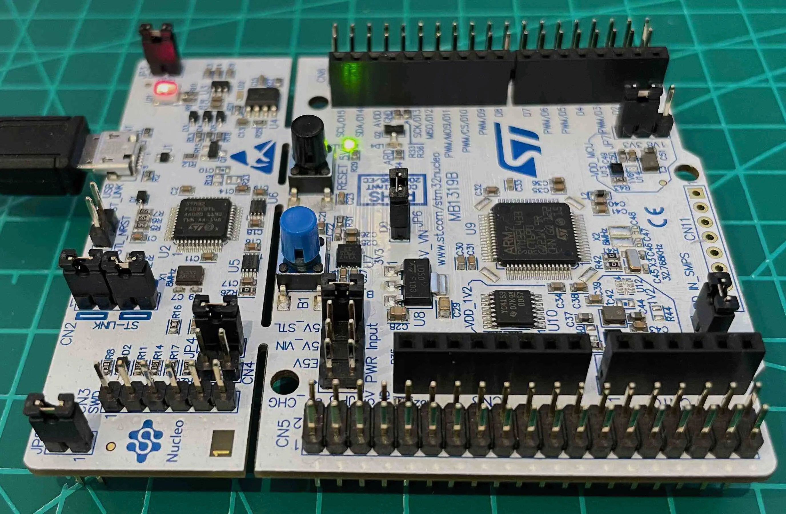

既然是硬件开发，还是需要准备一块开发板的。早些年正版开发板的价格还是挺贵的，动辄几百甚至上千。好在我们有水果公司都忌惮三分的深圳华强北，打这些芯片厂家不要太轻松。下面列出的几款小型开发板，某宝十多块钱就能包邮送到家，就连外国的电子论坛也经常来组团海购。

| 开发板     | 芯片       | 制造商       | 芯片架构  | 特点                 | 不足                       |
| --------- | --------- | ----------- | -------- | -------------------- | ------------------------- |
| Pro Micro | Mega32U4  | 爱特梅尔/微芯 | AVR8     | 简单，稳定，易上手      | 功能少，性能偏弱             |
| Pico      | RP2040    | 树莓派       | ARM      | 易上手，高性能，便宜    | 量产设计时需要较多外围器件    |
| Mini F401 | STM32F401 | 意法半导体    | ARM      | 多功能，高性能，低功耗  | 门槛高，价格高，假冒/翻新多   |
| NodeMCU   | ESP8266   | 乐鑫         | RISC-V   | 超便宜，WiFi，中国制造 | 功耗略高，引脚少             |

AVR8 系列芯片作为纯血 Arduino 的第一代平台，在今天显得有些落伍了。如果是普通入门，我更推荐树莓派的 Pico。它性价比极高，官方授权的正版开发板也只要十来块钱。RP2040 芯片还支持 UF2 固件。这是一种「往优盘拖拽文件」的固件写入方式，无需烧录工具，也不用操作命令行，不但对业余选手友好，还非常适合小孩子的编程启蒙。

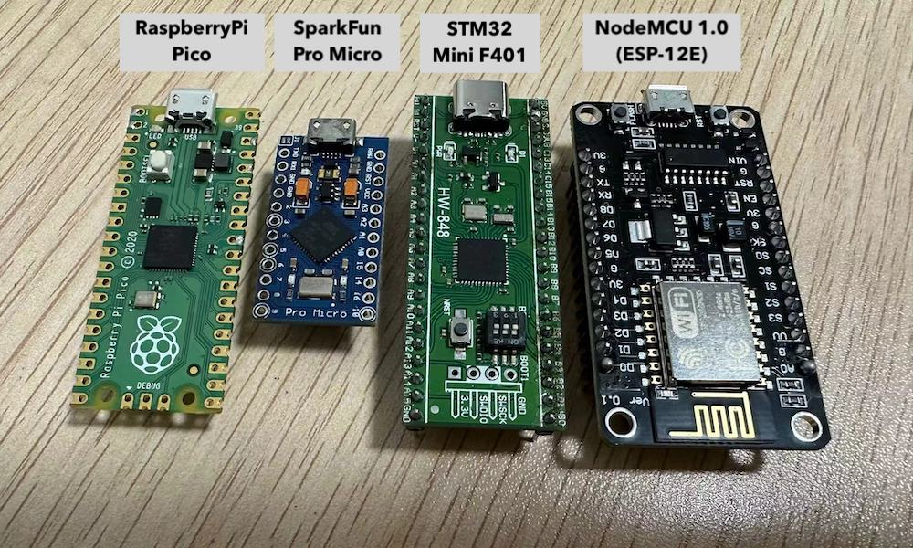

美中不足的是 RP2040 不具备无线功能。对于大量采用无线连接的智能家居开发，我推荐这个领域市场占有率的绝对王者，国产乐鑫的 ESP 系列芯片。入门级的 ESP8266 系列价格比 RP2040 更低，具备无线能力使其既可以作为无线设备连接到 WiFi，也可以自己作主机对外提供 WiFi 服务。ESP32 系列运算能力更强，还增加了低功耗蓝牙的支持。虽然 ESP 的功耗比国外顶尖的 Nordic nRF 系列有较大差距，但智能家居通常有稳定持续的供电，这个短板就不是那么致命了。至于电池供电为主的穿戴设备，还是首推低功耗蓝牙领路人的 nRF 系列。以下内容全部以搭载 ESP8266 芯片的 NodeMCU 开发板（某宝搜索 nodemcu 即可，十来块包邮）和 Macbook 作为开发机进行讲解。

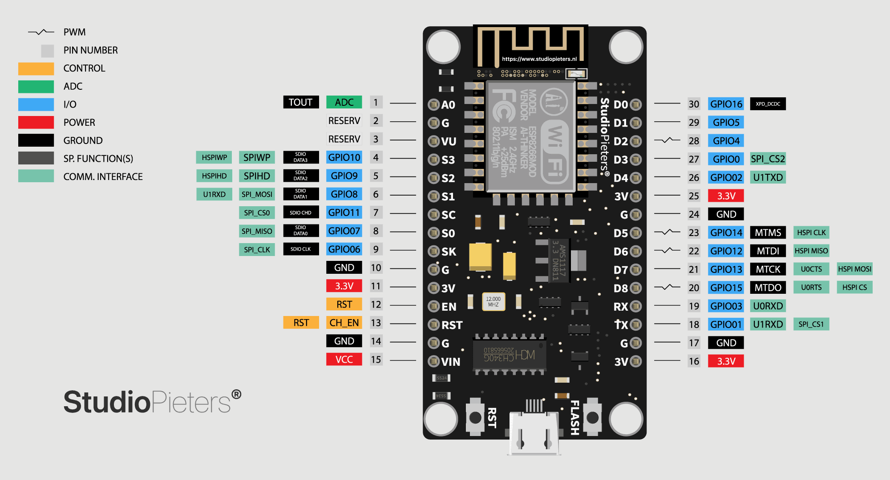

> 因为众所周知的原因，建议先打开梯梯。

先到 Arduino 官网下载 [IDE](https://www.arduino.cc/en/software)。打开后进入设置页面，添加第三方开发板的源地址。

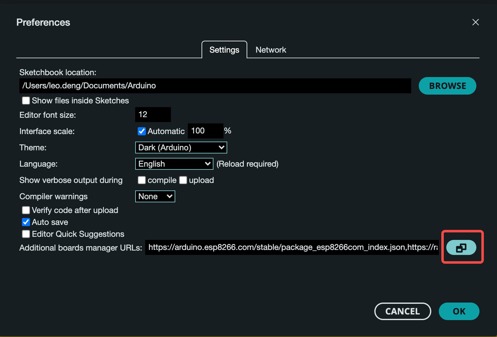

增加一行 `https://arduino.esp8266.com/stable/package_esp8266com_index.json`。

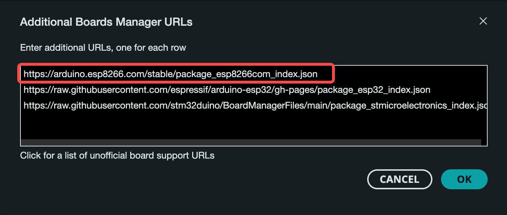

然后进入开发板管理面板，搜索 esp8266，安装开发板资料，目前的最新版本是 3.1.2。

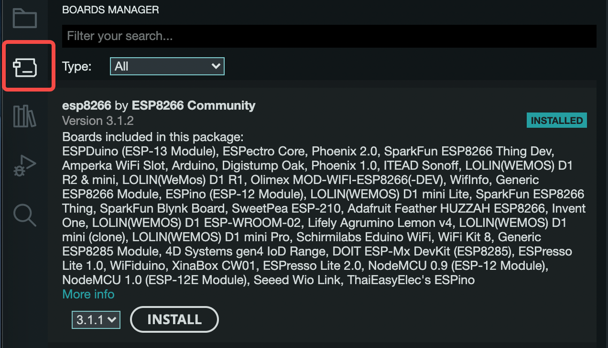

ESP8266 不支持 USB 下载，必须使用专门的硬件（下载器）连接串口，才能在电脑上操作更新固件。不过 NodeMCU 这款开源的开发板已经集成了串口转换芯片。如果你买的 NodeMCU 用 CH340 做串口转换（某宝最便宜的版本），需要安装[驱动](https://www.wch.cn/downloads/CH34XSER_MAC_ZIP.html)（没错这也是国产芯片）才可以使用。安装驱动时注意查看 macOS 安全和隐私设置，可能需要输入密码。如果是 CP2102 或 CH9102 就不需要驱动了，系统直接支持。

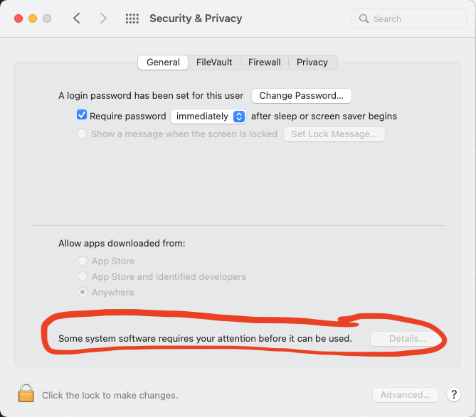

将开发板连接到电脑，系统中出现一个 Vender ID 为 0x1a86 的 USB 设备，终端输入 `ls /dev/tty.wch*` 能看到串口信息，一切就准备就绪了。

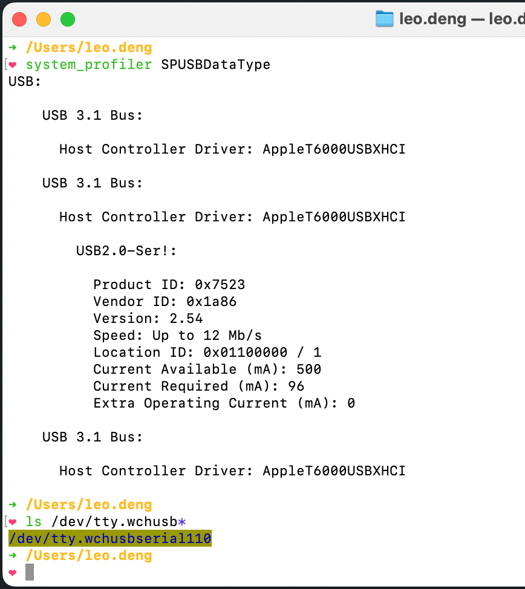

接下来先跑一个简单的例程：blink。发光二极管简单直观，是所有单片机开发板的标配，而 blink 也是所有芯片厂商开发资料的必备例程，堪称电子世界的 Hello World，是开发者拿到板子后「测试一下下」的首选。

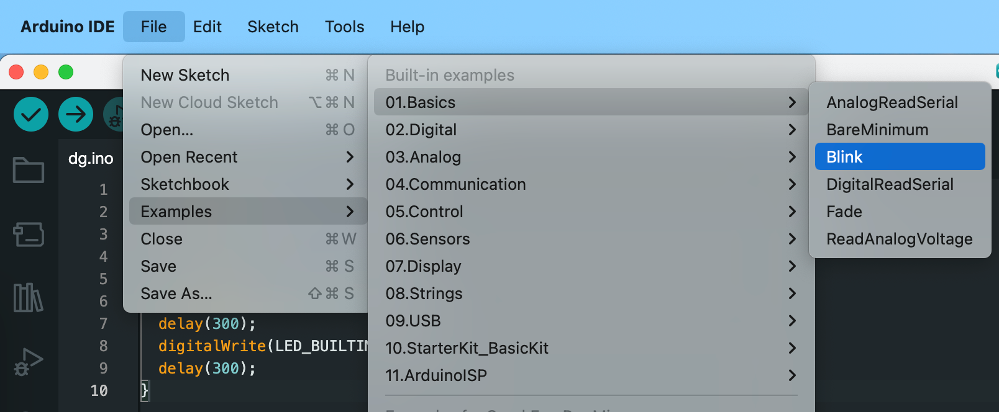

那么 Arduino 里面的 blink 长什么样呢？在 IDE 打开平台内置的示例项目，代码非常简单。

```cpp
// the setup function runs once when you press reset or power the board
void setup() {
  // initialize digital pin LED_BUILTIN as an output.
  pinMode(LED_BUILTIN, OUTPUT);
}

// the loop function runs over and over again forever
void loop() {
  digitalWrite(LED_BUILTIN, HIGH);  // turn the LED on (HIGH is the voltage level)
  delay(1000);                      // wait for a second
  digitalWrite(LED_BUILTIN, LOW);   // turn the LED off by making the voltage LOW
  delay(1000);                      // wait for a second
}
```

在一个 Arduino 程序中，有两个函数必须定义，分别是启动时调用的 `setup`，和运行状态下反复调用的 `loop`。在 blink 例程中，`setup` 只做一件事，就是把连接到发光二极管的通用引脚设置为输出。而 `loop` 做的事情，相信有编程基础的人都能很容易看懂，每间隔一秒钟，连接发光二极管的引脚改变输出数字信号的高（`1`）或者低（`0`）。发光二极管一端连接通用引脚，另一端接地。当二极管两端有电位差时，电流经过就会发出可见光。反之，二极管会熄灭。因此，blink 例程如果正常运行的话，开发板上的发光二极管会匀速地闪烁。代码理解完了，刷入之前还得配置好正确的开发板和端口信息。

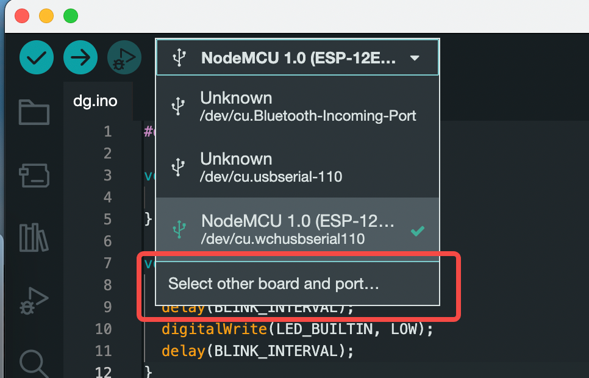

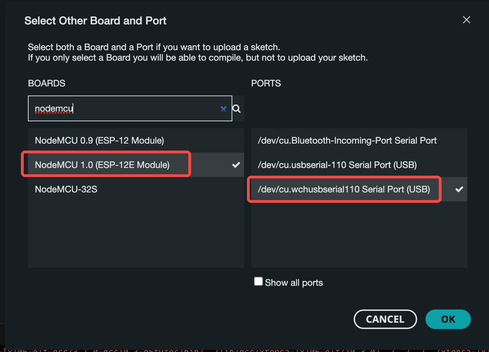

点击 IDE 左上的 Upload 按钮，尝试写入代码。

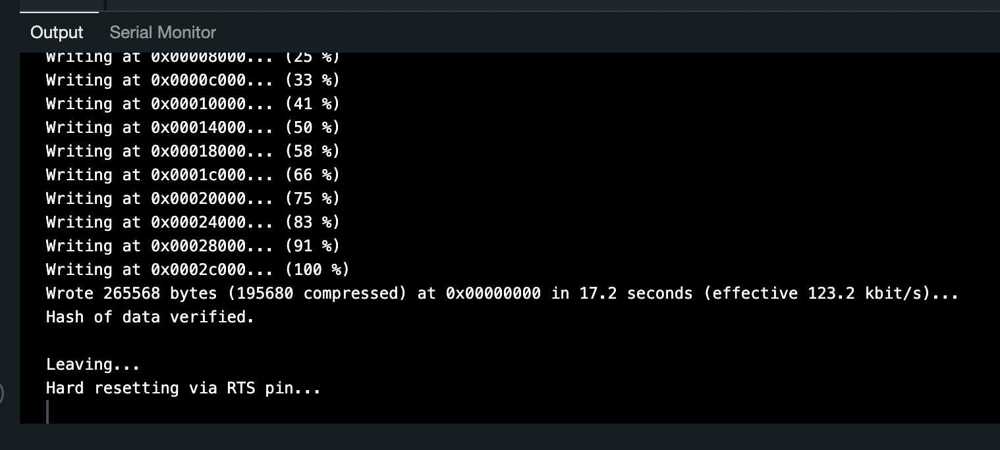

IDE 的信息显示程序刷入已经完成。这时候可以看到二极管不出意外开始闪烁，说明运行符合预期。对于不同的芯片和开发板，二极管连接的引脚也不尽相同。Arduino 平台内部消化了硬件差异，将其统一定义为宏 `LED_BUILTIN`，完全不需要应用程序针对硬件做特殊处理。这样的设计，使得同一份 Arduino 应用代码可以无差别运行在不同的硬件上。电子爱好者可以非常便捷地相互分享各自的小项目，完全不用担心另一个爱好者因为拥有不同的开发板而无法使用。

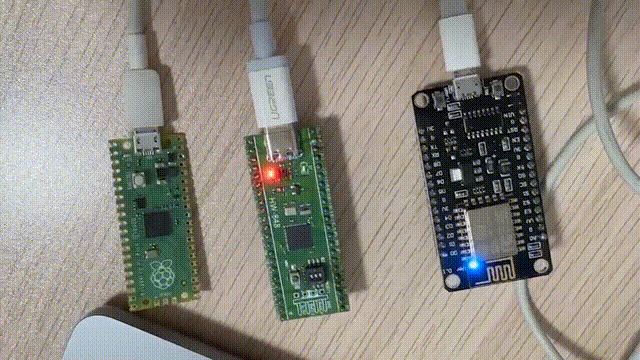

简单入了个门，接下来看看智能家居怎么玩吧。ESP8266 自带 WiFi 功能，既能连接已有的 WiFi AP，也能自己作为 AP 提供 WiFi 服务，非常适合智能家居场景的个性化定制。那我们就试试用手机通过 WiFi 来控制开发板上这个发光二极管。废话不多说，直接上代码，跟着注释走一遍。

```cpp
#include <ESP8266WiFi.h>
#include <ESP8266WebServer.h>

// ESP8266 作为 WiFi AP 的连接信息
#define WIFI_SSID "Leo_Smart_IoT"
#define WIFI_PASSWORD "12345678"

bool ledOn = false;
bool blinkOn = false;
uint32_t blinkInterval;
uint32_t blinkTimer;

// 80 端口开启一个 Web 服务，互联网程序员觉得眼熟吗？
ESP8266WebServer server(80);

void setup() {
  pinMode(LED_BUILTIN, OUTPUT);
  // 这里注意一下，NodeMCU 的二极管是阳极接电源，阴极接通用引脚
  // 因此引脚输出低时有电流经过，二极管亮起，引脚输出高时二极管熄灭
  digitalWrite(LED_BUILTIN, HIGH);

  // 创建一个 WiFi 软 AP
  WiFi.softAP(WIFI_SSID, WIFI_PASSWORD);

  // Web 服务路由配置，像不像用 NodeJS 写 express？
  server.on("/", onConnect);
  server.on("/on", turnOn);
  server.on("/off", turnOff);
  server.on("/slow", blinkSlow);
  server.on("/fast", blinkFast);
  server.begin();

  // 加个延时，等电路状态稳定一下再继续
  delay(100);

  // 在串口信息中打印 WiFi AP 的 IP 地址，方便访问 Web 服务
  Serial.begin(115200);
  Serial.println("");
  Serial.println("===================");
  Serial.println("HTTP Server started");
  Serial.print("Please visit: http://");
  Serial.print(WiFi.softAPIP());
  Serial.println("/");
}

// 这一段不用多解释了吧，返回一个网页，HTTP 状态码 200，有没有写 JSP 的感觉？
void onConnect() {
  String content = "<!DOCTYPE HTML>";
  content += "<html>";
  content += "<head>";
  content += "<meta charset=\"utf-8\">";
  content += "<meta name=\"viewport\" content=\"width=device-width, initial-scale=1.0\">";
  content += "<title>WiFi LED Control</title>";
  content += "<style>";
  content += "body { font-family: sans-serif; text-align: center; padding-top: 50px; }";
  content += "button { font-size: 28px; display: block; margin: 30px auto 0; width: 80%; }";
  content += "</style>";
  content += "</head>";
  content += "<body>";
  content += "<h1>WiFi LED Control</h1>";
  content += "<button id=\"on\">Turn On</button>";
  content += "<button id=\"off\">Turn Off</button>";
  content += "<button id=\"slow\">Blink Slow</button>";
  content += "<button id=\"fast\">Blink Fast</button>";
  content += "<br><br><br><code></code>";
  content += "<script>";
  content += "const sendCmd = e => { const xhr = new XMLHttpRequest; xhr.open('get', `/${e.target.id}`); xhr.send(null); e.preventDefault() }";
  content += ";[...document.querySelectorAll('button')].forEach(el => el.addEventListener('click', sendCmd, false))";
  content += ";document.querySelector('code').textContent = (new Date).toISOString()";
  content += "</script>";
  content += "</body>";
  content += "</html>";

  server.send(200, "text/html", content);
}

// 二极管状态：点亮
void turnOn() {
  ledOn = true;
  blinkOn = false;
}

// 二极管状态：熄灭
void turnOff() {
  ledOn = false;
  blinkOn = false;
}

// 二极管状态：慢闪
void blinkSlow() {
  blinkLed(1000);
}

// 二极管状态：快闪
void blinkFast() {
  blinkLed(300);
}

void blinkLed(uint32_t interval) {
  blinkOn = true;
  blinkInterval = interval;
  blinkTimer = millis();
}

void loop() {
  // 处理 Web 服务的客户端请求
  server.handleClient();

  // 如果状态为快闪或慢闪，判断是否需要切换亮灭
  if (blinkOn) {
    uint32_t currentTime = millis();
    if (currentTime - blinkTimer > blinkInterval) {
      ledOn = !ledOn;
      blinkTimer = currentTime;
    }
  }

  // 输出二极管引脚的电平高低
  digitalWrite(LED_BUILTIN, ledOn ? LOW : HIGH);
}
```

检查一下没啥问题，刷入。更新完成以后，点击 IDE 右上角的串口监视器按钮。选择代码中设置过的波特率 115200，可以看到单片机串口打印的日志，也就是 ESP8266 在自己作为 AP 的 WiFi 内提供 HTTP 服务的地址。

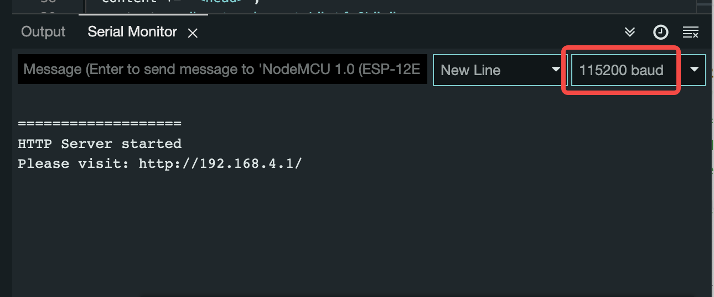

手机连接这个 WiFi 后打开浏览器访问它，看看效果，操作一下，原来物联网开发这么简单！

<video src="videos/blink-wifi.mp4" preload="metadata" controls></video>

这个例子是把 ESP8266 设置为 WiFi AP，其实它也可以作为客户端设备，去连接已有的 WiFi AP，从而具备访问互联网的能力。甚至，可以让 ESP8266 先以 WiFi AP 的形态启动，我们用手机连上以后，输入互联网 WiFi AP 的信息并保存，再让 ESP8266 以客户端的形态重启，读取已经保存的 WiFi 信息，接入互联网。这样一套流程下来，就开始有一点产品级使用体验的感觉了。

有人可能要吐槽，不就是个发光二极管嘛，这算什么开发呀，顶多升级版 hello world。没错，例子虽然简单，代码只有 100 来行，阅读起来也没有任何难度。但是，它已经具备了物联网项目最基本的特征：通过智能终端操作一个无线接入的设备完成具体的任务。把这个例子应用到实际中，如果引脚控制的不是发光二极管，而是空调、热水器、窗帘或者灯的开关，是不是就有点像那么回事了？控制端的技术栈同样可以选择小程序或者原生应用，更方便和 iOS Shortcuts 这样的编排工具配合。而作为互联网背景的程序员，搭建 Web 服务我们更加擅长。下班离开公司的时候远程打开家里的空调，这对硬件知识相对弱一些的互联网程序员来说，技术上并非不可逾越，自己动手实现完全有可能。所以，现在你怎么看智能家居？

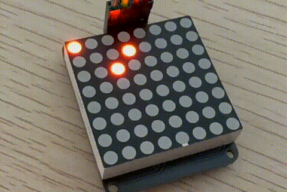

最后提醒一下，**在没有准备好专业的设备，经过充分的学习和小心实践之前，不要轻易碰强电，安全第一！**
