# 什么是 ComfyUI

[ComfyUI](https://github.com/comfyanonymous/ComfyUI) 是一套**运行在浏览器中**，通过**节点编辑器**来搭建 **Stable Diffusion 工作流**的图形界面。

[安装步骤](https://github.com/comfyanonymous/ComfyUI?tab=readme-ov-file#apple-mac-silicon)就不一一介绍，阅读 README 的基本能力相信合格的程序员都是没问题的。安装完成后启动，初始界面长这个样子，已经搭建好了一个简单的文生图工作流。

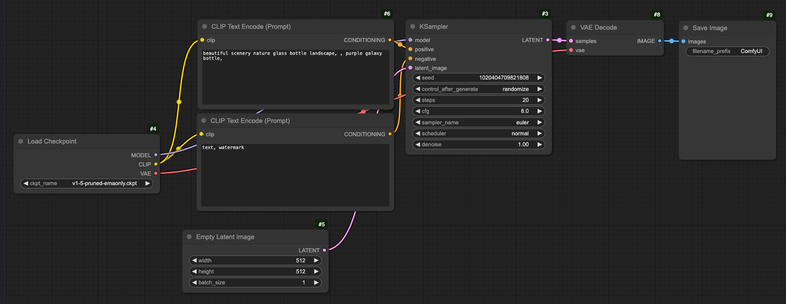

虽然有些看不懂的缩写和术语，但是连蒙带猜基本可以确定，这个工作流可以生成一张**漂亮的自然风景和紫色银河系的景观玻璃瓶**图片，尺寸为 **512px * 512px**，图片中不含任何**文字**或**水印**。点击浮动菜单最顶上的 Queue Promopt”，看看效果，还行吧。

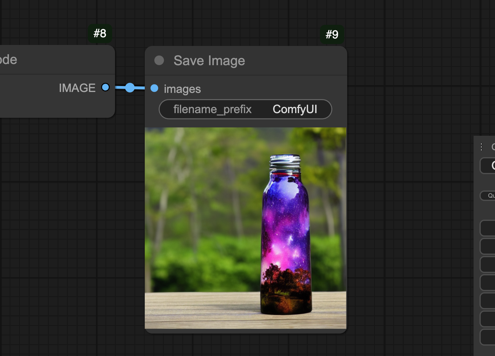

再试试别的。正在射门的，金发，红衣，足球男孩。好像不太对，但也没大错……

白色翅膀，红发，黑裙，哥特风女孩。越来越不对劲了。

再试了一些其他的组合，总是差点意思 。缩写和术语不知道什么意思，节点的连接关系也搞不懂，看来瞎玩确实不行。怎么才能配置生成像网上流传那些精美图片呢？**只有正规才有机会**，要想让画师下岗，还是得从基础学起，了解概念，掌握原理，熟悉用法。

# 扩散模型和 Stable Diffusion

这是一个池塘水波纹的照片，你知道小石子是从哪扔进去的吗？😂 鬼才知道。然而换作 AI 就不是这么想的了，大模型的思路是反复扔石头，记录下全过程，逐帧分析。各种可能的角度和力度全都扔一次。

好了，现在你来问我吧。尽管我不知道你扔的那个波纹是咋回事，但我已经把所有可能性都记录下来了，从里面反过去找出一个跟你一样的，这还不容易。

这就是扩散模型的基本原理：通过添加噪音，逐渐降低数据质量，再对其重建，恢复原始的数据分布，并学习逆转的过程。扩散模型的训练和应用过程大致如下：

- 训练数据预处理：包括清洗（去除异常值）、标准化（特征一致性缩放）、增强（增加多样性）等操作。
- 正向扩散（训练）：对一张输入图像不断添加高斯噪声，训练产生 UNet（图像分割）模型。每一步训练过程都选择随机的时间步长 `t`，将其对应的高斯噪声添加到图像中，并将 `t` 转化为 **embedding**（嵌入向量）。
  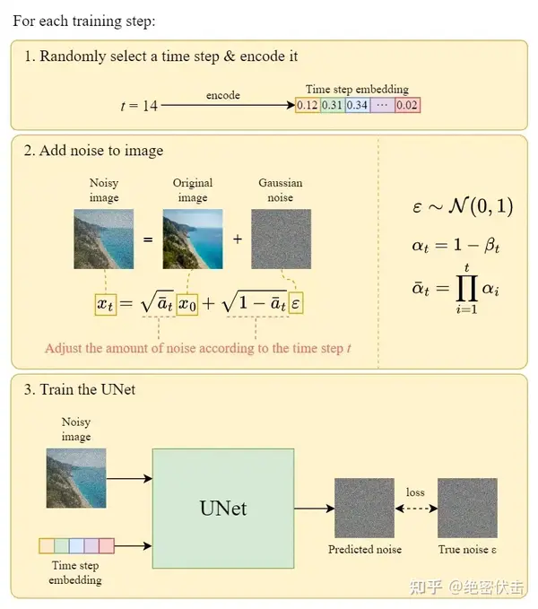
- 反向扩散（应用）：随机生成一张高斯噪声图像，在潜空间中对其不断重复去噪操作，还原出清晰的目标图像。每一步都由正向训练得到的 UNet 模型，依据时间步长 t 来进行噪声图像预测，将其从最初的噪声图像中去除。
  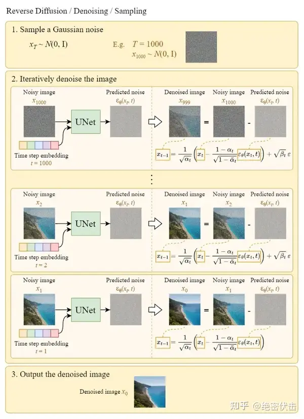

UNet 模型结构图示

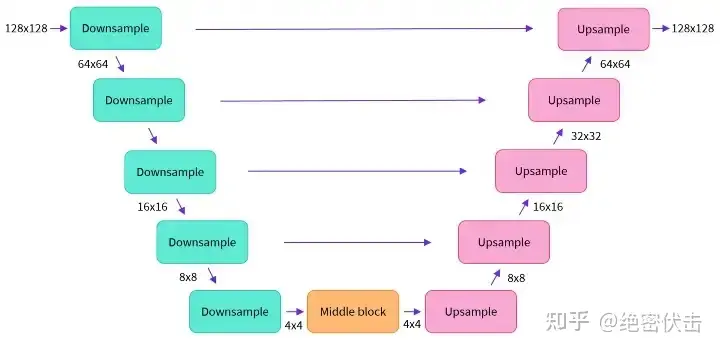

扩散模型在医学影像、自动驾驶等的领域有广泛应用。**稳定扩散**（Stable Diffusion）是对扩散模型的改进，速度和质量都有提升。类似的还有 Midjourney、DALL-E、SORA 等，也是基于扩散模型实现和改进。

# ComfyUI 基本概念一览

## Node

节点，工作流的基本单元，用于完成各种不同的功能。

- 一个节点通常由输入、输出、参数三部分构成。
- 节点之间同类型的输出（上游节点）和输入（下游节点）可以建立连接（link）。在工作流视图中，匹配的输出和输入及其连接会用同一种颜色来展示。
- 输出可以连接多个下游节点的输入，而输入只能连接一个上游节点的输出。

### CLIP

前面介绍的扩散模型，只用到 time embedding 和随机高斯噪声就可以进行模型的训练和应用。而对于文生图这样的使用场景，文本 embedding 是必不可少的，这就遇到了 ComfyUI 中第一个看不懂的概念——CLIP。

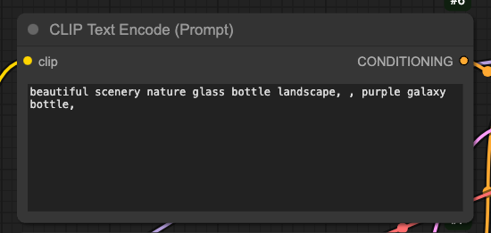

CLIP 可不是修剪或视频片段的意思（虽然好像跟图像也沾那么点边儿？），而是**对比语言图像预训练**（Contrastive Language-Image Pre-Training）的首字母缩略词。CLIP 是 OpenAI 在 2021 年发布的一种多模态预训练神经网络，它通过大量图像和文本的配对数据进行预训练，学习图像和文本之间的对齐关系。CLIP 模型有两个主要部分：文本编码器（Text Encoder）和图像编码器（Image Encoder）。文本编码器用于将文本转换为低维向量表示，图像编码器则将图像转换为类似的向量表示。CLIP 模型在预测阶段通过计算文本和图像向量之间的余弦相似度来生成预测，特别适用于零样本学习任务。有了 CLIP，我们不必对向量这些机器学习的概念有非常深入的了解，也可以用自然语言作为输入来进行文生图。同样也可以用 CLIP 的图像编码器来进行图生图。

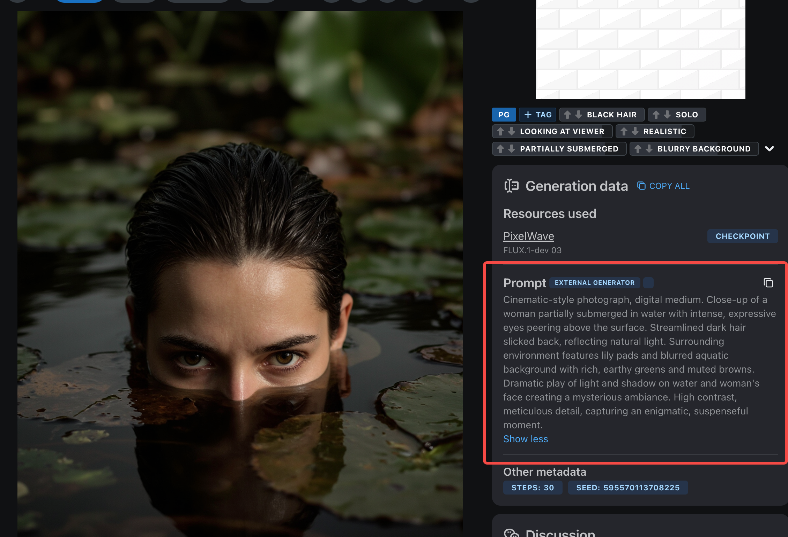

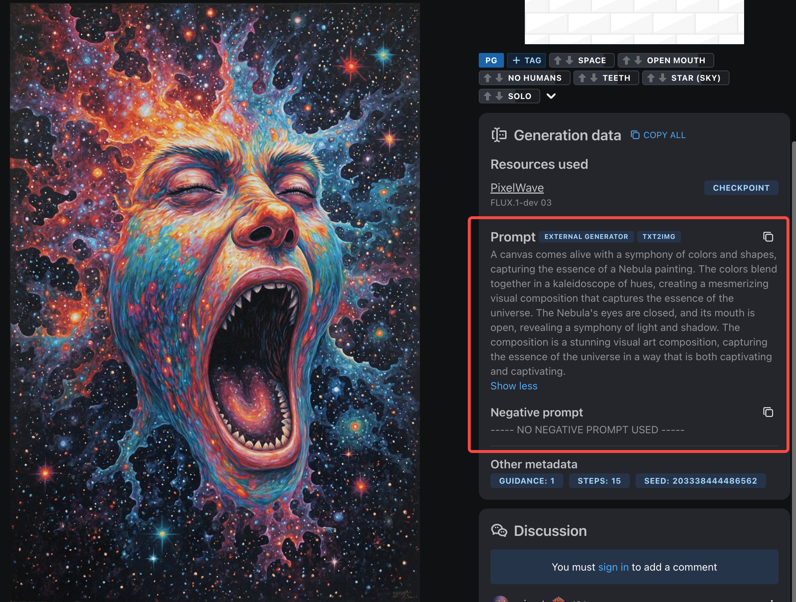

CLIP 提示词（Prompt）的内容越多越详细，会更容易得到接近预期的图像。网上流传的一些精美图片，提示词通常都是长长一段。相比之下，示例工作流生成的图片虽然不算差，但也谈不上多精美。掌握基本用法只是入门，想出神图还得下功夫打磨提示词。

> 提示词中的关键字可以用 `(keyword:weight)` 语法单独设置权重，如 `(purple:0.8)` 会减弱紫色这个关键字的效果。该语法默认为 1.1，即 `(keyword)` 等价于 `(keyword:1.1)`。多个来源的学习材料都建议这个权重取值范围在 0.5 ~ 1.5。

### VAE

另一个重要的概念是 VAE（Variational Auto-Encoder，变分自编码器）。它一种深度学习模型，核心特点是能够将输入映射到一个贝叶斯网络的概率分布上，而不是一个固定的向量。这使得 VAE 不仅能够进行数据重构，还能生成与输入数据相似的新数据。VAE 有编码（数据转向量）和解码（向量转数据）两部分，在示例工作流中只用到解码，将潜空间图像转换成人类可识读的图片。

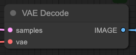

### KSampler

KSampler 看起来比较容易理解，然而它却是工作流中很核心的部分——对潜空间噪声图进行逐步去噪的操作，也就是反向扩散的部分。这个节点的面板有不少可调整的参数，会对生成的图像产生显著影响。

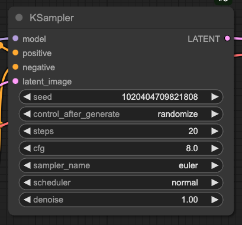

- seed，生成预测噪声的种子。
- control after generate，生成结束后对 seed 参数的控制。可选值有随机、固定、递增、递减。
- steps，去噪的步数，越大则结果越精致。
- cfg，这可不是配置（config）哦，而是**无分类器指导**（classifier free guidance），控制生成过程对提示词的遵从度。参数值越大结果越接近提示词，但会降低创意性，实践的取值范围通常在 6 ~ 8。
- sampler，采样器，从噪声中生成图像的算法。
- scheduler，调度器，控制采样过程中如何调整噪声水平。
- deniose，去除噪声的比例，取值范围 0 ~ 1。

### Latent Image

注意到 KSampler 的上游有一个潜空间图像（latent image），这就是扩散模型的反向（应用）阶段输入的含噪声的图像。对于文生图工作流，可以用 Empty Latent Image 节点生成一个标准的高斯噪声图。

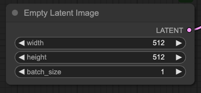

> 也可以用 VAE Encode 将给定图片编码为一个含数据的噪声图像，作为初始的潜空间图像，这会产生**以给定图片为样板生成新图片**的效果（图生图的一种方式）。

### Checkpoint

Checkpoint 节点只有下游没有上游，它就是内置了 CLIP 和 VAE，提前训练好的 Stable Diffusion 大模型。

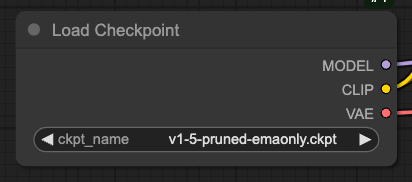

### Save Image

最后，顾名思义就是 AI 最终生成的图片了。

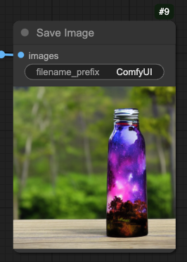

了解以上概念后，我们再来看看打开 ComfyUI 默认创建的工作流，好像也没有那么茫然。

既然刚才提到了图生图，那也试一下。看出来区别了吗？加载一张图片，通过 VAE 编码器，转化为输入 KSampler 的潜空间图像。这个示例也简单演示了如何扩图。

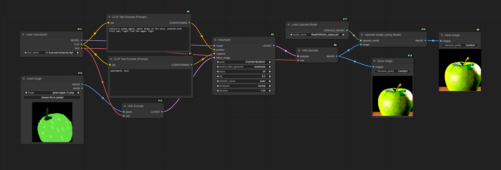

图生图还有另一种思路。将加载的图像（或视频）数据输入 CLIP Vision Encode，转换为输入 KSampler 的正向或负向提示词。

## Group

为了让工作流的逻辑关系展示更清晰，可以对相关的节点编组。在工作区右键菜单即可添加组，拖拽调整组的大小和位置，进入框内的节点即可自动入组，非常方便。

## 工具栏

### Queue

当前会话的任务队列。对于比较满意的生成结果，还可以载入其工作流，恢复包括参数在内的全部配置。

### Node Library

节点库。分类列出当前可用的全部节点，可以一键添加。相比工作区右键添加节点，这里还可以鼠标悬浮预览节点面板。

### Model Library

可用的模型。除了必不可少的生成式大模型（checkpoint），也有搭建完整工作流所需的微调、编解码等其他各类模型。

### Workflows

这里展示当前会话打开的工作流，也可以载入 ComfyUI 内置的示例工作流，学习基本操作。

# 开源社区

相比 Midjourney 等商业化产品，ComfyUI 和 Stable Diffusion 的使用体验和学习门槛是它的减分项。但它也有开源项目特有的优势——百花齐放的社区支持。

## Stable Diffusion 资源

对穷人玩家来说，最难搞的就是模型训练，即要求一定的专业知识，也需要大量的时间精力和钞票。好在有 [Civitai](https://civitai.com/) 这个宝藏网站，提供了大量训练好的大模型，写实、动漫、科幻、卡通、复古，各种风格应有尽有，微调、编解码等模型也很丰富。这些模型基本都能直接免费下载，甚至不需要注册登录。

除了免费下载的模型，Civitai 还有大量网友上传的用 Stable Diffusion 生成的图片，并附带了包括提示词在内的详尽参数。很多图片都[内嵌了生成该图片的工作流数据](https://civitai.com/images/1726591)，是学习和练习使用 Stable Diffusion 非常好的资料，一些创作者还会发帖分享创作过程和思路。

## ComfyUI 扩展

ComfyUI 社区同样丰富多彩，有非常多扩展。这里吐血推荐两个必装扩展。

### ComfyUI Manager

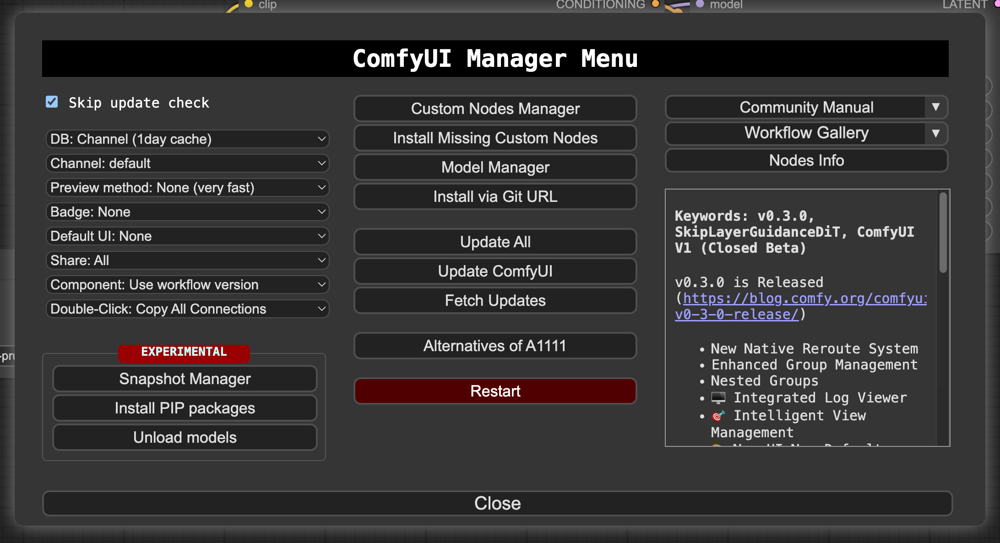

[ComfyUI Manager](https://github.com/ltdrdata/ComfyUI-Manager) 可以说让 ComfyUI 从毛坯变成了精装。它有两个非常好用的功能：

- 通过 ComfyUI Manager 集成的源，可以方便地浏览和安装社区开发的模型、自定义节点、工作流等资源。
- 如果你导入了别人分享的工作流，ComfyUI Manager 可以帮你检查工作流用到的节点，并一键安装缺失的自定义节点。

### ComfyUI Custom Scripts

[ComfyUI Custom Scripts](https://github.com/pythongosssss/ComfyUI-Custom-Scripts) 极大增强了 ComfyUI 的交互体验，如输入提示、工作流排列优化、便捷查看模型信息等。特别是支持导出内嵌工作流数据的截图，让工作流的分享和学习变得更直观和易于交流。对于别人分享的工作流截图，还能以拖拽截图的方式直接导入。

### 其他推荐的扩展

- [yolain/ComfyUI-Easy-Use](https://github.com/yolain/ComfyUI-Easy-Use)
- [cubiq/ComfyUI_essentials](https://github.com/cubiq/ComfyUI_essentials)
- [ty0x2333/ComfyUI-Dev-Utils](https://github.com/ty0x2333/ComfyUI-Dev-Utils)
- [crystian/ComfyUI-Crystools](https://github.com/crystian/ComfyUI-Crystools)
- [AIrjen/OneButtonPrompt](https://github.com/AIrjen/OneButtonPrompt)

# 学习资料

- [Stable Diffusion 入门](https://stable-diffusion-art.com/beginners-guide/)
- [ComfyUI 入门](https://stable-diffusion-art.com/comfyui/)
- [ComfyUI 文档](https://blenderneko.github.io/ComfyUI-docs/)
- [ComfyUI Wiki](https://comfyui-wiki.com/)
- [Civitai](https://civitai.com/)

# 附件

[绿苹果图生图工作流](attachments/green-apple.zip)
