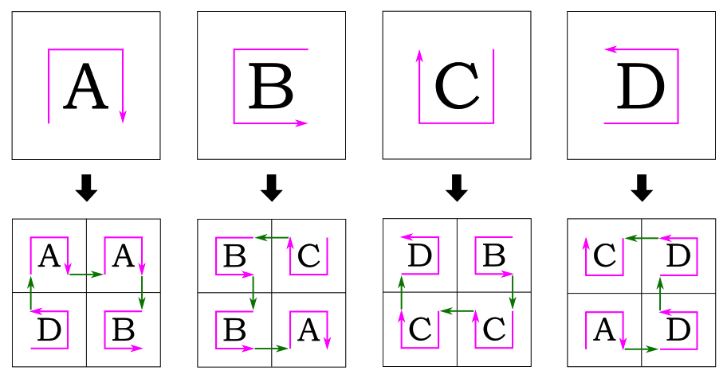
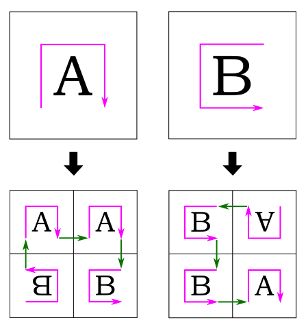
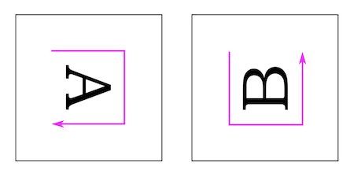
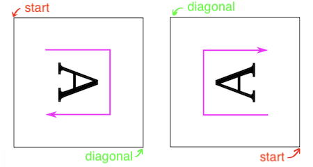
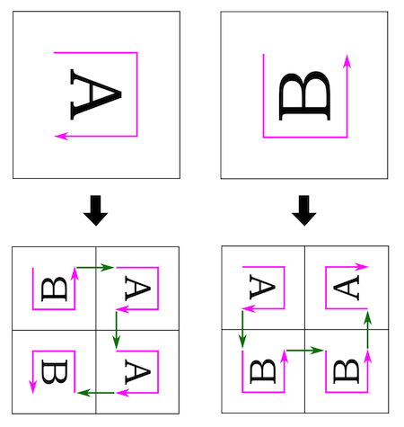
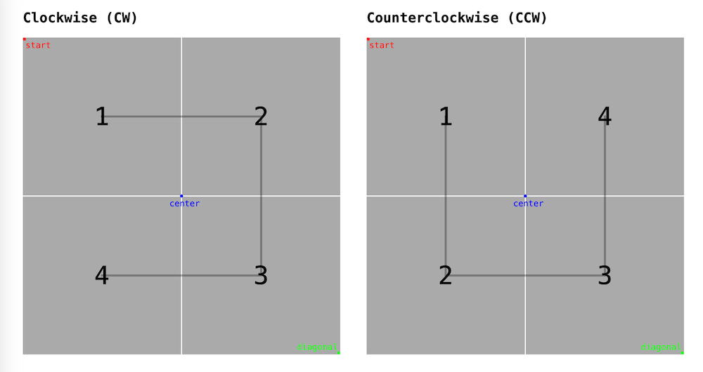
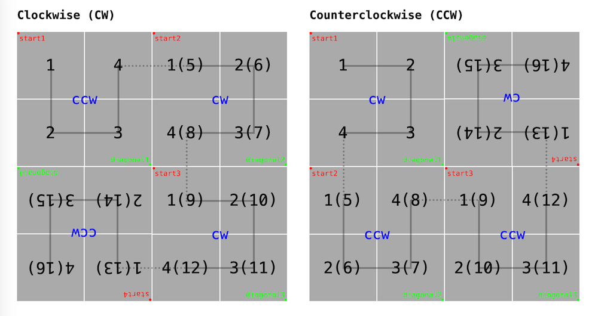

前段时间给团队同学分享[分形](https://en.wikipedia.org/wiki/Fractal)的内容，提到过[希尔伯特曲线](https://en.wikipedia.org/wiki/Hilbert_curve)。春节前最后一天上班，下午的时候整个工区就剩我一个人。像老师不在教室的小学生，肆无忌惮地摸鱼，兴起写了个简单的希尔伯特曲线生成器。

希尔伯特曲线的定义和性质这里不多介绍，可以查看维基百科词条或者其他的资料。根据维基百科的资料，如果考虑方向，希尔伯特曲线的迭代规则有以下四种形状：



通过观察不难发现，形状 A 旋转 180 度以后就是形状 C，同理形状 B 旋转后可以得到形状 D。如果把旋转后相同的形状进行合并，可以进一步简化为两种形状：顺时针（A）和逆时针（B）。



考虑到浏览器的渲染都是以画布左上角为坐标原点，为了方便后面的计算，这里也稍作调整，统一选择左上的小格作为起始位置，即后续的实现我们都会从如下两种形状开始。



那旋转怎么处理呢？假设绘制线段的算法接收两个参数，分别是正方形格子的左上角（起始角）和右下角（对角）的坐标，那么只要交换这两个参数的顺序，就可以得到旋转 180 度的结果。回想一下中学的解析几何，是不是这么回事？



这样一来，前面归纳的迭代规则就变形成了这样：



观察一下两者的共同点。不难发现，一次迭代之后，正方形格子一分为四，其中：

- 第二和第三格，和迭代前格子的方向一致；第一和第四格，方向相反；
- 前三个格子的旋转角度和迭代前格子一致，第四格旋转 180 度。

希尔伯特曲线是一条折线，编写代码要做的就是计算出包括端点在内的所有拐点的坐标序列，依次连接起来。对于给定的正方形画布，第一步是对它四等分，计算出每一个小格子中心点的坐标。根据初始选择的方向（顺时针或逆时针），对这些坐标点排序，得到 4 个坐标点的序列。



```js
function getPoints (startX, startY, diagonalX, diagonalY, ccw) {
  const centerX = (startX + diagonalX) / 2
  const centerY = (startY + diagonalY) / 2
  if (ccw) {
    return [
      [(startX + centerX) / 2,    (startY + centerY) / 2],
      [(startX + centerX) / 2,    (centerY + diagonalY) / 2],
      [(centerX + diagonalX) / 2, (centerY + diagonalY) / 2],
      [(centerX + diagonalX) / 2, (startY + centerY) / 2],
    ]
  } else {
    return [
      [(startX + centerX) / 2,    (startY + centerY) / 2],
      [(centerX + diagonalX) / 2, (startY + centerY) / 2],
      [(centerX + diagonalX) / 2, (centerY + diagonalY) / 2],
      [(startX + centerX) / 2,    (centerY + diagonalY) / 2],
    ]
  }
}
```

根据前面归纳的迭代规则，对四个格子分别重复上面的步骤。每迭代一次，剩余迭代次数减一。



```js
function getPoints (depth, startX, startY, diagonalX, diagonalY, ccw) {
  const centerX = (startX + diagonalX) / 2
  const centerY = (startY + diagonalY) / 2
  if (ccw) {
    return [
      ...getPoints(depth - 1, startX,    startY,  centerX,   centerY,  !ccw),
      ...getPoints(depth - 1, startX,    centerY, centerX,   diagonalY, ccw),
      ...getPoints(depth - 1, centerX,   centerY, diagonalX, diagonalY, ccw),
      ...getPoints(depth - 1, diagonalX, centerY, centerX,   startY,   !ccw),
    ]
  } else {
    return [
      ...getPoints(depth - 1, startX,  startY,    centerX,   centerY,  !ccw),
      ...getPoints(depth - 1, centerX, startY,    diagonalX, centerY,   ccw),
      ...getPoints(depth - 1, centerX, centerY,   diagonalX, diagonalY, ccw),
      ...getPoints(depth - 1, centerX, diagonalY, startX,    centerY,  !ccw),
    ]
  }
}
```

把递归调用和退出条件两部分合起来，整个计算逻辑基本就完成了。

```js
function getPoints (depth, startX, startY, diagonalX, diagonalY, ccw) {
  const centerX = (startX + diagonalX) / 2
  const centerY = (startY + diagonalY) / 2
  if (depth > 1) {
    if (ccw) {
      return [
        ...getPoints(depth - 1, startX,    startY,  centerX,   centerY,  !ccw),
        ...getPoints(depth - 1, startX,    centerY, centerX,   diagonalY, ccw),
        ...getPoints(depth - 1, centerX,   centerY, diagonalX, diagonalY, ccw),
        ...getPoints(depth - 1, diagonalX, centerY, centerX,   startY,   !ccw),
      ]
    } else {
      return [
        ...getPoints(depth - 1, startX,  startY,    centerX,   centerY,  !ccw),
        ...getPoints(depth - 1, centerX, startY,    diagonalX, centerY,   ccw),
        ...getPoints(depth - 1, centerX, centerY,   diagonalX, diagonalY, ccw),
        ...getPoints(depth - 1, centerX, diagonalY, startX,    centerY,  !ccw),
      ]
    }
  } else {
    if (ccw) {
      return [
        [(startX + centerX) / 2,    (startY + centerY) / 2],
        [(startX + centerX) / 2,    (centerY + diagonalY) / 2],
        [(centerX + diagonalX) / 2, (centerY + diagonalY) / 2],
        [(centerX + diagonalX) / 2, (startY + centerY) / 2],
      ]
    } else {
      return [
        [(startX + centerX) / 2,    (startY + centerY) / 2],
        [(centerX + diagonalX) / 2, (startY + centerY) / 2],
        [(centerX + diagonalX) / 2, (centerY + diagonalY) / 2],
        [(startX + centerX) / 2,    (centerY + diagonalY) / 2],
      ]
    }
  }
}
```

根据设定的迭代次数 <i>depth</i>，最终结果是一个长度为 <strong>2<sup><i>depth*2</i></sup></strong> 的数组，其中每个元素都是类型为 `[x:number, y:number]` 的点。用线段依次连接这些点，就可以得到一条希尔伯特曲线。这里我用 SVG path 绘制图像，实现了一个[简单的演示](https://myst729.github.io/toys/hilbert-curve/)。你也可以用 canvas 或者其他可能的方式去绘制。
