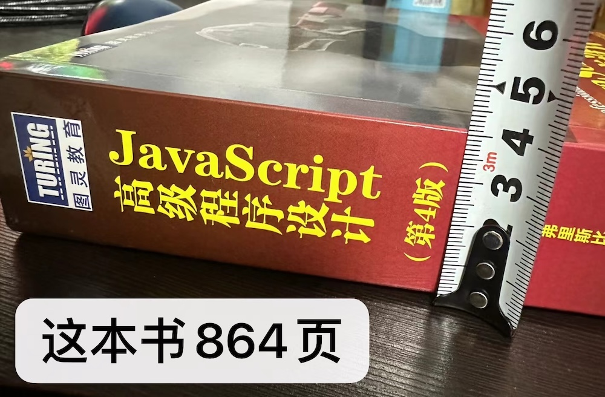
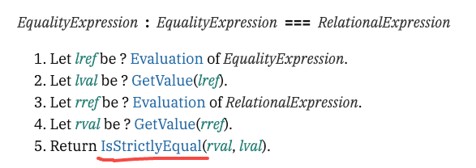
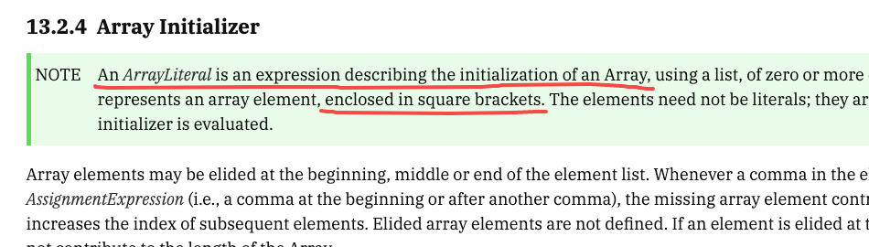
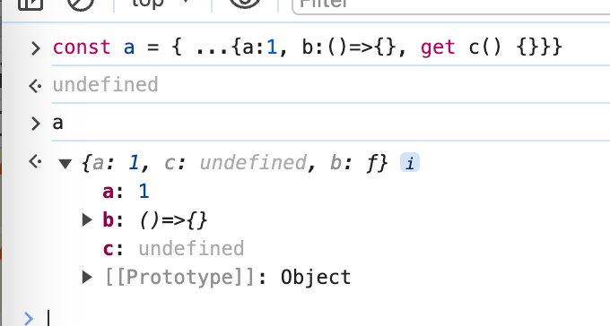
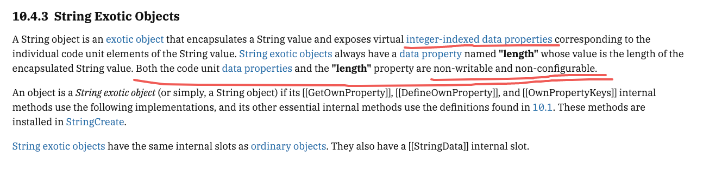
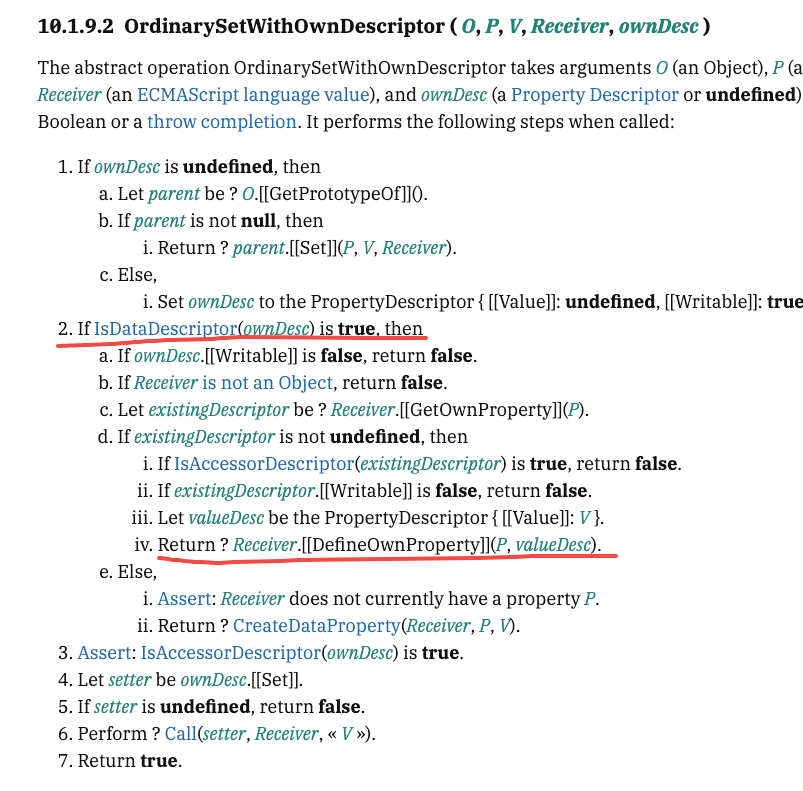

## JavaScript 这么废，连个字符串倒序都没有？

自从多年以前入坑做码农，到现在不知道写了多少次字符串倒序的代码。然而，直到 2024 年，JavaScript 语言规范仍然没有提供一个标准的方法来做这件事。其实，相关讨论早已[持续多年](https://esdiscuss.org/topic/july-tc39-meeting-notes-day-1)。由于[种种原因](https://es.discourse.group/t/string-reverse-method/620)，社区始终无法给出一个完美的方案，标准化自然无从谈起。

## 缩小范围，自己动手，低投入高回报

字符串涵盖的范围太广了，但常规的业务开发多数时候只需要处理单字节字符。因此我们完全可以自己实现一些简洁够用的工具方法。

```js
// 实现一
String.prototype.reverse = function () {
  let result = ''
  for (let i = 0; i < this.length; i++) {
    result = this[i] + result
  }
  return result
}

// 实现二
String.prototype.reverse = function () {
  let result = ''
  let len = this.length
  while(len--) {
    result += this[len]
  }
  return result
}
```

这样虽然简单直接，但代码稍微多了点，能不能复用语言已有的能力，重构一波，写短一点？

```js
String.prototype.reverse = function () {
  return [...this].reverse().join('')
}
```

很好很 fancy，但是老的浏览器不支持展开操作符怎么办？在银行干 IT 的兄弟们还要兼容 IE 😭

```js
String.prototype.reverse = function () {
  return this.split('').reverse().join('')
}
```

拆开，反转，再合并，步骤太多了。直接借用方法，一步到位不行吗？更加函数式，显得技术很强。

```js
String.prototype.reverse = function () {
  return Array.prototype.reverse.call(this)
}
```

What?


查阅 [MDN 相关条目](https://developer.mozilla.org/en-US/docs/Web/JavaScript/Reference/Global_Objects/Array/reverse)，作为前端学习最权威的技术文档，竟然对抛出 **TypeError** 这个行为只字未提？没办法了，自己盲猜吧。想了一下，`Array.prototype.reverse` 方法是直接修改 `this`，JavaScript 的基本类型是按值传递，而值是不能改的。用返回新数组的 `Array.prototype.toReversed` 方法应该就没问题。

```js
String.prototype.reverse = function () {
  return Array.prototype.toReversed.call(this).join('')
}

'qwerty'.reverse() // 'ytrewq'
```

直接改字符串下标肯定也是改不了的。验证一下，果然如此。

```js
let str = 'abc'
console.log(str[1]) // 'b'
str[1] = 'm'
console.log(str[1]) // 'b'
console.log(str)    // 'abc'
```

等等，虽然没改成功，但为什么不报错？哦哦哦～借用方法的时候基础类型被装箱了。换成字符串对象肯定会炸！

```js
let strObj = new String('qwerty')
console.log(strObj[2]) // 'e'
strObj[2] = 'n'
console.log(strObj[2]) // 'e'
console.log(strObj)    // String {'qwerty'}
```

😧 也没炸？带着这个疑问，一顿花式操作。直到……

```js
Array.prototype.join.call(Array.prototype.reverse.call({ 0: 'a', 1: 'b', 2: 'c', length: 3 }), '') // 'cba'
```

一会儿报错一会儿不报错，跟基础类型传值到底有没有关系？都是这几个属性，为什么 String 对象不行，写成 ArrayLike 对象却可以？写代码好难，怀疑人生，JS 真是个垃圾语言，迷茫没前途，躺平算了 😭 

## 越钻研越抑郁，不如安心做个搬砖工？

精神可嘉，方法更重要。大部分技术学习的材料，会更偏重实际应用。对于一项技术的设计和实现细节，往往不会过多阐述。如果对这部分内容感兴趣，想钻研到底，不妨到相关的标准化文档里去找答案。简单搜索一下，不难找到 JavaScript 的语言规范 [ECMA-262: ECMAScript® language specification](https://ecma-international.org/publications-and-standards/standards/ecma-262/)。

然而，阅读语言规范，从入门到放弃：


直观感受一下 840 页是什么概念：



语言规范内容庞杂，措辞晦涩，结构编排跳跃。感觉无从下手，应该如何阅读规范？首先要搞清楚，**语言规范的目标读者，是引擎实现者**。它不是写给语言使用者看的，不会特意照顾使用者的技术背景和阅读习惯。

作为语言的使用者，特别是业务开发者，阅读规范并非必需。那么我们阅读规范的目标是什么？通过学习规范了解语言底层机制，可以加深对语言的理解，对编写高质量的代码有帮助。如果你不满足于业务搬砖，在技术上想更进一步，可以把阅读规范当作一种补充学习的方式。

#### 【举例】编写 OOP 风格的业务代码

```js
class Something {}
(new Something).toString() // '[object Object]'
(new Something) + 1        // '[object Object]1'

class Year {
  #this_is_the_raw_Date_value
  static isYear (obj) { return #this_is_the_raw_Date_value in obj }
  [Symbol.toStringTag] = 'Year'
  constructor (yyyy) { this.#this_is_the_raw_Date_value = new Date(`${yyyy}-04-01`) }
  valueOf () { return this.#this_is_the_raw_Date_value.getFullYear() }
  toString () { return `${this.valueOf()}` }
  toJSON () { return this.valueOf() }
}
`${new Year(1994)}`                         // '1994'
new Year(2012) + 1                          // 2013
JSON.stringify([new Year(2008)])            // '[2008]'
Year.isYear(new Year(2024))                 // true
```

这个简单的示例覆盖了业务开发中一些常见场景的支持，如：比 `typeof` 更实用的自定义类型检查


#### 【举例】Duck Typing 式数据处理

```js
Array.prototype.map.call({ 0: 'a', 1: 'b', 2: 'c' }, v => v.toUpperCase()) // []
Array.prototype.map.call({ 0: 'a', 1: 'b', 2: 'c', length: 3 }, v => v.toUpperCase()) // ['A', 'B', 'C']
```

```js
[...({ 0: 'a', 1: 'b', 2: 'c', length: 3 })] // Uncaught TypeError

[...({
  0: 'a',
  1: 'b',
  2: 'c',
  length: 3,
  [Symbol.iterator] () {
    let i = 0;
    return {
      next: () => {
        return i < this.length
          ? { done: false, value: this[i++].repeat(3) }
          : { done: true, value: undefined }
      }
    }
  }
})] // ['aaa', 'bbb', 'ccc']
```

#### 【举例】炫技……（实际应用：黑产攻防，等）

```js
([][[]] + [])[+!![]] + ([] + {})[+!![] + + !![]]
```


## 开始阅读前的注意事项

- 一条原则：实用主义，按需投入。不要贪多求全，最好是带着问题，进行非线性的查阅
- 两个关注点：语法（syntax）：代码怎么编写、语义（semantics）：代码怎么执行

接下来我们通过几个简单案例来试试，完全 0 基础怎么开始阅读 ECMA-262 规范。

#### 【实践】JavaScript 万恶之源 `==` 比较操作

- 打开 [https://tc39.es/ecma262/](https://tc39.es/ecma262/)
- 搜索 *compare* 或 *compare operator*，没有合适的匹配结果
  
- 搜索 *comparison*，看上去 **7.2 Testing and Comparison Operations** 有较高相关度，但不知道如何继续检索
  
- 放宽条件，搜索 *operator*，前几条匹配结果都是13章的操作符，进入目录检索
  
- 发现 **13.11 Equality Operators** 正是要找的内容，原来这操作符的定义不是“比较”，而是“相等”（**13.10 Relational Operators** 也覆盖了一部分“比较”）。看一下语法：
  
- 再看看语义，掰得很碎，还是比较易懂
  
- `==` 和 `===` 唯一的差别就是第5步
  
- 先看看 **IsStrictlyEqual**，不出意外，说的就是你 `NaN`（**7.2 Testing and Comparison Operations** 的内容出现了）
  
- 再看看 **IsLooselyEqual**，类型相同直接进入 **IsStrictlyEqual**
  
- 所以说后续的步骤才是 `==` 的精髓（坑？），分支逻辑太多了
  

结论：**IsLooselyEqual** 没有问题，定义符合 [MECE 原则](https://zh.wikipedia.org/wiki/MECE%E5%8E%9F%E5%88%99)，`==` 也没有问题，行为可预测可重现。然而在业务开发中，要始终保证编写的代码命中正确的分支，心智负担还是太高了，不易理解和维护。


#### 【实践】编写字符串倒序方法时遇到的一系列问题 之 为什么 `...` 可以展开字符串

- 搜索 *spread*，第一条结果是 **13.2.4 Array Initializer** 的 **SpreadElement** 语法，完全命中
  
- 往下翻看它的语义，注意后面两步，特别是第3步的 **GetIterator(spreadObj, SYNC)**
  
- 传入 **kind** 为 **SYNC**，命中第2步，也就是说，有 **@@iterator** 方法的类型才可以被展开为数组
  
- 看看 **@@iterator** 方法又是怎么规定的，属性名为 **Symbol.iterator** 的函数
  
- 验证一下，字符串类型确实符合。那么我们也可以通过实现 **Symbol.iterator** 方法，来让自定义的数据结构支持展开操作
  
- 因为对象类型本身并没有 `Symbol.iterator` 属性，是不可以迭代的，直接展开会报类型错误
  
- 但是我在业务开发中经常这样写，这不是没问题吗？
  
- 答案在 **13.2.5 Object Initializer** 可以找到
  
- 相关的语义详见 **13.2.5.5 Runtime Semantics: PropertyDefinitionEvaluation**，初始化对象时，复制属性并不需要迭代器
  
- 继续往下读，也能找到访问器属性被展开后是 `undefined` 的原因（过程略，提示：内部方法 `[[OwnPropertyKeys]]`）
  

#### 【实践】编写字符串倒序方法时遇到的一系列问题 之 为什么借用 `Array.prototype.reverse` 反转字符串会报错

- 搜索 *Array.prototype.reverse* 直接进入 **23.1.3.26 Array.prototype.reverse ( )**。找到数组的中心点，对位交换，很直观的实现。问题可能出在执行交换的变更，看看 **Set(O, lowerP, upperValue, true)** 的步骤
  
- 进入 **7.3.4 Set ( O, P, V, Throw )**，原来第四个参数决定了写入不成功是否抛错。由此得知，借用数组的 `reverse` 方法反转字符串会报错，这是 `reverse` 方法本身的行为，并不是针对字符串类型
  
- 另外注意到 **23.1.3.26 Array.prototype.reverse ( )** 的第二条笔记，这个方法不检查 `this` 类型
  
- 可见并不是所有的方法都可以借用给其他类型
  

#### 【实践】编写字符串倒序方法时遇到的一系列问题 之 为什么修改字符串的属性既不成功也不报错

- 搜索 *string*，**6.1.4 The String Type** 能得到一些有用信息，但对回答问题没有太大帮助
- 搜索 *string literal*，点进去一看，详细列举了构造字符串的各种语法
- 借鉴上一个问题的办法，搜索 *string initializer*，没有结果
- 试试对象类型，搜索 *string object*，也没有什么帮助
- 搜索 *string instance*，进入 **22.1.4 Properties of String Instances**，这里描述了什么是字符串实例，终于找到地方了。结合 **10.4.3 String Exotic Objects** 的描述，数字下标成员可枚举，不可变更，不可删除，`length` 属性不可枚举，不可变更，不可删除。这意味着这些属性都不能通过 `Object.defineProperty` 的方式修改
  
  
- 那么对属性赋值的行为呢？在数据类型上面找好像方向不太对，看看赋值是怎么说的。搜索 *assignment*，注意到 **13.15 Assignment Operators** 对赋值操作符有如下描述
  
- 此操作的静态语义有两项检查，分别针对**解构赋值语法**和**严格模式禁止修改 `eval` 和 `arguments`**
  
- 看一下运行时语义，修改字符串实例的下标成员显然会依次执行 1.a，1.c，1.d，1.e
  
- 看看 1.d 执行的 **PutValue** 操作，进入 **6.2.5.6 PutValue ( V, W )**，注意到 3.d 的描述，操作不成功时，严格模式会抛出 TypeError
  
- 试一下，严格模式抛错，非严格模式静默失败，现象完全符合
  

#### 【实践】编写字符串倒序方法时遇到的一系列问题 之 对数组的 `length` 赋值又有什么不同？

- 先看现象。修改 `length` 会改变数组长度，副作用是删除超过长度的下标成员。但不可删除的成员无法被删除，`length` 的实际值也会以此重新计算
  
- 规范确有提及
  
- 看看具体步骤，还是从赋值操作的步骤进入 **6.2.5.6 PutValue ( V, W )**
  
- 看看 **[[Set]]** 到底干了些什么
  
- 命中步骤 2.d.iv，调用了内部方法 **[[DefineOwnProperty]]**
  
- 当操作的属性为 `length` 时，命中 1.a，进入 **10.4.2.4 ArraySetLength ( A, Desc )**，一长串逻辑就是在处理增删成员的各种情况
  

接连看了几个案例，是不是有点头大。今天先到这里，相信你对**按需**阅读规范也有了一点点感觉。

## 一些建议和参考资料

- 友（wú）情提示：语言规范对应用开发者的阅读体验并不友好，不推荐作为首选的技术学习手段
- 真·零基础阅读规范入门小妙招：连蒙带猜，术语围堵，再加一点耐心
- JavaScript 语言特性和实现的通俗讲解：[你不知道的 JavaScript](https://www.ituring.com.cn/book/1488) 系列图书
- JavaScript: The First 20 Years（中译：[JavaScript 二十年](https://cn.history.js.org/)）
- TC39 官网引用的规范阅读指引：[How to Read the ECMAScript Specification](https://timothygu.me/es-howto/)
- 语言规范只呈现结论，不包含设计和讨论的过程。对这部分内容感兴趣可以移步 [ES Discuss](https://esdiscuss.org/)，[tc39/proposals](https://github.com/tc39/proposals)
- 新时代新办法：求助 AI。可以看到一开始的问题其实并不准确。严格来说 JavaScript 不允许随意使用 `...` 操作符，必须配合更多的语法约束，比如初始化数组或对象，函数定义时的参数列表，函数调用时传入的参数，等。但 AI 仍然能尝试理解发问者的意图，给出它认为可能的方向。在发问者和 AI 的相互引导下，对话很快可以行进到正确的结果，指明在规范中应该查阅的章节（截图略）。
  
- 字符串新晋坑王赏析：Emoji。让我们给开发富文本编辑器的同学一点鼓励和支持 😭
  
  
  
  
  
