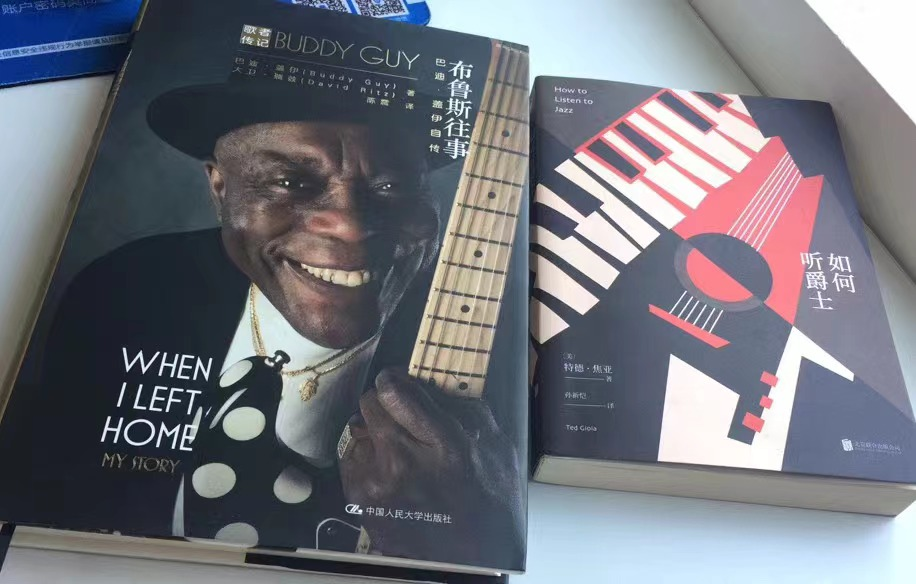
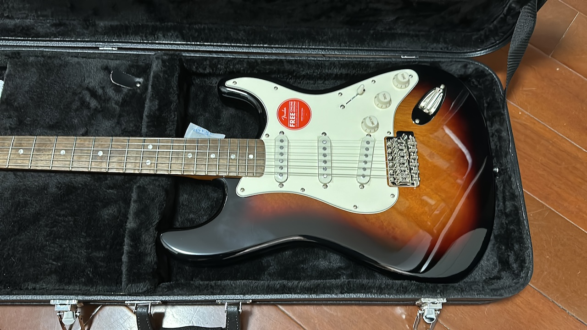

音乐是我为数不多的消遣之一。

从小对音乐有种莫名的好奇。幼儿园时看到老师弹奏脚踏风琴，什么也不懂，就在旁边看。到了初中，在音乐教室第一次看到钢琴，脚都挪不动了。有同学被老师叫上去协助演示，更是羡慕得不得了。小时候家里很穷，父母都是普通工人，为了供我和弟弟上学，打两三份工拼命赚钱。因此，我知道这些东西跟我没有太大关系。到读了大学，家里条件也稍微好一些，才有机会在早已错过「童子功」的年纪，省吃俭用攒点钱，弥补一下童年对音乐的遗憾。直到现在，回到成都家中，我都会拿出大学时买的烧火棍，打理干净，插上音箱摆弄一番，再感叹一下，小心地装回琴包。

作为专业或者谋生手段，音乐的门槛是非常高的。身为一个赶上了互联网爆发期的程序员，我应该算得上是高收入人群，完全有条件负担女儿学习音乐的费用。即便如此，我也不希望她太辛苦。音乐的门槛不仅仅是物质，还有精神上的要求：枯燥的理论学习，大量重复的练习，时间跨度极长的延迟满足。并不容易坚持。对她学习音乐，我的要求只是喜欢就好，当作日后的一个消遣，不爱练习也不强求，考不考级更无所谓。

以消遣的名义，我对自己却是另一套标准。我可以花相当多的时间看乐理，看编曲理论，看黑人音乐发展史，只为了更专注的欣赏。至于钱，尽管可以很大方的为家人买买买，但我对从小过惯穷日子的自己却极其苛刻，更别提为“消遣”花钱。一年在成都待不了几天，我那根烧火棍也就常年吃灰。每次回成都，除了感叹工作繁忙荒废技艺，还会后悔没有物尽其用，不如当初省下这笔钱。尽管那些钱甚至不到我现在半天的工资。

直到，那位陌生的音乐老师竟然给我堪称“砸人饭碗”的发言点了赞。

消遣而已。从小萌发的兴趣，到头来成了精神内耗，何必逼自己这么狠？看看购物车里躺了好几年的东西，下单付款。送给自己一件有生以来最贵的玩具。

身体慢慢变成一个油腻的中年人，最初的心境却没有改变，还有什么比这更幸运？
