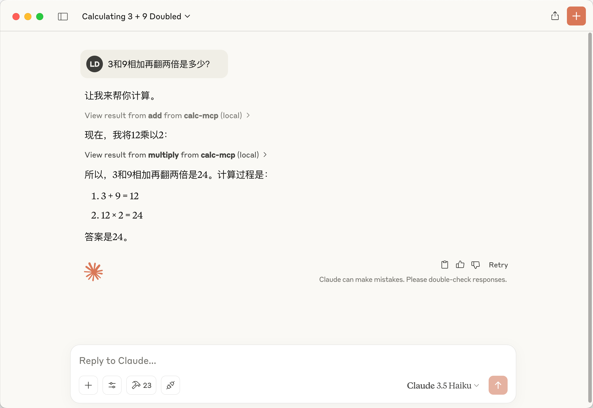

[MCP](https://modelcontextprotocol.io/introduction) 是什么就不介绍了，不知道可以先自行了解一下。之前看了 [blender-mcp](https://github.com/ahujasid/blender-mcp) 这个项目，可以通过跟 Claude 对话，操作本机的 Blender 进行 3D 建模。看起来是一个整合本地工具的好路子（Siri 😭）。下面就以一个简单的算术小应用为例，演示一下怎么通过MCP 扩展 AI 能力。

## 开发

创建 MCP 服务不用全部自己动手，引入 NPM 包 `@modelcontextprotocol/sdk`，只关注核心部分就行了。如果你的服务要提供 SSE 调用的方式，那还需要 `express` 来启动 HTTP 服务（然而 Claude Desktop 目前还不支持 SSE 调用 MCP，Cursor 支持了 😂）。

OK，看一下整体结构。除了标准 Node 项目该有的文件，一共会创建 4 个 js 文件，分别是：

```md
- calc.js     # 算术方法（核心业务逻辑），方便编写单元测试，暴露给 server.js 使用
- server.js   # 创建 MCP 服务的文件，暴露给 index.js 和 sse.js 使用
- sse.js      # 提供 SSE 调用的入口文件
- index.js    # 支持 STDIO 调用的入口文件
```

先看看核心业务逻辑 **calc.js** 的实现。内容如下，用统一的格式定义了几个数学方法，包含方法的描述和参数定义：

```js
import { z } from 'zod'
import { zodToJsonSchema } from 'zod-to-json-schema'

export const calcSchema = z.object({
  a: z.number().describe('第一个数字'),
  b: z.number().describe('第二个数字'),
})

export const inputSchema = zodToJsonSchema(calcSchema)

export const calcTools = {
  add: {
    fn: (a, b) => Promise.resolve(a + b),
    description: '计算两个数字的和',
    inputSchema,
    sign: ' + ',
  },
  subtract: {
    fn: (a, b) => Promise.resolve(a - b),
    description: '计算两个数字的差',
    inputSchema,
    sign: ' - ',
  },
  multiply: {
    fn: (a, b) => Promise.resolve(a * b),
    description: '计算两个数字的积',
    inputSchema,
    sign: ' * ',
  },
  divide: {
    fn: (a, b) => Promise.resolve(a / b),
    description: '计算两个数字的商',
    inputSchema,
    sign: ' / ',
  },
  power: {
    fn: (a, b) => Promise.resolve(a ** b),
    description: '计算两个数字的幂',
    inputSchema,
    sign: ' ^ ',
  },
  random: {
    fn: (a, b) => Promise.resolve(Math.floor(Math.random() * (Math.abs(b - a) + 1)) + Math.min(a, b)),
    description: '随机生成两个数字之间的整数',
    inputSchema,
    sign: ' ~ ',
  },
}
```

接下来看看 **server.js**。6-9 行创建了一个 MCP 服务，`capabilities` 字段声明了这个服务提供的能力。这里我只启用了工具（`tools`），其他可以启用的能力还有提示词（`prompts`）、资源（`resources`）、日志（`logging`）等。11-17 行定义了 `tools/list` 的返回，用于对外暴露可供调用方法的清单。19-32 行则定义了每一个方法被调用时（`tools/call`）的逻辑，包括输入参数解析，自定义的返回内容，以及异常处理。这个例子里的方法都是纯函数调用，所以退出时没有什么清理工作。如果你的 MCP 启用了资源等能力，那就要在这里处理一下，以便释放掉被占用的内存。

```js
import { Server } from '@modelcontextprotocol/sdk/server/index.js'
import { CallToolRequestSchema, ListToolsRequestSchema } from '@modelcontextprotocol/sdk/types.js'
import { calcSchema, calcTools } from './calc.js'

export const createServer = () => {
  const server = new Server(
    { name: 'calc-mcp', version: '0.1.0', description: '一个用于执行简单数学运算的工具集' },
    { capabilities: { tools: {} } }
  )

  server.setRequestHandler(ListToolsRequestSchema, async () => ({
    tools: Object.entries(calcTools).map(([key, value]) => ({
      name: key,
      description: value.description,
      inputSchema: value.inputSchema,
    })),
  }))

  server.setRequestHandler(CallToolRequestSchema, async (request) => {
    const { name, arguments: args } = request.params
    if (name in calcTools) {
      const validArgs = calcSchema.parse(args)
      const result = await calcTools[name].fn(...Object.values(validArgs))
      return {
        content: [
          {
            type: 'text',
            text: `${Object.values(validArgs).join(calcTools[name].sign)} = ${result}`,
          },
        ],
      }
    }
    throw new Error(`Unknown tool: ${name}`)
  })

  const cleanup = async () => Promise.resolve()
  return { server, cleanup }
}
```

提供 SSE 调用的 **sse.js** 文件内容如下。两个路由分别是 SSE 建连和接收消息，跟写普通的 express web 应用没太大区别。注意：如果通过 SSE 提供服务给其他的客户端（比如 Cursor），可能需要处理 preflight 请求，否则会碰到跨域限制的问题。

```js
import { SSEServerTransport } from '@modelcontextprotocol/sdk/server/sse.js'
import express from 'express'
import { createServer } from './server.js'

const app = express()
const { server, cleanup } = createServer()
let transport

app.get('/sse', async (req, res) => {
  console.log('Received connection')
  transport = new SSEServerTransport('/message', res)
  await server.connect(transport)

  server.onclose = async () => {
    await cleanup()
    await server.close()
    process.exit(0)
  }
})

app.post('/message', async (req, res) => {
  console.log('Received message')
  await transport.handlePostMessage(req, res)
})

app.listen(3001, () => {
  console.log('Server is running on http://localhost:3001')
})
```

支持 STDIO 调用的 **index.js** 内容如下，没有什么很特殊的，写过命令行工具的应该不会看不懂。

```js
#!/usr/bin/env node

import { StdioServerTransport } from '@modelcontextprotocol/sdk/server/stdio.js'
import { createServer } from './server.js'

async function main() {
  const { server, cleanup } = createServer()
  const transport = new StdioServerTransport()
  await server.connect(transport)

  process.on('SIGINT', async () => {
    await cleanup()
    await server.close()
    process.exit(0)
  })
}

main().catch((error) => {
  console.error('Server error: ', error)
  process.exit(1)
})
```

## 调试

对于 SSE 方式，可以通过 SDK 提供的能力，额外运行 `npx @modelcontextprotocol/inspector` 启动一个 web 调试客户端。连接上提供 SSE 服务的 express 应用，就可以开始玩了。


STDIO 方式调试起来比较简单，终端直接敲命令（并不简单，挖了好久才搞清楚指令正确的写法，Claude 自己都乱答 😭）。调用 `tools/list`，列出可用工具的清单，具体指令如下：

```bash
echo '{"method":"tools/list","params":{},"jsonrpc":"2.0","id":2}' | node ./lib/index.js
```


使用工具，则是调用 `tools/call`，将工具名和参数通过 `params` 字段传入：

```bash
echo '{"method":"tools/call","params":{"name":"power","arguments":{"a":2,"b":7}},"jsonrpc":"2.0","id":2}' | node .
```


## 接入

搞了半天，代码都跑通了，但 Claude 在哪呢？接下来就简单配置一下 Claude Desktop，让它可以使用本地的 MCP 服务来完成任务。打开 Claude.app 的设置界面，进入 Developer 标签，点击 **Edit Config** 按钮。


这样会打开 Finder 定位到 **claude_desktop_config.json** 文件


用你喜欢的文本编辑器打开它，输入以下内容。非常简单，就是调用一个 node 命令行工具。


{
  "mcpServers": {
    "calc-mcp": {
      "command": "node",
      "args": ["/Users/leo.deng/Documents/coding/dg/calc-mcp/"]
    }
  }
}


保存 **claude_desktop_config.json**，重启 Claude.app 并打开设置界面，如果看到这个 MCP 服务的状态是 **running**，那就没问题了。


## 使用

回到 Claude.app 主界面，对话框右下角已经能看到 6 个可用的 MCP 工具了：


点击下试试，可以看到详细的工具清单：


输入一个问题，Claude 立刻识别出本地 MCP 工具具备回答问题的能力，弹窗询问是否使用它。


结果看起来挺不错的。


我们这个 MCP 服务并没有提供计算对数的能力，Claude 也能够识别出来。


对于需要拆解的复杂问题，也可以很好地完成。



但是代入场景以后，就不是那么理想了，可能是工具的描述写得还不够好？


不过可以提要求，指定 Claude 使用 mcp 服务。对于专业工具而言，对话加上一点限制并不费事，还是可以用的。


## 代码

代码自取，仅供参考：[myst729/calc-mcp](https://github.com/myst729/calc-mcp/)

## 更新 2025-04-08

[VSCode 推出 agent mode，支持 MCP](https://code.visualstudio.com/blogs/2025/04/07/agentMode)。根据官方提供的[文档](https://code.visualstudio.com/docs/copilot/chat/mcp-servers)尝试了一下，在 VSCode Insider 中将 MCP 服务配置成全局可见，Copilot Chat 调用成功。配置为工作区可见目前暂时不生效，不知道是我配置方式不对，还是功能没有完全开放。


使用效果还不错，这下可以把 Claude Desktop 扔掉了。


