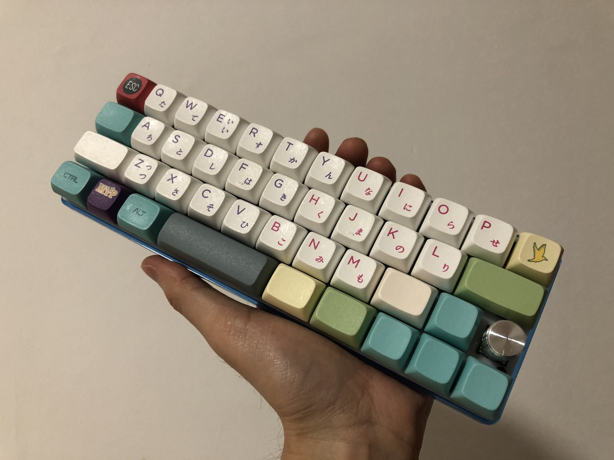

## [Xtrm](https://github.com/myst729/xtrm)

极限无边框设计的 40% 机械键盘，运行 [QMK](https://github.com/myst729/qmk_firmware/tree/master/keyboards/dg/xtrm) 固件。旋钮可以实现翻页、音量/亮度调节、桌面切换等功能，兼具功能性和可玩性。

---

## [Vuelog](https://github.com/myst729/Vuelog)

基于 Vue.js 的无后端博客系统。关于项目的起因和设计思路，请阅读[这个工单](https://github.com/myst729/Vuelog/issues/6)。

---

## [takahashi](https://github.com/myst729/takahashi)

一个模仿[高桥流](https://zh.wikipedia.org/wiki/%E9%AB%98%E6%A9%8B%E6%B5%81%E7%B0%A1%E5%A0%B1%E6%B3%95)风格的投影片模版。桌面浏览器按键盘的右（➡️）、下（⬇️）和空格键向后翻页，按左（⬅️）和上（⬆️）向前翻页。移动设备上左划向后翻页，右划向前翻页。

---

## [txt2img](https://github.com/myst729/txt2img)

把文章和页面内容转换成图片分享到新浪微博的 WordPress 插件，详情请阅读 [txt2img — 把 WordPress 文章发布到新浪微博](/posts/2012/txt2img-publish-posts-to-weibo/)。
